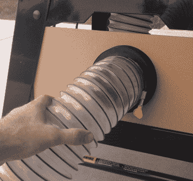

# 3D 打印磁性灰尘端口保持店铺清洁

> 原文：<https://hackaday.com/2018/08/29/3d-printed-magnetic-dust-port-keeps-shop-clean/>

我们经常听说，在投资“真正的”制造之前，3D 打印充其量只是制造原型的一种方式。在最坏的情况下，这是一种为你的桌子或隔间制作小玩具的方式。批评者说，3D 打印并不适合建造实用的设备，即使你设法打印出一些有用的东西，你也可能用更传统的制造方法做得更快或更好。因此，当我们看到一个印刷设计成功地同时抵制了这两种批评时，我们自然会特别兴奋。

 [由【泰勒·兰德里】](https://www.thingiverse.com/thing:3060812)创造的这种磁性灰尘端口连接器不仅具有明确的实用目的，而且其设计在很大程度上违背了正常的构造技术。它由两个法兰组成，尺寸适合普通的 4”柔性管道，表面嵌有磁铁。

这允许联接器的两侧容易地连接和分离，而不依赖于螺纹或摩擦配合。不仅螺纹可能会粘上锯屑，而且当有人在管道上绊倒或工具被移动时，磁性连接允许耦合释放。

目前只有一种类型的耦合是可用的，但[泰勒]说，他正在考虑适应其他工具的设计。他还提到，他目前使用的磁铁是他从以前的项目中留下的定制尺寸，所以如果你想复制这个设计，你可能需要调整磁铁开口。幸运的是，他已经提供了 STEP 文件，所以你不必去破解 STL。

像[Taylor]提出的这种快速连接灰尘端口似乎是对我们过去介绍过的[全店灰尘收集系统](https://hackaday.com/2018/01/05/automatic-dust-collection-for-the-whole-shop/)的完美补充。事实上，[它甚至可能不是系统中唯一的 3D 打印组件](https://hackaday.com/2014/04/10/3d-printed-cyclone-dust-separator/)。