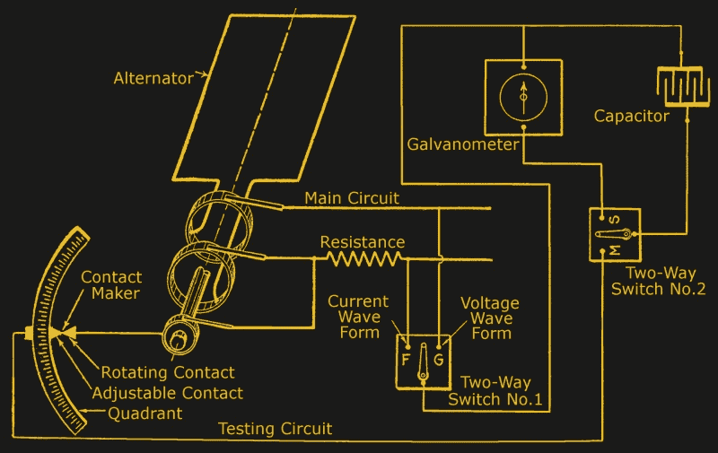
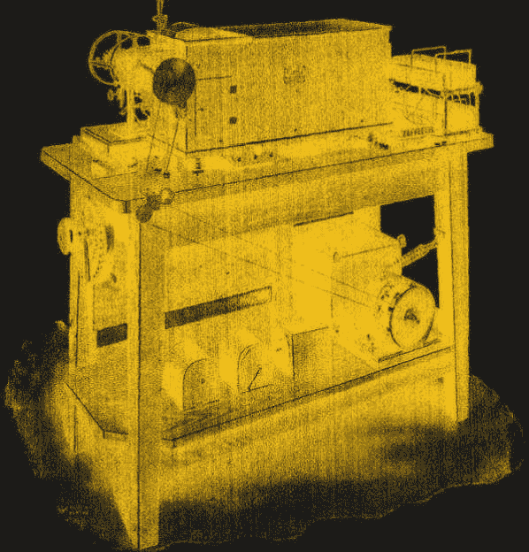
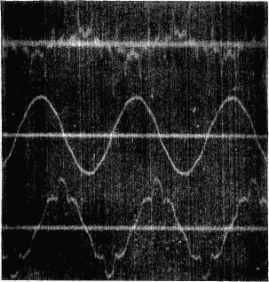

# 前 CRT 示波器

> 原文：<https://hackaday.com/2018/09/11/the-pre-crt-oscilloscope/>

示波器尤其神奇，因为它将抽象的电子世界转化为你可以想象的东西。如今，示波器可能会使用 LCD 或另一种平板电子显示器，但多年来的黄金标准是无处不在的 CRT(阴极射线管)。然而，从历史上看，在电子和无线电的早期，CRT 并不常见。我们所认为的阴极射线管直到 1931 年才真正出现，尽管如果你能抽高真空并提供 30 千伏电压，早在 1919 年就有电子管了。但是在此之前已经有很多电子学工作做得很好了，那么早期的科学家是如何将电流可视化的呢？你可能认为答案是“他们没有”，但事实并非如此。我们今天被高分辨率的电子显示器宠坏了，但是我们的祖先很聪明，用他们所拥有的东西来可视化电子设备。

请记住，直到 20 世纪初，你甚至还没有电子放大器(我们在之前已经讨论过[)。最早直观了解电路状况的方法是纯粹的手工操作。你可以进行测量，并在一张图表纸上画出你的读数。](https://hackaday.com/2018/07/24/edwin-armstrongs-battle-for-fm-radio/)

这听起来很疯狂，但诀窍是使用一个旋转的转子，带有一个触点和一个匹配但可移动的触点。你可以移动触点，用[电流计](https://hackaday.com/2011/03/16/laser-light-show-features-full-xy-control-via-homemade-galvanometers/)(基本上是一个带线圈的指南针)检查驻波上的不同点。转子的速度本质上是你的扫频，你会希望旋转触点与你的波形同步。

如你所料，这是相当粗略的，并且依赖于恒定的波形，因为你的第一次和最后一次测量将相隔许多周期。上图显示的是儒勒·弗朗索瓦·儒贝尔的半自动流程系统，该系统出现在 1915 年左右的书籍中。事实上，有几种变化，你可以在[霍金斯电气指南](https://www.gutenberg.org/files/50068/50068-h/50068-h.htm#Page_1839)的第 63 章中了解更多关于它是如何工作的。

## 自动化

霍金斯描述了两种获得波形的方法:一种是像儒贝尔那样的逐步记录法，另一种是包括阴极射线管、辉光灯、动铁、动圈和热线法在内的恒定记录法。请记住，阴极射线管，在当时，基本上是一个实验室的好奇心，需要大量的辅助设备和操作技巧。

一个自动化的尝试是使用 hospital ier ondograph——一种自动化的儒贝尔仪器。虽然不是一个朗朗上口的名字，ondograph 使用了同步电机齿轮，使旋转触点每分钟比电机少转一圈。每次通过时，电容器(我们称之为电容器)将充电到触点上的测量值，然后放电到带有像左边这样的笔的检流计中。

另一个系统包括将一面镜子连接到检流计上，并使用“下落平板”照相机。一个照相底片(本质上是一片胶片)会在重力的作用下滑落到一个狭缝前面，这个狭缝允许检流计发出光线。实际上，降膜是水平偏转，反射镜的位置是垂直偏转。聪明，如果机械复杂。

## 发明之母

还有许多其他方法可以将信号转换成视觉信号，比如镜子、灯光甚至是气体火焰。一种通用电气公司的仪器使用镜子和同步电机投射到一片玻璃上，这样操作者就可以在纸上描绘出图像。霍金斯描述为“辉光示波器”的一种方法似乎是使用一种类似霓虹灯的灯泡，但没有霓虹灯。哪个电子周围发光，会让你知道电流是正还是负。

同步电机以高达 125 Hz(霍金斯书中的周期数)的速度运行，因此用其中一个捕获 USB 总线事务是不会发生的。

  Scope from General Electric  Falling plate image of an inductor ringing

结果是什么样的？我们认为还不错，但它确实让你欣赏你的视野，不管你有什么。也许最好的图像来自于使用电影摄影机，而不是下降板相机。但是别忘了。那时候，你还得冲洗胶卷。

## 选择对声反应时间

CRT 最终会取代所有这一切，而不会被大规模取代。早期的 CRT——1897 年的布劳恩管——只有垂直偏转，所以旋转镜提供水平时基。直到 1899 年，人们才想到用磁力在水平方向移动光束。

1931 年，兹沃里金制造了一种密封的阴极射线管，其热离子发射器只需要几百伏电压就能工作。不久之后，通用无线电公司制造出了第一台我们认为是示波器的东西。

嗯，算是吧。第一个示波器——a 535——是一系列部件的集合:电源、电子管支架和 CRT。1933 年通用无线电公司(也叫 GenRad)的 635 型示波器(T1)把所有东西都装在一个盒子里，但仍然缺少任何放大器或水平扫描电路。687 是 GenRad 在 1934 年生产的最后一台示波器[，它有缺失的扫描电路。不过，它没有任何放大器。奇怪的是，示波器的前面板是我们认为的左侧，而 CRT 本身就在前面。或者，前面是面板，CRT 指向右边。取决于你的观点。](https://www.oscilloscopemuseum.com/oscilloscope-genrad-687-b-s293.html)

## 我们走了多远

在不到 100 年的时间里，我们取得了惊人的进步。然而，对我来说有趣的是，我们可能不会发明这些创造性的解决方案，因为我们已经被宠坏了。你可能会想，也许一百年后，有人会对我们古怪的计算方式发笑。或者认为我们一定是在如此原始的环境中完成任何事情的天才。