# DEF CON 26 的所有徽章(第 4 卷)

> 原文：<https://hackaday.com/2018/09/05/all-the-badges-of-def-con-26-vol-4/>

从充满 led 的蟑螂，到令人印象深刻的 576 RGB LED 显示屏，甚至是一大块地毯，我们在 DEF CON 26 上的非官方硬件徽章的最后一部分令人印象深刻。今年我试着去看每一个徽章，和每一个徽章制作人交谈。到目前为止，我们已经在这个系列的[卷 1](https://hackaday.com/2018/08/14/all-the-badges-of-def-con-26-vol-1/) 、[卷 2](https://hackaday.com/2018/08/21/all-the-badges-of-def-con-26-vol-2/) 和[卷 3](http://hackaday.com/?p=322578) 中介绍了大量徽章，现在是时候结束了！

如果我没有机会在这些文章中提到你的徽章，我们还是想听听。每个人想要的是挖掘这些独特硬件的华丽例子的细节。因此，在 Hackaday.io 上为你的徽章发布一个项目页面，并确保你能进入一直在飞速增长的会议徽章列表。

## 取消徽章

 [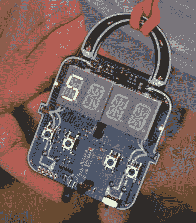](https://hackaday.com/?attachment_id=320388)  [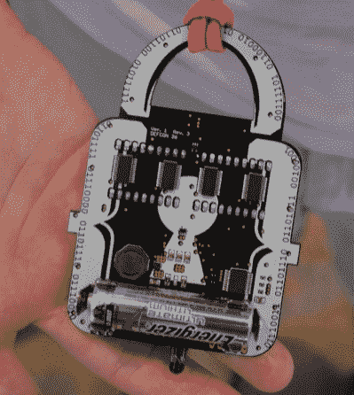](https://hackaday.com/?attachment_id=320387) 

我真的很喜欢[废掉徽章](https://twitter.com/nullibadge)的设计，原因有很多。从表面上看，徽章的形状非常讨人喜欢——让人想起一把挂锁。印刷电路板的顶部为挂绳提供了完美的购买选择，用于红色降落伞的百灵鸟头结为设计增添了巨大的美感。表面的四个数字是 12 段显示器(两个模块，每个模块有两个字符)，用于显示“讨厌的东西”。

单节 AA 电池的选择是极好的。在这一年里，由于四节 AA 电池，官方徽章像重物一样挂在你的脖子上，我很乐意看到轻量化成为核心设计愿望的趋势。总共制作了 50 个这样的徽章。它们由 PIC16F 驱动，包括一个红外传感器，但我不记得这些是如何交互的细节，但我相信你可以在官方徽章页面上了解到这一点和更多信息。

## NoodleCon 徽章

 [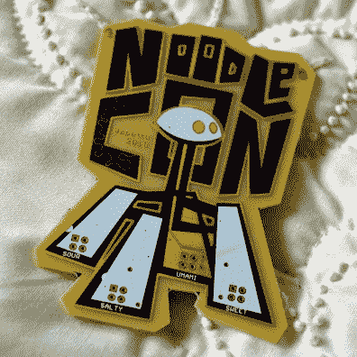](https://hackaday.com/2018/09/05/all-the-badges-of-def-con-26-vol-4/noodlecon-badge-front/)  [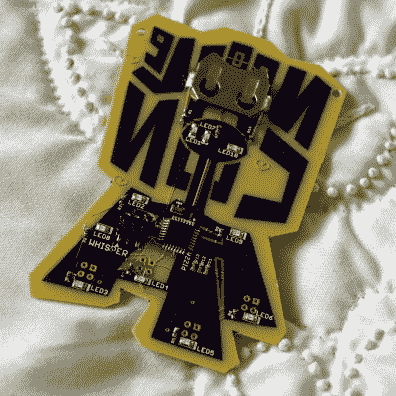](https://hackaday.com/2018/09/05/all-the-badges-of-def-con-26-vol-4/noodlecon-badge-rear/) 

Hackaday 校友 Sarah Petkus 一直在寻求制造一个令人敬畏的机器人，这个机器人很有个性，被亲切地称为 Noodle(查看[她的 Hackaday Supercon 关于可爱的四足动物](https://hackaday.com/2017/12/06/sarah-petkus-on-building-a-cartoon-to-go-to-mars/))。对于 DC26，她决定在面条的骗局中加入一个骗局，这就是徽章。

任何关注莎拉作品的人都知道她的艺术是中肯的，这里有一个很好的例子。看看前面和后面的阻焊膜，你会注意到文字是镜像的。这让它看起来像是你能透过棋盘看到的设计。丝网和镀金铜的大胆使用大胆地传递了她的审美，让你只想盯着设计看。有一个小曲线通过前面的 C 是一个极好的接触！由 ATmega328 和 CR2032 驱动，背面有 10 个 led 闪烁，产生背光效果。

## 2017 年的 DC208 徽章

[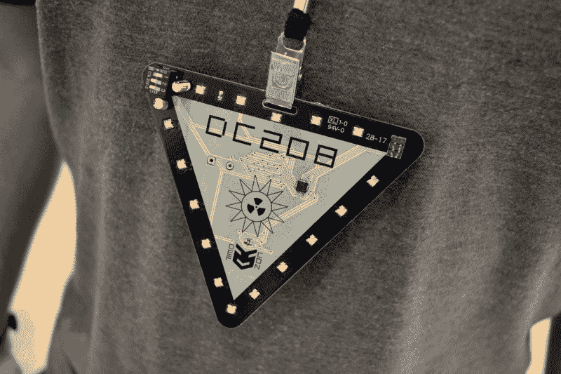](https://hackaday.com/wp-content/uploads/2018/08/01-dc208-front.jpg)

去年的 DC208 徽章被称为盖革徽章。这一个似乎是失去了它的嘀嗒声压电扬声器。如果你想深入研究，GitHub 上有[的设计。](https://github.com/badgelife/DC208-DC25-geiger-badge)

## CypherCon 2.0 和 3.0 徽章

 [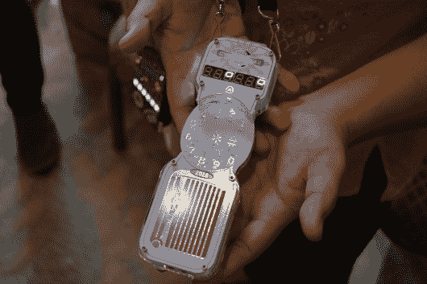](https://hackaday.com/?attachment_id=320479) CypherCon 3.0 badge looks like a lineman’s phone [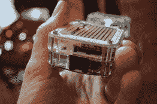](https://hackaday.com/?attachment_id=320478) Hardline connection on the bottom [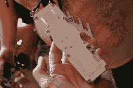](https://hackaday.com/?attachment_id=320477) rear view

我还在为错过在密尔沃基举行的 cypher con 3.0(T1)而自责，那里离我住的地方大约有 90 分钟的路程。顾名思义，骗局围绕密码学和谜题展开。这场比赛由 [@Goetzman](https://twitter.com/Goetzman) 组织，徽章由 [@Tymkrs](https://twitter.com/tymkrs) (他创造了 DEF CON 26 官方徽章)设计。

徽章本身的设计看起来像一部电话。为了行骗，他们从中国进口了一个新的 96 线 PBX 电话系统，并将其设置为黑客攻击的目标。几个前一年的立方体徽章被安装在交换系统中，jtagulator 是一个可拨打的分机。我们的目标是拨入它，侵入系统，消除一些物理障碍，并获得一个以前无法到达的新分机。幸运的是，有一个 reddit 帖子在讨论一些细节。你也会想去看看[专门介绍赛弗肯徽章的网页](https://hackthebadge.com/)。

 [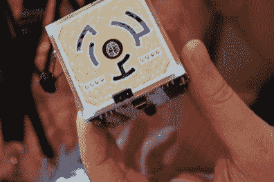](https://hackaday.com/?attachment_id=320480)  [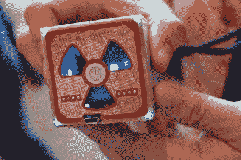](https://hackaday.com/?attachment_id=320481) 

Tymkrs 手上也有 CypherCon 2.0 cube 徽章。能亲眼目睹真是太好了，你可以从布莱恩·本考夫去年的报道中学到更多东西。

## 还有！XOR 徽章

[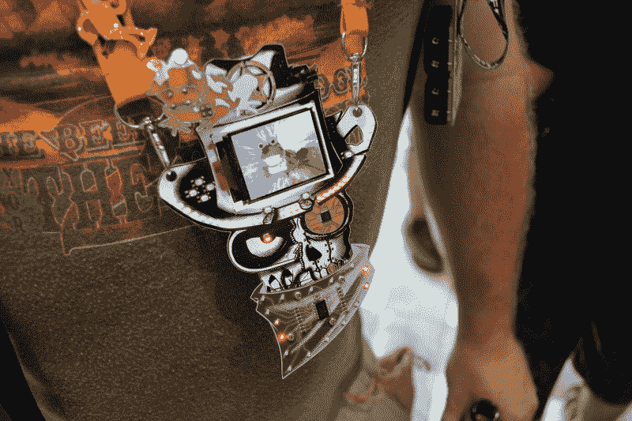](https://hackaday.com/wp-content/uploads/2018/08/09-bender-badge.jpg)

我们已经对和做了深入的回顾！今年 con 之前的 XOR 徽章。去看看吧，因为他们真的为一群积极的 badgemakers 年复一年地改进他们的产品树立了榜样。

值得看一看那些没有出现在那篇文章中的东西。我提到了一套四个神秘的安装孔，你可以看到上面确实有一个徽章底部的附件。显示的是有红色发光二极管播放追逐模式的大手帕附件。我还看到了一个雪茄插件。

 [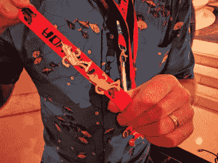](https://hackaday.com/?attachment_id=320683)  [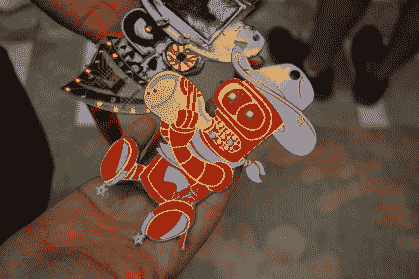](https://hackaday.com/?attachment_id=320486) 

该团队有一批忠实的追随者，他们已经进入了制作与 Futurama 主题一致的东西的游戏。这里可以看到由 [@sqearlsalazar](https://twitter.com/sqearlsalazar) 打造的婴儿弯腰者徽章。还有由徽章粉丝制作的班德标志性舞蹈的宝石别针。别针和挑战硬币是 DEF CON 的长期传统。我们可能需要在未来尝试更多的报道。

## DCZIA

 [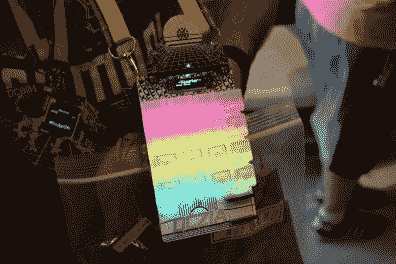](https://hackaday.com/?attachment_id=320599)  [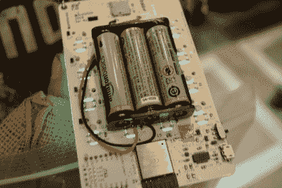](https://hackaday.com/?attachment_id=320600) 

今年的 [DCZIA 徽章](https://github.com/DC801/DC26PartyBadge)简直太疯狂了！这是一个有 16 个键的机械键盘。键帽是半透明的，这使得它们可以背光，这就是它变得狂野的地方。请看徽章背面的图像。你觉得那些 LED 模块是什么？

如果你说标准的 WS2812 模块被误用，你是正确的！它们被倒置安装在电路板的切口中。没什么大不了的，对吧？你可以在你的长椅上黑掉它！当然，但这些实际上是由合同制造商组装的…祝你解释组装过程愉快。徽章与 ESP32 一起出售，所有的 SMD 部件都已安装，但通孔元件是为您自己焊接准备的。

## Monero 徽章

 [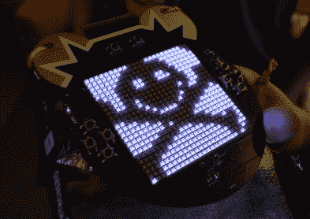](https://hackaday.com/?attachment_id=320669)  [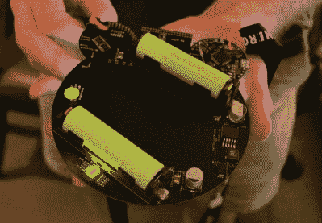](https://hackaday.com/?attachment_id=320670) 

Monero 徽章有一个非常紧密的 RGB LEDS 矩阵，看起来非常壮观。上面的图片让你了解了展示的整洁程度。[这个视频](https://twitter.com/leonjza/status/1030009940151283712)从动画的纯粹亮度上看有点褪色，但你可以想象这个徽章在播放动画时有多惊艳。

它是由 [@elasticninja](https://twitter.com/elasticninja) 和 [@tonym128](https://twitter.com/tonym128) 开发的，他们计划建造 155 个。毫不奇怪，显示器很难制造，[需要一些返工](https://twitter.com/elasticninja/status/1023877171159420928)才能达到我遇到它们时的 125 个工作板。我相信，无法正常工作的单元被分配给了有事业心的黑客，他们觉得自己可以修复。

576 个 APA102 发光二极管的功率消耗肯定是巨大的，事实上，第一个电源在测试中确实着火了。该电源经过多次重新设计，最终采用了由两个 18650 锂电池供电的版本。STM32F4 利用加速度计和陀螺仪的输入驱动电路板。

## 一对通量电容器徽章

 [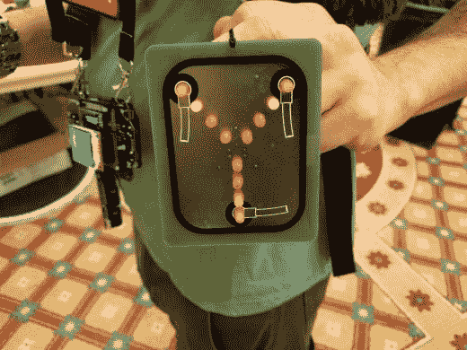](https://hackaday.com/2018/08/29/all-the-badges-of-def-con-26-vol-3/flux-capacitor-2-front/)  [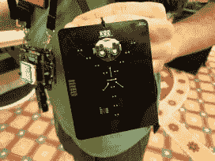](https://hackaday.com/2018/08/29/all-the-badges-of-def-con-26-vol-3/flux-capacitor-2-rear/)  [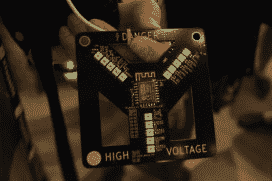](https://hackaday.com/?attachment_id=320671) 

我碰到的不是一个，而是两个通量电容器徽章！第一个上的 ENIG 为电容器外壳提供了很好的反光背景，黑色阻焊膜和白色丝网用于动画位。为了完善它，裸露的 FR4 是一个非常好的选择！

第二个产品在其中心有一个 ESP8266，带有用于动画的 RGB LEDs。PCB 框架中的切口是增加趣味性的一大亮点。

## 夏令营 2018 徽章

 [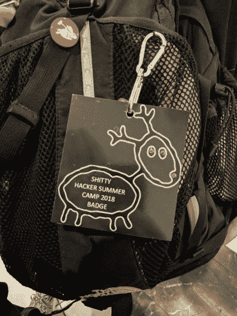](https://hackaday.com/?attachment_id=320684)  [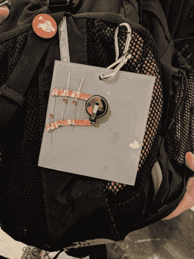](https://hackaday.com/?attachment_id=320685) 

没有 PCB？没问题。这个徽章是一大块丙烯酸树脂，上面钻有通孔 led。电路构造既简单又巧妙。电路板背面的引线已经弯曲平整，铜带用作电源总线，连接到硬币电池座。

## CoinOp 徽章

 [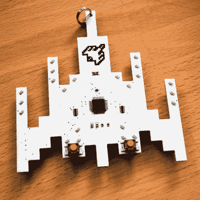](https://hackaday.com/2018/09/05/all-the-badges-of-def-con-26-vol-4/coinop-badge-front/)  [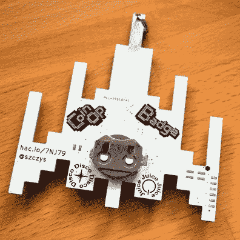](https://hackaday.com/2018/09/05/all-the-badges-of-def-con-26-vol-4/coinop-badge-rear/) 

CoinOp 徽章是我根据我最喜欢的街机游戏 Galaga 创作的。我在我的地下室里手工制作了 59 块这样的板(延时视频发布在项目页面上)。它由一个 CR2032 硬币电池供电，这与徽章的名称非常相称。ATmega48 驱动 18 个红色 led 和 3 个蓝色 led，以补充游戏中船只上的颜色。有两个按钮，让你发射激光，循环可视化，并把徽章睡眠。

## 焊接技能村“掉落零件”徽章

 [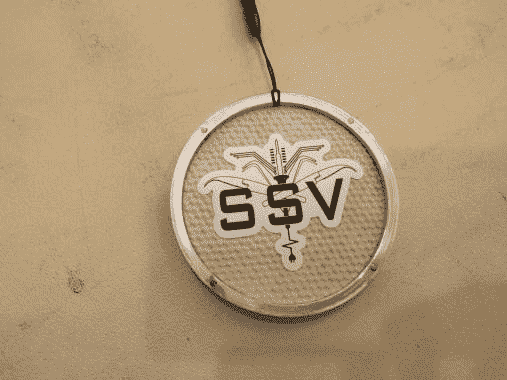](https://hackaday.com/?attachment_id=320688)  [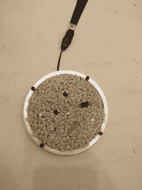](https://hackaday.com/?attachment_id=320687) 

焊接技能村是今年 DEF CON 的新内容。Hackaday 和 Tindie 有幸参加了在该村举行的 SMD 挑战赛，这场比赛分为八轮，六名黑客试图手工焊接越来越小的表面贴装封装(更多信息请见后续文章)。这个徽章似乎是一个自发的创造，被作为一个奖杯给予——不是为了赢得挑战，而是为了在地上掉落最多的零件。这是一块嵌有微小零件的地毯。绝妙的想法，完美的执行，我喜欢这个独一无二的徽章，如果我是接受者，我会戴着它去每个骗局！

## 不是徽章的徽章

 [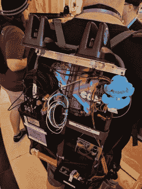](https://hackaday.com/?attachment_id=321435)  [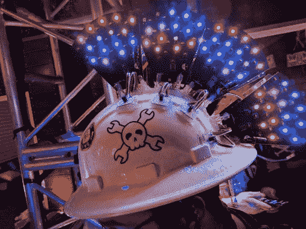](https://hackaday.com/?attachment_id=320680) 

有很多硬件产品严格来说不是徽章，但是看到人们穿着定制的硬件不是很棒吗？这里我们有#HackThePack，它是 [@last_person 的公开邀请](https://twitter.com/last_person/status/1027371215286022144)，供人们黑他装在背包框架上的 WiFi 设备。

对于 blinky 帽子，我没有得到任何关于它或它的创造者的信息。我在 Queercon 泳池派对上见过他，当然，我喜欢看到快乐的扳手和一些非常棒的 LED 鳍！

## 蟑螂徽章

 [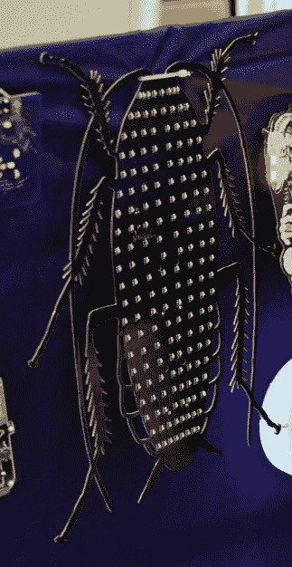](https://hackaday.com/?attachment_id=321440)  [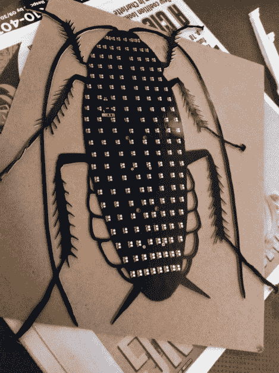](https://hackaday.com/2018/08/29/all-the-badges-of-def-con-26-vol-3/defcon-badge-cockroach-by-red/) Unpopulated PCB )photo via Twitter)

这是一个邪恶的可怕的 PCB 的使用。不幸的是，我没有得到红色蟑螂徽章的图片，但是这个设计值得一提。从这个巨大的(至少 14 英寸长)板上伸出多刺的腿是折断附肢的秘诀，所以他使用了与蟑螂身体两侧平行的超长触角来稳定腿。坦率地说，你能在一块板上得到这么多错综复杂的剪纸实在令人震惊，但我想为什么不呢？

## 直到明年！

就这样？我当然是开玩笑的。这是一个令人惊讶的徽章年，这是一个试图覆盖尽可能多的爆炸。祝贺所有的徽章制作人，你们的创造力和精神已经建立了一个完整的社区，并为 DEF CON 和 beyond 增添了一层新的兴趣。

我们希望在[黑客日超级大会](https://www.eventbrite.com/e/hackaday-superconference-2018-tickets-47386813234)上看到大家佩戴徽章。今年有人专门为 Supercon 制作徽章吗？我知道 Hackaday 是！