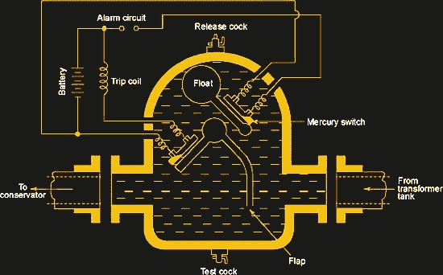

# 看看液体电介质

> 原文：<https://hackaday.com/2018/09/18/a-look-at-liquid-dielectrics/>

几年前的一个晚上，当我开车经过我的家乡时，我看到前方当地志愿消防队闪烁的灯光。我路过一条小路，那里有很多活动:一根电线杆着火了。我可以看到烟雾和火焰从变压器中喷出，我可以听到响亮、愤怒的 60 赫兹嗡嗡声，听起来像一百万个马蜂窝。当我经过时，变压器爆炸了，释放出一团燃烧的液体，雨点般地落在道路和下面的草坪上。这似乎是一个好时机，停止东张西望，尽快击败它。

我当时知道燃烧的液体是变压器油，但我从来不知道它是干什么用的，也不知道它为什么会在那里。从电线杆上的变压器到当地变电站的大电容器和开关设备，石油只是许多配电设备中的许多液体电介质之一。液体电介质是一种有趣的材料，值得一看。

## 同样的事情，不同的状态

如果你知道什么是电介质，你就已经很清楚为什么液态电介质是有用的了。电介质只是一种不导电但可以被电场极化的材料。所以电介质只是绝缘体的特例，这种材料的特性使电荷很容易分离，但不能流动。所以，所有的电介质都是绝缘体，但不是所有的绝缘体都是电介质。

液体电介质只是处于液态的电介质材料，保持着我们熟悉的电容器中常见的固体电介质的所有属性。但实际上，液体电介质更有用的特性是它们的绝缘能力，而不是它们的电荷分离特性。事实上，电绝缘可能是液体电介质最重要的特性，至少就它们在配电装置中的应用而言是如此。

我看到爆炸的变压器可能充满了矿物油，这可能是当今最常见的液体电介质。矿物油是高度精炼的石油——婴儿油是芳香矿物油——由于其高闪点和优异的绝缘性能，它被用于变压器。它的主要工作是通过对流将热量从绕组中传导出去；一些大型变压器甚至有散热片来增加向大气的热传递。变压器油还用于排除会侵蚀内部部件的氧气和湿气，尤其是用于绝缘绕组的纸。

 [https://www.youtube.com/embed/rHVh0KwG_0k?version=3&rel=1&showsearch=0&showinfo=1&iv_load_policy=1&fs=1&hl=en-US&autohide=2&wmode=transparent](https://www.youtube.com/embed/rHVh0KwG_0k?version=3&rel=1&showsearch=0&showinfo=1&iv_load_policy=1&fs=1&hl=en-US&autohide=2&wmode=transparent)

电气齿轮经常充满油的另一个原因是为了限制电晕放电和熄灭电弧。当电场电离周围的液体时，日冕就会出现。你可以在大多数高压线下听到电晕放电，其中被电离的流体是绝缘体周围的空气。在高空中，这并不是一件坏事，但在封闭空间内，它可能会导致灾难。具有比空气更低的相对介电常数(相对于“介电常数”的优选术语)的液体电介质解决了这个问题。液体电介质也用于控制高压系统的大型开关，以抑制电路在自由空气中断开时可能出现的长而强的电弧。

Buchholz relay: Source: [Electrical Live](https://electricallive.com/2015/03/buchholz-relay.html)

Buchholz 继电器是一种通过冷却油监控变压器健康状况的有趣设备。这是一种机电设备，位于变压器和散热器之间的充油室内。它有两个水银倾斜开关:一个连接在容器顶部的浮球上，另一个连接在靠近底部的挡板上，管道在这里进出。轻微的变压器故障会分解油并产生气泡；如果室内积聚了足够的气体，浮子将下降到足以使水银开关接触并触发警报。类似地，重大故障会产生大量气体，推动挡板触发断路器，隔离变压器，防止进一步损坏。

## 更好的选择

当然，矿物油并不完美。正如我看到的戏剧性的演示，矿物油是易燃的。过去几十年对更好的变压器油的研究导致了多氯联苯(PCBs)的使用，这是一种有机氯化合物，具有优异的介电性能，实际上不易燃。不幸的是，它们也有剧毒；认为[爱渠](https://en.wikipedia.org/wiki/Love_Canal)和[剂橙](https://en.wikipedia.org/wiki/Agent_Orange)有毒。它们的生产在 20 世纪 70 年代就被禁止了，但是仍然有相当数量的充满多氯联苯或者被多氯联苯污染的变压器悬挂在电线杆上。

变压器和开关设备中矿物油的其他替代品包括昂贵的硅油和碳氟化合物油，用于易燃性是安全问题的地方，甚至包括来自植物的油，如蓖麻油和普通植物油。天然油比矿物衍生的电介质更容易生物降解，在有泄漏可能性的地方工作良好。已经投入了相当大的努力来优化这些具有添加剂的天然油，并将其用作具有所需性质的合成油的基础。

[专题图片:测试中的变压器油， [KEP 电力测试博客](http://kep-power-testing-blog.blogspot.com/2017/05/preventive-transformer-oil-testing.html)