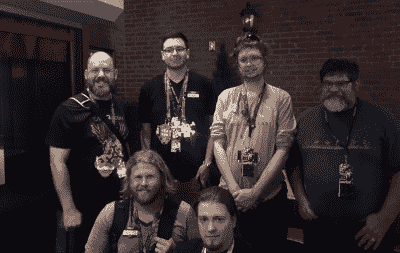

# 竞争性焊接现在是一件事

> 原文：<https://hackaday.com/2018/08/30/competitive-soldering-is-now-a-thing/>

在 Hackaday，我们一直对焊接一些自制作品的技巧和技术印象深刻。我们不只是在谈论没有模板的手工焊接 80 引脚 qfn:有人用裸铜线构建 charlieplexed LED 阵列，并使用 Kynar 线实现机械稳定性。外面有一些非常非常有才华的人，他们都在电线、热和通量的介质中工作。

在今年的 DEF CON 上，我们打开了竞争焊接的闸门。与来自硬件黑客村的[兔子]和来自 HHV 和焊接技能村的许多志愿者一起，[几十人竞争焊接一个装满 led 和微型电阻器的小工具包](https://dchhv.org/events/smdsolderchallenge.html)。

问题中的套件是一个由我的 MakersBox 组装而成的 [SMD 挑战套件，由一个小 PCB、一个 SOIC-8 attini、一个 1206、0805、0603、0402 和 0201 尺寸的 LED 和电阻器组成。比赛分轮进行。六名挑战者同时参加比赛，每个人有 35 分钟的时间完成装备。](https://www.tindie.com/products/MakersBox/smd-challenge/)

我们以前见过——也参与过——焊接挑战，每一项挑战都有一点独特之处，让它变得更加有趣。例如，在今年夏天的 Toorcamp，焊接挑战是在移动到下一个尺寸的部件之前简单地喝一杯啤酒。你可以清醒地焊接 1206 LED 和电阻，喝一杯啤酒，焊接 0805，喝一杯啤酒，继续焊接，直到焊接 01005 器件。是的，人们能够做到。

当然，作为 DEF CON 和所有，我们试图更正式一点，中午前喝酒是不礼貌的。[本次焊接挑战赛的规则](https://dchhv.org/events/smdsolderchallenge.html)分为五类:总时间、元件是否焊接到位、“功能性”测试、零件方向以及焊点质量。

The winners of the soldering challenge, at the Hackaday Breakfast Meetup at DEF CON 26

那么，有了这些规则，谁在今年的 DEF CON 上赢得了焊接挑战呢？总分 25 分，得分最高的是:

*   [真实]–23 分
*   【乳山】–19 分
*   18 分
*   18 分
*   18 分
*   18 分
*   18 分
*   18 秒

焊接挑战的参与人数令人难以置信，整个焊接技能村都挤满了渴望拿起熨斗的人们。结果是惊人的！

我们要感谢[兔子]，硬件黑客村，焊接技能村，以及 MakersBox 让这一切成为现实。这真的是一次神奇的经历，现在竞争性焊接*已经成为一件事*，我们将会再做几次。你认为该如何改进？请在评论中留言。