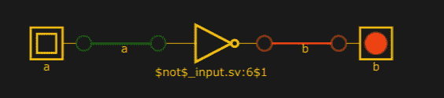

# 可视化 Verilog 仿真

> 原文：<https://hackaday.com/2018/09/03/visualizing-verilog-simulation/>

你通常不会想到模拟 Verilog 代码——通常是针对 FPGA——是一个可视化的过程。您编写一个测试脚本，俗称测试平台，并运行您的模拟。您可能会得到一些打印信息，或者通过转储波形得到一个图形结果，但您通常看不到电路。一个新的网站结合了 Yosys 和一个基于 Javascript 的逻辑模拟器，让你在浏览器中可视化和模拟 Verilog。这是 GitHub 上正在进行的工作，所以你可能会像我们一样发现一些小问题，但它仍然是一项令人印象深刻的工作。

如果您不熟悉 Verilog，可以使用“加载示例代码”按钮来挑选一些示例。如果你想要简单的东西，你可以试试这个:

```

module test(
input a,
output b
);

assign b=~a;

endmodule

```

这样就形成了一个电路:

[](https://hackaday.com/wp-content/uploads/2018/09/logic.jpg)

A 按钮是活动的，所以单击它会将小的人造 LED 和相关的电线一起变为红色。这可能不明显，但是您可以拖动组件来适应您的需要。也可以删除导线并创建新连接。如果有添加和删除组件的方法，我们也搞不清楚。

这是学习 Verilog 的一个不错的方法，因为你可以很快看到代码在做什么。但是，它不够灵活，不能作为一个大型模拟器。例如，将某物命名为 clk 会在原理图上放置一个时钟输入，但使用任何其他名称作为时钟会使其成为一个按钮，如上面示例中的“a”。也没有办法设置时钟。

不过，这很有趣。 [Yosys 有很多我们通常不使用的功能](http://www.clifford.at/yosys/documentation.html)，包括生成带有设计原理图的 graphviz 文件的能力，尽管它们没有像这样清晰。我们很乐意看到这与[法尔斯塔德](https://hackaday.com/2015/07/20/a-breadboard-in-a-browser/)作为模拟引擎结合，这样你就可以基本上使用 Verilog 模块作为你模拟的一部分。那个模拟器可以做[数字电路](https://hackaday.com/2015/09/23/learn-flip-flops-with-simulation/)，就是不接受 Verilog。如果你想在你的浏览器中进行真实的模拟，试试我们经常使用的 [EDA 操场](https://hackaday.com/2015/07/21/learn-fpgas-in-your-browser/)。