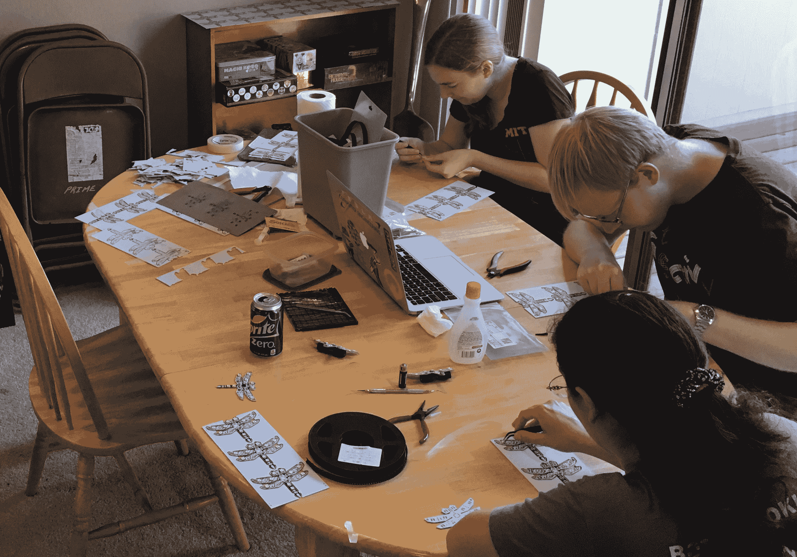
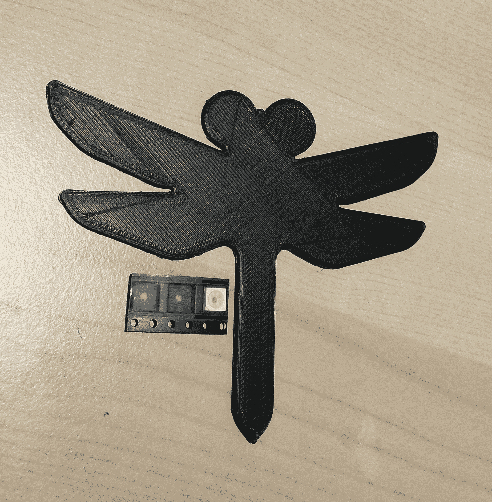
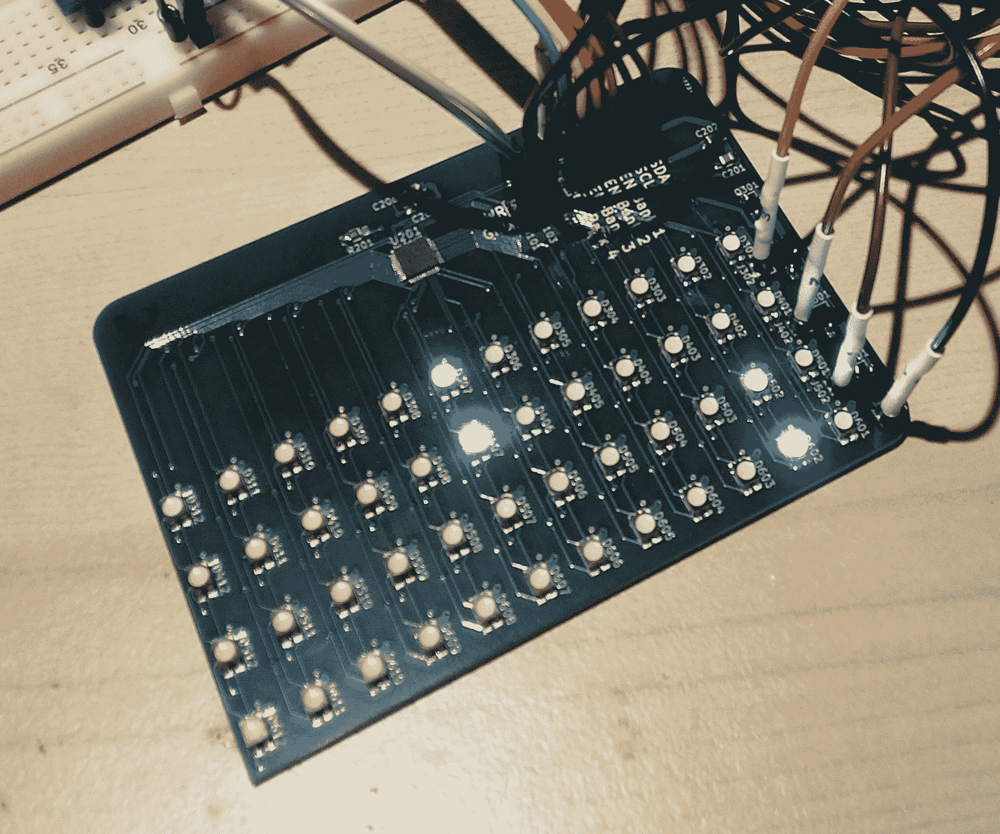
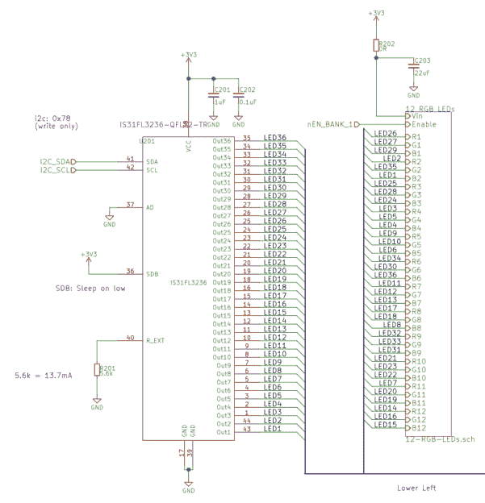
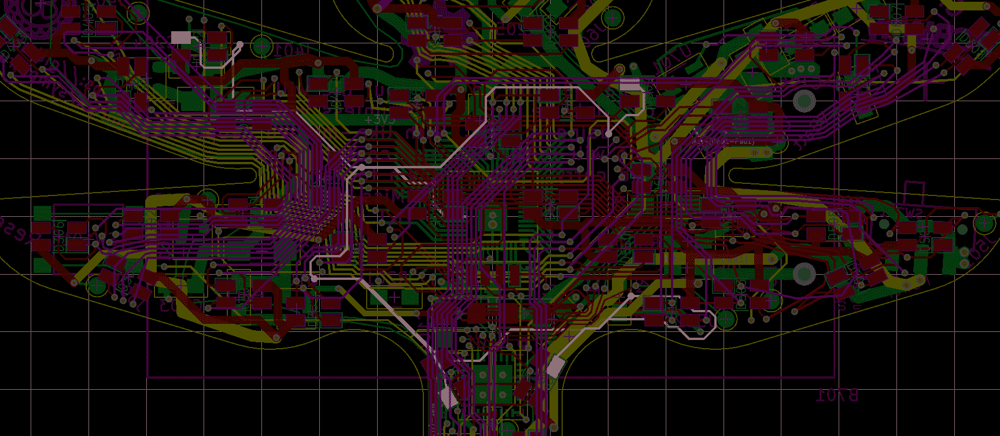

# 什么时候哑 led 是明智的选择？

> 原文：<https://hackaday.com/2018/09/04/when-are-dumb-leds-the-smart-choice/>

几年前，我开始制作电子会议徽章，为 DEFCON 25 制作了一个蜻蜓形状的设备。就像[所有的徽章](https://hackaday.com/tag/badges/)一样，最重要的设计因素是它的华丽程度，两年前我用十个 RGB LEDs 实现了这一点。当时，我打算在厨房的桌子上手工组装 105 个徽章中的每一个。鉴于这些限制，以及对电气和编程简单性的渴望，我决定在常见的 5050 尺寸封装中使用 APA 102(ada fruit 的 DotStar)。它们易于放置，易于电气设计，易于控制，并且对人类取放机器友好。尽管在生产结束时我发现了一些问题，但 APA102s 还是成功了。

今年，我制作了一个新的改进版本的 dragonfly，但应用我学到的经验教训，我选择了一个与 2017 年非常不同的 led 架构。我把智能发光二极管换成了哑的。

Volume production

当开始一个新项目时，我发现清楚地阐明一个目标是有帮助的。第一年的目标是“学习如何构建一个以上的东西”，这是一项相当困难的技能！今年的目标是“学习如何做事情，就好像我正在为真实的构建一个产品*”幸运的是，事实证明[我不是这里](https://hackaday.com/2017/10/25/a-passive-mixer-from-concept-to-shelf/)[唯一一个对这个过程感兴趣的](https://hackaday.com/2016/09/29/taking-a-u2f-hardware-key-from-design-to-production/)，我还有很多要学的。为实现这一目标，计划生产 500 枚徽章，并由真正的海外生产厂进行生产和组装，这一过程需要新的设计考虑。*

让我们做一些快速的数学运算。2017 年，每个 APA102 花了我 0.13 美元(在易贝购买)，每个单元有 10 个，所以每个徽章的 led 是 1.30 美元。还不错！发光二极管几乎是该设备的头条功能，值得花一些钱来做好它。但是今年我显然需要更多的发光二极管。上次我被手工放置每个 LED 的实际现实所束缚，这对我愿意使用的每块电路板的部件数量做出了硬性限制，但 2018 年我已经决定不会出现这种情况。那么我应该用多少个 led 呢？

3D printed size reference and APA102 5050 RGB LED

很明显我应该瞄准几百个！嗯……正如你在右图中看到的，100 个 led 放不下。有多少人会？经过一些非科学的发挥与设计的印刷模型，它似乎与一些调整可能 50 左右。我去的时候会有足够的时间调整这个数字，所以开始估算比一开始就准确无误更重要。如果我以相同的价格使用相同的 APA102s(请记住，这是一个粗略的估计)，我看到每块电路板大约有 50 * 0.13 美元= 6.50 美元的 led。同样，对于标题功能，不算太坏。但也许我可以做得更好。现在，就组装时间而言，添加 led 基本上是免费的，我想要尽可能多的 led。

没有控制器的“哑”led 怎么办？那应该是省钱的简单方法。快速浏览一下 DigiKey 可以发现，虽然我可以买到各种封装的哑 RGB LEDs，但它们实际上并不便宜。最便宜的整卷约 0.17 美元一张。所以我转向互联网上我最喜欢的网站开始研究。和研究。即使是粗略的搜索也显示*的价格明显*更低，我在[收集了一张包含引脚排列、价格、包装和选项的详尽表格](https://docs.google.com/spreadsheets/d/1Obx7k8KNUcLzu8Yw4vUYaUeg1qcl6ARtSNQoFPomS04/edit?usp=sharing)。从表格中突出显示的一行可以看出，我选择的零件价格惊人，每个 0.006 美元。也就是每个 RGB LED0.6 美分*。现在，如果我能在那里得到 50 个的话，我们就降到了每块板 0.30 美元的可笑价格。三个 APA102s 的价格，我可以填充一个完整的徽章！但直接驱动 50 个 RGB LEDs(或 150 个通道)的微控制器并不实用，所以我需要想出如何控制它们。*

## 处于控制之下

LED matrix test board

驱动 led 的方式有很多。在过去，我使用过一个特殊的 36 通道恒流 LED 驱动器， [IS31FL3236](http://www.issi.com/WW/pdf/31FL3236.pdf) ，我真的很喜欢它，尽管它在 DigiKey 上的单个数量为[2.24 美元，有点贵。这比我去年花在 led 上的钱要多得多，所以绝对不行。另外，这是 QFN。但今年随着更高的数量和专业组装情况有所不同。在 DigiKey 上有一个 500 件的价格折扣。(你能猜到我为什么决定做那么多徽章吗？)这使得价格降到了每个 1.26 美元左右。此外，如果一台机器正在做锡膏印刷和零件放置，我不在乎它是 QFN-事实上，小尺寸可能会使我的设计更容易！那么，我如何使用 36 通道驱动器来驱动 150 个通道呢？](https://www.digikey.com/product-detail/en/issi-integrated-silicon-solution-inc/IS31FL3236-QFLS2-TR/706-1434-1-ND/5423473)

首先，我决定从我的任意 RGB LED 数量中减去两个，目标是 48 个 LED，以方便地乘以 12(如 12 x 3 通道 RGB LED)。控制器在数量上不是太贵，所以最简单的选择是给每个徽章增加四个控制器。使用 DigiKey 价格，这使我们经过了几个价格折扣，因此每个控制器的成本仅为 0.95 美元。使用这种架构，每块电路板的 LED 成本看起来像(48 * $ 0.006)+(4 * $ 0.95)= 4.09 美元，比使用 APA102 节省了相当可观的成本！但考虑到 LED 控制的选择过多，使用这么多 LED 控制器似乎是浪费。还能更好吗？

这是一个很常见的技巧，利用视觉暂留来扫描一个 led 网格，并欺骗人眼立刻看到它。单独一个 IS31FL3236 一直驱动它的每个引脚(它不分时)，但也许这两种技术可以混合在一起。每个 LED 都是公共阳极，这意味着每个 R、G 和 B 二极管的高端是共享的，从而提供了一种方便的方式来同时打开或关闭每个 LED。我决定继续做一个测试板，看看这是否可行。

The controller with one bank of LEDs

我将 LED 分成四组，每组 12 个 LED，并将 LED 控制器上的每个引脚连接到四个 LED 的单个引脚(每组一个)。它们穿过一个 [PFET](https://en.wikipedia.org/wiki/Field-effect_transistor#p-channel) ，而不是将每个 LED 的阳极直接连接到电源轨。每个存储体都有一个 FET，因此它们可以由微控制器单独开启和关闭。在摆弄了我的反向 fet 和时序后，我让测试板工作，给了我一个由单个 IS31FL3236 控制器和四个 fet 驱动的 12 x 4 RGB 矩阵。

这是我最终用于[最终产品](https://github.com/borgel/sympetrum-v3/blob/master/Hardware/Badge/Sympetrum-V3%20FF3.pdf)的架构。唯一值得注意的评论是最终的电路板布局是多么令人痛苦。我简单的路由策略和存储体交换拓扑的结合意味着我必须将每个走线路由到电路板的所有四个角落。这将我推到了六层，这成为了更高容量设计决策的又一个案例——从四层跳到六层只需要每块电路板 0.60 美元。

Why did I choose this?

那么，每块电路板的 led 和驱动器的最终成本是多少？(48 * $0.006) + $1.26 + (4 * $0.054) = $1.764.在最初的 10 个 LED 设计上，0.50 美元的溢价和大量的代码复杂性产生了 48 个 RGB LEDs。经过多次迭代[的 LED 控制状态机](https://github.com/borgel/sympetrum-v3/blob/master/Firmware/Src/led.c#L309)后，我能够得到我一直在寻找的黄油般平滑的淡入淡出效果，最终的表现非常令人满意。完美的闪光灯。