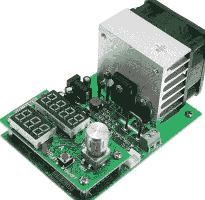

# ZPB30A1 电子负载获得开放固件

> 原文：<https://hackaday.com/2018/09/06/zpb30a1-electronic-load-gets-an-open-firmware/>

进口廉价设备和测试装置是一件喜忧参半的事情。它可以让你不用掏空银行账户就能装备你的实验室，但另一方面，它便宜通常是有原因的。当然，一件硬件的零售价格不应该是我们衡量其质量的标准，但当他们以品牌价格的一小部分出售这种东西时，肯定有一些地方走了捷径。

 一个完美的例子是 ZHIYU ZPB30A1 电子负载，可从各种在线进口商处购买，价格约为 30 美元。虽然价格对于可以处理高达 110 W 的可调负载来说是正确的，但它有一些非常明显的缺点。为了解决其中的一些问题，[【Luca Zimmermann】一直致力于为装载机的 STM8S 微控制器](https://github.com/ArduinoHannover/ZPB30A1_Firmware)开发一个开源的替代固件。

[Luca]很快发现该设备的 STM8S005K6 芯片是写保护的，所以不幸的是，你不能只给它刷新一个新的固件。如果你想解锁额外的功能，你需要进行大脑移植。幸运的是，这些芯片非常便宜，当您订购 ZPB30A1 时，您可以在购物车中添加一些芯片。

安装了新的 GPLv3 许可固件后，该设备获得了恒定功率和电阻模式(普通固件只能实现恒定电流)、串行日志记录，并支持调节分流电阻值。甚至有一个基本的菜单系统来适应新的模式。还有几个功能没有实现，比如自动关机，但这已经是对现有软件的一个相当大的升级了。现在我们只需要一些关于[Luca]将他的升级 ZPB30A1 放入的光滑定制外壳的细节。

如果这看起来太简单，你可以一直走 DIY Arduino 路线来满足你的负载测试需求，或者建造一个功率高达 1 kW 的庞然大物。

【感谢 Benik3 的提示。]