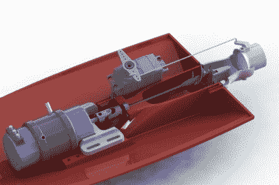

# 3D 打印的遥控喷射船开始加速

> 原文：<https://hackaday.com/2018/09/05/3d-printed-rc-jet-boat-gets-up-to-speed/>

命运的一个奇怪转折是，目前拥有 3D 打印机的人很有可能用它造了一艘船。事实上，他们可能已经印了好几个，印得太多了，以至于他们甚至有一个架子，上面摆满了不同颜色和大小的小船。这是因为这是一个流行的基准，以确保打印机校准良好。但是如果你要花几个小时打印一艘船，为什么不打印一艘有冲击力的呢？

 这个[由【约坦 boat】设计的 3D 可打印喷射船可能不是一个检查你桌面机器校准的好打印机，事实上你会想在接受这个挑战之前确保你已经把所有东西都调好了。如果经典的“](https://www.youmagine.com/designs/3d-printed-jet-boat-v2) [Benchy](https://www.thingiverse.com/thing:763622) ”是初学者的小船，那么这当然是给 3D 打印老手的。但是如果你有能力完成它，并且有一些遥控装置来装备它，这可能是一个结束你夏天的好项目。

除非你有一台特别高的打印机，否则 460 毫米长的船体将需要打印成几块，然后再拼接在一起。你可能会使用胶水，但一些更坚固的东西，如用烙铁将零件焊接在一起，是更好的选择，以确保你的印刷船不会在湖上尽最大努力重演泰坦尼克号。

[Jotham]建议以 0.15 毫米的图层高度打印叶轮，因为您会希望收集所有细节以提供光滑的表面。你还需要使用支架，所以打印后要花相当多的时间清理。模型的其余部分可以打印 0.3 毫米，这将节省大量的时间在船体上。总的来说，打印船的所有部件需要大约半卷灯丝(假设没有错误)，这使得前期电子成本约为 10 美元。

说到电子设备，你需要一个遥控接收器，一个转向伺服系统，一个电子速度控制器(ESC)和一个合适的电机。[Jotham]使用了带有 120A 水冷 ESC 的 3674 无刷电机，但注意到设置是*方式*功率过大。在休息后的视频中，你可以看到船在空中的时间和在水中的时间一样多，这可能看起来很酷，但并不完全有效。

如果你想完善你的 3D PLA 舰队，[我们也看到了印刷的 FPV 救生艇](https://hackaday.com/2016/11/27/3d-printed-rc-lifeboat/)以及在水中“飞行”的[水翼艇](https://hackaday.com/2014/04/25/3d-printed-hydrofoil-boat-rc-flies/)。

【感谢艾登的提示。]

 [https://www.youtube.com/embed/EjYarSz_9GE?version=3&rel=1&showsearch=0&showinfo=1&iv_load_policy=1&fs=1&hl=en-US&autohide=2&wmode=transparent](https://www.youtube.com/embed/EjYarSz_9GE?version=3&rel=1&showsearch=0&showinfo=1&iv_load_policy=1&fs=1&hl=en-US&autohide=2&wmode=transparent)

