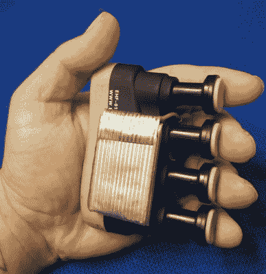

# 刚刚赢得人机界面挑战的 20 个项目

> 原文：<https://hackaday.com/2018/09/05/twenty-projects-that-just-won-the-human-computer-interface-challenge/>

地球上最大的硬件竞赛正在进行。[黑客日奖](https://hackaday.io/prize)是开放硬件的奥斯卡。这是诺贝尔建筑奖。这是固件开发的菲尔兹奖，只要进入决赛，你就能在硬件开发人员的高层获得骑士头衔。

上周，我们完成了 Hackaday 奖的第四个挑战，人机界面挑战。现在，我们很高兴地宣布，其中 20 个项目已被选中进入最后一轮，并获得了 1000 美元的现金奖励。祝贺今年 Hackaday 奖人机界面挑战赛的获胜者。以下是获奖者，排名不分先后:

### *人机界面挑战赛* Hackaday 奖决赛入围者:

*   [情绪镜](https://hackaday.io/project/160615)
*   [氧化还原键盘](https://hackaday.io/project/160610)
*   [Atltvhead](https://hackaday.io/project/34274)
*   触摸你
*   脑语音
*   [HiveTracker](https://hackaday.io/project/160182)
*   [22 自由度四足机器人](https://hackaday.io/project/158251)
*   [电子发夹集线器](https://hackaday.io/project/160167)
*   [著名的板书](//hackaday.io/project/96972)
*   [你可以自己制作的动作捕捉系统](https://hackaday.io/project/27519)

*   [快速文本输入的喷吸界面](https://hackaday.io/project/160107)
*   [符合人体工程学的手持式鼠标/键盘](https://hackaday.io/project/160690)
*   [color chord——蒸汽朋克风格的创作](https://hackaday.io/project/158515)
*   [低成本开源眼球追踪](https://hackaday.io/project/153293)
*   [位](https://hackaday.io/project/154493)
*   [可穿戴电脑右& Powerglove 鼠标](https://hackaday.io/project/5610)
*   她结婚了
*   [声控眼镜](https://hackaday.io/project/160106)
*   [蛇形](https://hackaday.io/project/160713)
*   [阿里阿德涅头带](https://hackaday.io/project/160367)

这次挑战是关于人机界面的，参赛作品又一次让我们大吃一惊。这些是我们见过的最好的人机交互项目，但这意味着什么呢？

 迄今为止，人类计算机界面最明显的例子是地位低下的键盘。在过去的几年里，机械键盘社区已经在固件天才的工作基础上建立起来，创造了一个可以想象到的各种形状和大小的独特键盘的世界。但是这些 Hackaday 奖决赛选手更进一步。

来自[Shervin Emami]的[人体工程学手持式鼠标/键盘替代产品](https://hackaday.io/project/160690-ergonomic-handheld-mouse-keyboard-alternative)是满足您的键盘输入和光标移动需求的一体化解决方案。这是一个蓝牙键盘和鼠标，但这个是一个*和弦*键盘，由一个 5 美元的手指强化设备制成，最初是为吉他手和患有 RSI 的人设计的。通过添加一些按钮、一个陀螺仪和一个加速度计，[Shervin]将这个 5 美元的设备变成了一个无价的硬件。

但是，今年 Hackaday 奖的决赛入围者并不全是晦涩难懂的输入设备。那些机械键盘的狂热分子也做出了贡献。其中最好的就是【Mattia Dal Ben】的[氧化还原键盘。顾名思义，这种键盘源自非常流行的 Ergodox 键盘，一种在 DIY 人群中掀起波澜的分离式键盘。[Mattia]的 Redox 有一些改进，包括将控制器从 Teensy 改为便宜得多的 Arduino Pro Mini，使键盘更小，并使拇指簇更容易够到。](https://hackaday.io/project/160610-redox-keyboard)

但是人机界面的挑战不仅仅是键盘。有很多例子，其中最伟大的是[【Bruno Lauren cich】的动作捕捉系统，你可以自己构建](https://hackaday.io/project/27519-motion-capture-system-that-you-can-build-yourself)。这个建筑始于在舞台上用舞蹈演员进行数字表演的愿望。这显然需要一套动作捕捉服，但它们很贵。没有一个价格合理的。

这对布鲁诺来说无关紧要，有志者事竟成。这套动作捕捉装备是由几个 MEMS IMU 器件组成的，所有这些器件都串在一个主控制单元上。利用一些传感器融合算法，结果是可以接受的。这意味着[Bruno]能够捕捉人体的运动，并像模拟一样在*割草机 Man-*中渲染这些捕捉。这几乎是人机界面挑战中最酷的参赛作品，还有差不多 24 个类似的作品。

不过，黑客日大奖还没有结束。[乐器挑战赛](https://hackaday.io/prize/details#five)才刚刚开始。这是我们的竞争，以建立平等的合成器，电吉他，或特雷门琴。如果你有技术造一个能制造哔哔声的机器，我们想看看。我们真的很期待这次比赛的结果，它肯定会很精彩。本次挑战赛的 20 名参赛者将分别赢得 1，000 美元和一次大奖的机会。你还有时间在硬件大师中赢得一席之地，所以[现在就开始你的 Hackaday 奖励活动](https://hackaday.io/project/add?light&tag=2018HackadayPrize)。

The [HackadayPrize2018](https://hackaday.io/prize) is Sponsored by:     