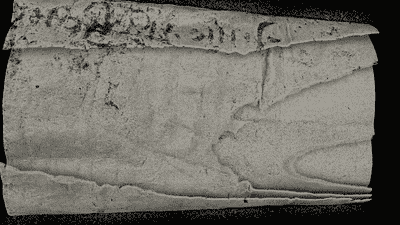

# CT 扫描仪的使用和滥用

> 原文：<https://hackaday.com/2018/09/20/the-use-and-abuse-of-ct-scanners/>

大卫·米尔斯是医学成像前沿的研究科学家。他的工作不包括你在医院里可能发现自己被推进去的扫描仪，如果你不幸受伤的话。他正在用更高级的设备工作，他在一所大学牙科学院用更小、分辨率非常高的 CT 扫描仪推动艺术的发展。

他也是 Hackaday 的朋友，今年夏天他在 EMF 夏令营关于 CT 扫描仪有趣用途的演讲让我们很兴奋。大卫用这些工具的历史、一些牙齿和骨骼扫描的例子带我们进入那个世界，然后深入研究他的非常专业的设备已经应用的一些更不寻常的应用。休息过后，请和我一起探讨鲜为人知的利用 x 射线技术的方法。

## CT 扫描旧文件

橡子和 CT 扫描仪和旧文件有什么关系？随着时间的推移，印刷的记录会退化，最终，仅仅是展开卷轴的行为就可能给古代文物带来厄运。如果不动的话，信息仍然在那里，巧妙的使用 x 光可以读取它。

Flythrough of a CT Scannned scroll via the [Apocalypto Project](https://www.youtube.com/watch?v=ZtUPuTgKJoE)

事实证明，像橡子这样的水果是许多历史文献中使用的墨水的原料。大卫用一颗寄生瘿蜂定居的橡子的扫描来说明橡子中的矿化是如何在 CT 扫描中被轻易发现的。文件中油墨的矿化也应如此。

这项技术的第一次测试是在英格兰诺福克的一套卷起的羊皮纸中世纪庄园记录上进行的。他们能够产生一个可读的虚拟展开！在这一突破之后，荷兰的一家邮政博物馆带着一套 17 世纪未开封的信件找到了他们，这是一个正在进行的项目，由于作者用来吸收多余墨水的粉末贝壳和信封上使用的蜡封中的铅污染，这个项目带来了特殊的挑战。

## 经典英国喜剧的拯救

今年早些时候，我们报道了一些非常古老、非常罕见、非常受损的电影《T2》的发现和复原。那是大卫·米尔斯的一些作品！似乎在历史扫描的世界里，一旦你成功了，消息就会传开，你就会被有趣的艺术品包围。

英国广播公司有一些严重退化的三醋酸酯胶片，其中包含英国喜剧二人组[埃里克·莫克姆和厄尼·怀斯](https://en.wikipedia.org/wiki/Morecambe_and_Wise)丢失的一集，并希望尽可能从中恢复。说它状况糟糕是一种保守的说法。

这种类型的薄膜在分解时会释放出乙酸，进一步加速对薄膜的损坏。就像写好的卷轴一样，试图展开这部电影会毁掉它。大卫的团队首先使用激光切割机将融合的胶片卷分割成足够小的片段，以供扫描仪使用。他们已经从中检索出可识别的图像，但仍有许多工作要做。他们与英国广播公司的一个团队合作，正在开发软件来帮助后期处理，以帮助消除失真，并希望很快恢复这些英国传统之一:一个新的莫克姆和明智的圣诞电视节目。

## 有时候你必须找点乐子

当然，和我们任何人一样，使用稀有而又令人敬畏的工具会带来一些有趣的副业。[大卫用 x 光检查了他的午餐，并在社交媒体上举办比赛，猜测他今天吃什么](https://twitter.com/dtl)。想知道 x 射线发射器在运行时是什么样子，他们扫描了一部相机正在转动的 iPhone。由此产生的视频带有 x 射线干扰相机产生的白点。他还提到想象一个不起作用的 pound shop USB 集线器，事实证明它的所有端口都是并行连接的，下面是一个黑色的环氧树脂块，没有芯片。似乎一英镑只能维持这么久。

我们大多数人永远不会遇到 CT 扫描仪，但大卫的讲话给我们提供了一个有趣和丰富的旅程，进入这个令人兴奋的领域。看看吧，这是一个值得花半个小时的方法。

 [https://www.youtube.com/embed/g0Kl8UkOFxs?version=3&rel=1&showsearch=0&showinfo=1&iv_load_policy=1&fs=1&hl=en-US&autohide=2&wmode=transparent](https://www.youtube.com/embed/g0Kl8UkOFxs?version=3&rel=1&showsearch=0&showinfo=1&iv_load_policy=1&fs=1&hl=en-US&autohide=2&wmode=transparent)

