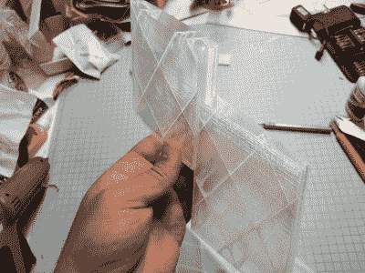

# 看起来很棒的 3D 打印遥控飞机充满了设计考虑

> 原文：<https://hackaday.com/2018/09/11/awesome-looking-3d-printed-rc-plane-is-full-of-design-considerations/>

设计和 3D 打印遥控飞机提供了几个有趣的挑战，所以除了令人敬畏的外观和快速飞行，[本地魔神]的北部派克建造绝对值得一看。浏览这个论坛可以找到一些细节，但是在[的个人主页](https://www.thingiverse.com/thing:3040294)上也有很多。

Tongue-and-groove joint

自然，对于遥控飞机，重量是一个问题。你上一次像他那样用 0%填充物是什么时候？这些部分也只有一个周长，使这个薄壁结构。他甚至在机翼内部的翼梁上切出圆圈。为了获得额外的强度，沃尔玛的廉价碳纤维箭充当主翼部分的翼梁。增加了更多的强度，大多数零件都配有榫槽装配，使得连接比其他方式更牢固。这种开槽连接也可以作为两个机翼部分的翼梁。为了应对更高的温度，他推荐 PETG、ABS、ASA、聚碳酸酯和尼龙用于发动机支架和防火墙，而飞机的其余部分可以用 PLA 打印。

从下面的视频中可以看出，【localmoner 的】flier 是一台高性能的 3D 打印机器。但是这种机器不一定要被放到空中，就像这艘遥控喷射船展示的那样。尽管[有些确实悬浮在薄薄的气垫上](https://hackaday.com/2018/01/11/3d-printed-hovercraft-takes-flight/)。

当他开始第一次飞行时，他知道他不需要折腾得太厉害。

 [https://www.youtube.com/embed/1Wrvbb9pe58?version=3&rel=1&showsearch=0&showinfo=1&iv_load_policy=1&fs=1&hl=en-US&autohide=2&wmode=transparent](https://www.youtube.com/embed/1Wrvbb9pe58?version=3&rel=1&showsearch=0&showinfo=1&iv_load_policy=1&fs=1&hl=en-US&autohide=2&wmode=transparent)

 [https://www.youtube.com/embed/JRH7djd_E_w?version=3&rel=1&showsearch=0&showinfo=1&iv_load_policy=1&fs=1&hl=en-US&autohide=2&wmode=transparent](https://www.youtube.com/embed/JRH7djd_E_w?version=3&rel=1&showsearch=0&showinfo=1&iv_load_policy=1&fs=1&hl=en-US&autohide=2&wmode=transparent)

我们非常感谢[Aidan]提供这个提示。