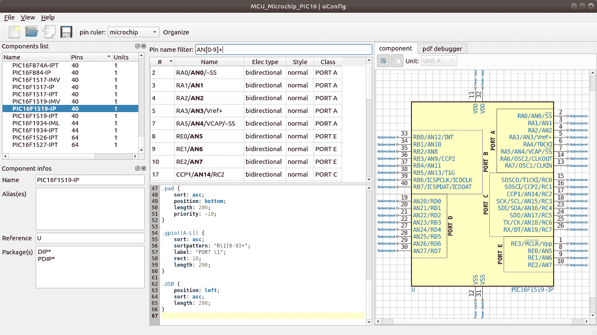

# Automagic 工具从 pdf 制作 KiCAD 原理图符号

> 原文：<https://hackaday.com/2018/09/11/automagic-tool-makes-kicad-schematic-symbols-from-pdfs/>

上次我们谈到一个 KiCAD 工具，它描述了一种使手工组装的禅宗式任务更加方便的方法。但是 EE CAD 任务中最繁重部分——零件创建——怎么办呢？家庭制造商可能无法获得昂贵的零件库订阅或团队来为他们创建零件，所以他们只能手工创建零件。如果梦想工具存在，它可以自己阅读该死的 PDF 文件并制作零件，那会怎么样？原来[Sébastien]制作了这个工具，它被称为 uConfig。

uConfig 有一个非常简单的前提。它抓取 PDF 格式的制造商数据表，找到它认为是带有引脚名称、功能等的零件图，并将结果作为 KiCAD 库中的零件发出。为了帮助最终的转换，[Sébastien]添加了规则引擎，该引擎[使用他的自定义 KiCAD 样式表](https://github.com/Robotips/uConfig/blob/master/rules/)来指定如何对 pin 进行分类。在简单的情况下，引擎可以字符串匹配或使用正则表达式让您指定类似“所有名为 VDD[A-C]的引脚应该是电源引脚”。但它也可以用来移动它认为属于“GPIOB”的所有东西，并把它们贴在创建的符号的底部。我们可以想象这样的功能在分解巨大的部件时会有特别的用途，比如[芯片上的 400 球喙骨](https://octavosystems.com/octavo_products/osd335x/)。

谢谢你的提示！