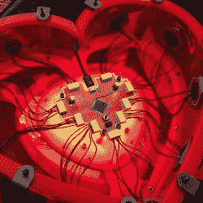

# “她邦”是一个巧妙的，可穿戴的，感性的，传感平台

> 原文：<https://hackaday.com/2018/09/19/she-bon-is-an-artful-wearable-sensual-sensing-platform/>

SHE BON (这是法语 *bon* ，或“好”)是由[莎拉·佩特库斯]设计的一个雄心勃勃的项目，它由一系列可穿戴的电子和机械元件组成，这些元件组合成一个系统，只有一个目的:感知和指示女性的觉醒。作为围绕性话题增加讨论和开放的支持者，[Sarah]的目标是将一些隐藏的东西变成明显和公开的东西，同时在这个过程中赋予它某种艺术天赋。

 该系统的核心是一个心形的可穿戴背包，所有其他传感器和反馈元件都从这里连接起来。在系统的设计上花了很多心思，确保不同模块的反馈具有艺术角度，同时穿着舒适，而且[Sarah]似乎有巧妙设计的诀窍。有些元素已经完成，有些仍在进行中，但是系统有完整的文档，对整体有清晰的愿景。这是一个不同寻常且令人着迷的项目，并且[是 2018 年 Hackaday 奖人机界面部分的决赛选手](https://hackaday.com/2018/09/05/twenty-projects-that-just-won-the-human-computer-interface-challenge/)之一。说到这里，[乐器挑战赛](https://hackaday.io/prize/details#five)正在进行中，一定要来看看哦！

The [HackadayPrize2018](https://hackaday.io/prize) is Sponsored by:     