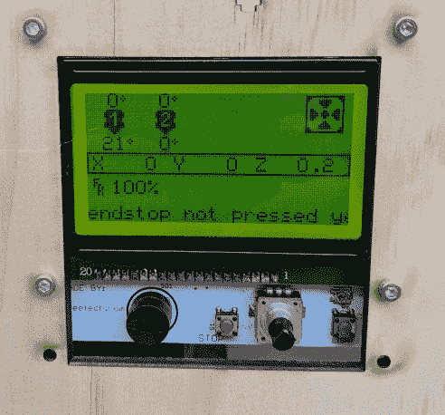
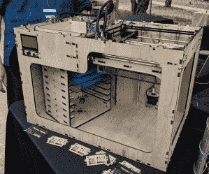
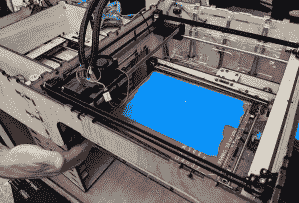
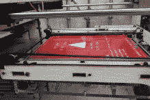
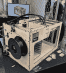
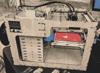
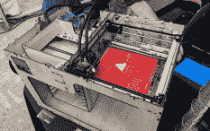

# 纽约 Maker Faire:无限自主 3D 打印

> 原文：<https://hackaday.com/2018/09/27/maker-faire-ny-infinite-autonomous-3d-printing/>

虽然这不是一个从中国直接运来的价值 200 美元的打印机的想法，但在过去几年里，3D 打印世界中最具创新性的想法之一是将塑料放在传送带上。是的，MakerBot 早在 2010 年就在这么做了，但我们不会谈论这个。在传送带上打印而不是在静态床上打印，可以让您自动轻松地打印多个对象，无需任何人工干预。如果你真的很聪明，你可以旋转热端 45 度，建造一个无限长的塑料片，就像[打印机【比尔·斯蒂尔】建造的](https://hackaday.com/2017/03/25/mrrf-17-the-infinite-build-volume-printer/)、[黑带](https://hackaday.com/2017/05/12/another-printer-with-an-infinite-build-volume/)，或者“CAD 文件可能存在于某个地方” [Printrbot 无限构建卷打印机](https://hackaday.com/2017/06/30/printrbot-teases-infinite-build-volume-printer/)。

在今年的世界创客大会上，我们没有看到无限打印机，但我们确实瞥见了一个可以可靠地将 3D 打印机投入生产的想法。这是一台多打印机自主 3D 打印机，由【Thomas Vagnini】设计和制造。

使用 3D 打印机进行生产和制造的想法是一个经过充分研究的问题。Lulzbot 有一个加热的房间，里面放满了他们用来制造所有机器的打印机。Prusa 的制造工厂同样装备精良。然而，这两种设置都需要助手猴子从床上取下一个零件，并为下一次打印设置机器。

              

不是一个严格的手动过程，[托马斯]'机器使用一种墨盒为基础的系统的印刷床。玻璃床储存在一个盒子里，对于第一次打印，打印机通过传送带系统将玻璃床拉到加热的构建板上。当打印完成时，零件和底座被送入旋转盒中，在那里可以由技术人员取出，为下一次打印做准备，并放回“底座进给器”中。这是一个将 3D 打印机的人工干预周期时间降至零的系统。如果你生产数百个零件，这将大大加快生产速度。

虽然这是一个相对小众的想法，但这是一台设计非常好的机器。它全部是激光切割，使用 core-XY 机制，通过适当的调整，它确实做到了它所说的那样。这并不适合所有人，但这也是在 3D 打印机上制造零件的目的。