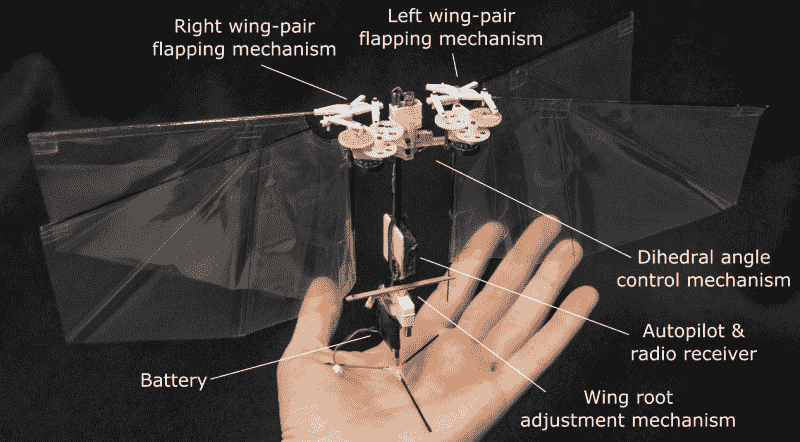

# 机器人果蝇不会吃你的水果

> 原文：<https://hackaday.com/2018/09/18/robotic-fruit-fly-wont-eat-your-fruit/>

自从我们上次检查后，DelFly 项目一直很忙。荷兰团队 13 年前开始生产最小的携带相机的无人机和自主微型扑翼飞机。然而，现在已经五岁的扑翼飞机必须使用一些传统的控制表面和像飞机一样的尾巴，这显然不像果蝇。现在他们已经解决了这些问题，并公布了一款 13 英寸 1 盎司重的扑翼飞机。你可以在下面的视频中看到 Nimble。

对真实苍蝇的近距离模拟意味着这东西在飞行中看起来明显像昆虫。双翼使用聚酯薄膜，并形成一个 X 配置。它们每秒扇动 17 次。充满电的电池——记住，整个电池重一盎司——可以用五分钟。凭借每秒 3 米的有效速度，该团队声称飞行范围超过 1 公里，峰值速度可达每秒 7 米。它甚至可以携带有效载荷，只要有效载荷的重量不超过 4 克。

这个微型机器人有两个旋转伺服致动器，每对翅膀一个，还有两个扑翼机构。他们的网站上有很多技术细节，但它引起了我们的注意，飞行计算机是 STM32 微控制器。

我们假设这有某种间谍应用，但 DelFly 说他们想用这台机器来研究昆虫飞行动力学。我们会相信它的表面价值。

如果你想看以前的版本，它清楚地显示了飞机的尾翼和操纵面，[我们之前已经看过了](https://hackaday.com/2013/12/23/the-worlds-first-autonomous-flapping-mav/)。如果你想知道对于一只自主的果蝇来说,[是什么样子，我们也可以帮你。](https://hackaday.com/2010/07/13/delfly2-and-delfly-micro/)

 [https://www.youtube.com/embed/CEhu-FePBC0?version=3&rel=1&showsearch=0&showinfo=1&iv_load_policy=1&fs=1&hl=en-US&autohide=2&wmode=transparent](https://www.youtube.com/embed/CEhu-FePBC0?version=3&rel=1&showsearch=0&showinfo=1&iv_load_policy=1&fs=1&hl=en-US&autohide=2&wmode=transparent)

照片由代尔夫特大学提供， [CC BY-SA 4.0](https://creativecommons.org/licenses/by-sa/4.0/)