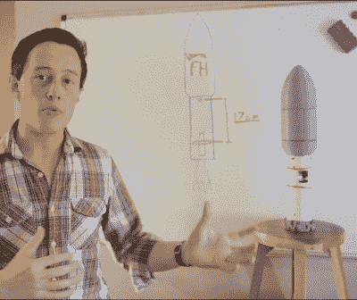

# 另一个 SpaceX 的火箭科学

> 原文：<https://hackaday.com/2018/09/18/rocket-science-with-the-other-spacex/>

当你说某事不是火箭科学时，你的意思是它并不像看起来那么难理解或做。言下之意是，火箭科学是很难的事情，最好留给 SpaceX 或 NASA 这样的公司。但那不是黑客精神。

【乔·巴纳德】最近[了他的猎鹰重型火箭第二级的一次不成功的飞行](https://www.youtube.com/watch?v=gFeDrlu0OpY)和[用这两个简单的概念和推力非常清楚地解释了哪里出了问题](https://www.youtube.com/watch?v=sjNsnxvJIfE)，在这种情况下，推力只是施加在力臂上的力。

不，你没有错过 SpaceX 的一件大事。他的猎鹰重型是自制的，使用模型火箭固体助推器。请注意，它比那个更先进一点，因为[他通过使用伺服电机控制发动机的方向实现了推力矢量](https://hackaday.com/2018/06/20/would-you-look-at-that-yaw-control/)。

这就是问题所在。第二级的惯性如此之小，力矩臂如此之短，以至于推力矢量中即使很小的偏差都会对力矩臂产生很大的影响，导致飞行器偏离期望的路径。你可以在下面的第一个视频中看到这一点。他讨论的另一个问题是高阻力，但我们将把它留给下面的第二个视频，其中包含他的解释和一些图表分析。

所以是的，也许火箭科学*就是*火箭科学。但是没有比走出去开始建设更好的方式了。

 [https://www.youtube.com/embed/gFeDrlu0OpY?version=3&rel=1&showsearch=0&showinfo=1&iv_load_policy=1&fs=1&hl=en-US&autohide=2&wmode=transparent](https://www.youtube.com/embed/gFeDrlu0OpY?version=3&rel=1&showsearch=0&showinfo=1&iv_load_policy=1&fs=1&hl=en-US&autohide=2&wmode=transparent)

 [https://www.youtube.com/embed/sjNsnxvJIfE?version=3&rel=1&showsearch=0&showinfo=1&iv_load_policy=1&fs=1&hl=en-US&autohide=2&wmode=transparent](https://www.youtube.com/embed/sjNsnxvJIfE?version=3&rel=1&showsearch=0&showinfo=1&iv_load_policy=1&fs=1&hl=en-US&autohide=2&wmode=transparent)

