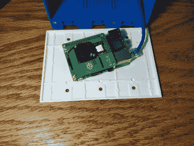

# 黑我的房子:作为基础设施的树莓派

> 原文：<https://hackaday.com/2018/09/26/hack-my-house-raspberry-pi-as-infrastructure/>

我终于有了自己的房子。这是一个收回，我买了一首歌。原本应该是快速改造的工程很快变成了拆除房子里的大部分干墙。在这堆干墙灰尘和松散的绝缘材料上还有一线希望。我可以提前安装所有的东西，而不是根据需要不断地改造电缆和小配件。一块空白的画布，当有房子那么大的时候，可以压倒一个黑客。我花了几个小时思考我房子的基础设施，很多次我希望有一个从黑客的角度写的指南。这是指南，或者至少是它开始。

你想让你的智能房子做什么？你想在你的智能房子里做什么？例如，我希望能够将我的廉价 120 V 焊机升级为更强大的 240 V 型号，因此在车库中添加 240 V 插头是必须的。额外的好处是，同样的 240 V 电路可以用来给电动汽车充电，如果有一辆停在那里的话。

“以太网无处不在”是我的口头禅。试着想象你可能想要插入台式机、笔记本电脑、接入点甚至 VoIP 电话的任何地方。我决定每个房间至少要有两个以太网插座，并试着想象家具的布局，以便把它们放在方便的地方。

问题是并不是所有的东西都使用以太网。我想要温度传感器、门上的磁性开关——哦，还要连接到 HVAC 控制器上，也许还需要一个网络摄像头或运动探测器。再加上控制灯光的 led 和继电器，显然需要一个更好的解决方案。

## Pi 框

我一直很喜欢 Raspberry Pi——它有 USB、GPIO 和 i2c 等接口。一部由[peter_3d] 创作的说明书给了我所需要的灵感。一个 3 组的电箱是树莓派的完美尺寸。Pi 的最新版本，Pi 3 b+支持 PoE 帽子，[，我们最近已经报道过](https://hackaday.com/2018/08/26/rasberry-pi-poe-hat-released/)。

在房子的每个房间，我都在天花板和中央走廊的墙上安装了一个电箱。每一个盒子都有一根以太网电缆连接到房间的中心点，这是我的家庭办公室。每个 Pi 将放在一个 3 宽的空白板上。从这些点中的每一个，我最终可以安装一个温度和湿度传感器，一个网络摄像头，一个运动探测器，或任何数量的其他传感器。走廊墙壁上的单元将得到完整的触摸屏处理。

一个支持 PoE 的智能交换机将为这个网络供电，一个提供 RESTful 接口的 flask 实例将允许将数据拉回到中央控制器，并将命令推回到节点。[马特·理查森]是灵感的一部分，在这个主题上有一个非常好的[入门](http://mattrichardson.com/Raspberry-Pi-Flask/)。中央网络界面可以跟踪温度，控制加热器和空调，并监控门的开关。

我对树莓派的一个长期抱怨是电源不稳定会杀死 SD 卡。从版本 3 开始，Pi 支持在没有 SD 卡的情况下通过网络引导。所有的文件系统都可以驻留在一个中央服务器上，并通过 NFS 安装，而不是运行到每个设备进行维护(fsck 卡)。关于为树莓派设置 PXE 引导的过程已经足够了，值得专门写一篇文章。

我对我的房子有进一步的计划，树莓派是一个很好的未来扩展平台。下一次，我们将更多地讨论结构化布线、安全摄像头，以及任何您想知道的东西。下面让我知道！