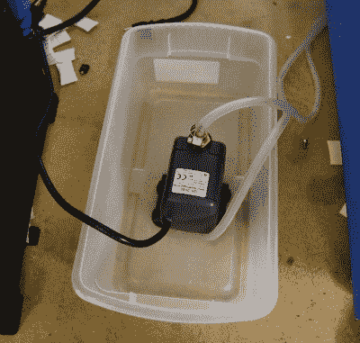
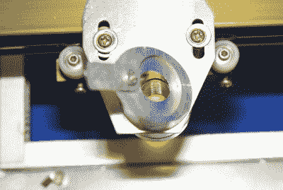

# 激光 Noob:K40 激光入门

> 原文：<https://hackaday.com/2018/09/27/laser-noob-getting-started-with-the-k40-laser/>

当你只需花 350 美元送货上门时，为什么要花数千美元购买激光切割机/雕刻机呢？当然，它没有那些花哨的国产机器好，但勇敢的 K40 是可以做到这一点的小激光器。去艾尔激光商场买一个。是的，这听起来像一个二手车经销商的广告，但它离真相有多远呢？请继续阅读，寻找答案！

激光切割和雕刻机已经存在几十年了。就像 3D 打印机一样，对于在家工作的人来说，它们原本贵得不可思议。最接近业余爱好者的激光器是 Epilog 激光器，对于一个小型激光系统来说，它的价格仍然在 10，000 美元到 20，000 美元之间。一些公司尝试了 Epilog，并且做得很好——特别是 Adafruit 曾经提供笔记本电脑激光雕刻服务。

在过去十年左右的时间里，事情发生了变化。中国卷入其中，突然间市场上出现了廉价的激光器。目前，有几种低成本的激光器型号，有不同的功率等级。最受欢迎的是最小的型号——40 瓦的型号，被称为 K40。有许多制造商，多年来也有许多版本。不过它们看起来都差不多:一个蓝色的金属片盒子，激光管安装在背面。切割室在左侧，电子设备在右侧。早期版本带有 Moshidraw 软件和一个并行接口。

K40 的机械结构没有太大的变化，但电子设备已经更新为带有现代步进驱动器的 USB。毫无疑问，这些都不是“高质量”的机器。它们是按成本建造的。联锁开关不存在。管子过热保护是你的问题。冷却水流量低报警？不，你最好自己留意一下。切割床看起来像是事后想法和某人在备件箱中找到的零件的混合物。排气管进入切割区域 3 英寸。换句话说，这些是黑客的完美机器。

多年来，我一直在易贝观察 K40 和类似的机器。最初这些机器是从中国运来的。如果一个大而重的充有气体的玻璃管能在环游世界的途中存活下来，那简直是冒险。现在，许多机器从加利福尼亚和其他 48 个州的港口运出。我猜机器会被运到美国的仓库，经过测试，然后好的产品会被送到客户手中。

考虑到这一切，我最终决定跳进去，得到一个 K40 激光器。我的第一个问题是决定买哪种激光器。易贝和阿里巴巴充斥着卖家出售不同版本 K40 的拍卖。每个人都说他们比其他人更新更好。有些自吹自擂不同的配件包，如空气辅助，但也更贵。有足够的信息让最有经验的易趣者陷入分析瘫痪状态。

最后，我决定用一种更便宜的(但不是最便宜的)带有数字面板显示器的激光器。我的模型还带有冷却水的温度读数，以及轮子——供那些喜欢滚动台式激光器的人使用。

我点击了“立即购买”按钮，开始等待。这台机器装在 62 磅重的板条箱里，从西海岸装运大约需要一周时间。这给了我足够的时间去订购一些安全设备。

### 激光安全

虽然 K40 可能很便宜，但我不想在安全设备上吝啬。网上有很多激光安全护目镜的供应商。中国有很多这样的公司，但我真的不想冒险去一家我从未听说过的公司。我做了一些调查，最后订购了一双霍尼韦尔生产的。亚马逊在 Prime 上提供了它们，所以它们在 K40 之前就给了我。无论你订购哪一对，都要确保它们适用于二氧化碳激光器。有许多类型的激光器，当涉及到像 K40 这样的红外激光器时，旨在保护你免受紫外医疗激光器伤害的护目镜不会有太大帮助。红外安全眼镜将是清晰的，或几乎如此。但是不要把它们误认为普通的安全眼镜。这些是特制的材料，当你的其他安全措施失败时，它们将帮助你免受 K40 发出的隐形失明光束的伤害。

激光会烧东西，不幸的是，这些东西在激光内部着火是很常见的。我在打印机附近放了一个大型 ABC 干粉灭火器。然而，这只是权宜之计。如果你曾经使用过干粉灭火器，你就会知道它们有多脏。为了保证 K40 和我实验室其他部分的安全，我打算投资一个气体灭火器。CO2 或 Halotron，取决于哪一种在地下室使用更安全。

虽然我从来不打算让激光器无人看管，但我的实验室里也有烟雾探测器。最后，我添加了一个一氧化碳探测器，以确保 K40 不会让房间充满无声杀手。

### 拆箱

Hackaday 不做拆箱视频，但我在拆箱 K40 时得到的印象是它很大——比人们从照片中想象的要大。我的机器尺寸为 32 英寸宽 x 19.75 英寸深 x 10.25 英寸高。谢天谢地，我的工作台就在窗户附近，这是一个完美的家。

### 冷却

K40 激光器是水冷的。所有激光器都包括一个冷却剂泵作为附件。我收到的泵是降低成本的奇迹。这是一个水族馆或池塘泵，有一个磁耦合叶轮。当我使用后看到水顺着 120 伏的电源线从水泵里滴出来时，我很担心。原来泵的后盖甚至没有密封。不需要这样。电机定子和线圈封装在黑色环氧树脂中。只要灌封化合物在适当的位置，就不会有东西接触到电机。它似乎对保持冷却水流动很有效。然而，我不能说我完全信任它与我的激光管的寿命。这个系统将来可能会有一个 mod。

至于冷却剂，我用的是蒸馏水。我的这些早期测试的容器是一个简单的鞋盒大小的塑料容器。它能装一加仑的水，使水泵保持在水下。如果激光有几天不用了，我会把水倒掉，通过向入口管道吹气来清空管子。

### 废气

用激光切割东西会产生烟雾；那是必然的。K40 配备了排气扇，这是相当贫血，至少可以说。它实际上是一个浴室排气扇，扇在激光器的背面。烟雾通过机箱背面的一个切口被吸入，并通过排气管排出。我已经在我实验室的窗户上安装了一个大风扇。虽然没有防护的叶片肯定是危险的，但它移动了大量的空气。这再加上股票排气扇能够保持燃烧木材和塑料的气味下降到合理的水平。然而，我肯定会升级股票排气在未来。

### 对准光学系统

安装这些激光器的第一步可以说是最危险的:对准镜子。这就是为什么我买了好的激光护目镜。关着门在激光器上工作通常是你不想做的事情，因为你无法控制光束的方向。

一直戴着激光安全眼镜，关上门，确保没有其他人走进房间。我的电子管偏离太远了，光束从开着的门射出，在我工作台后面的墙上留下了一个小小的焦痕。如果有其他人站在那里就不好了。

有大量的视频教程可以用来校准 K40 上的镜子。我发现[这个特别有用](https://www.youtube.com/watch?v=e1c3keOKL6Y)。这个想法是为了确保激光点击中光路中三面镜子的中心。其中两个镜子在 X-Y 平台上移动，因此无论它们放置在哪里，都要确保光束击中同一点，这一点很重要。我用了便利贴，而不是许多教程要求的油漆工胶带。在黄色便利贴上比在深蓝色胶带上更容易看到烧伤的痕迹。

这些步骤不需要电脑，只需关闭步进电机，用手移动工作台。当需要发射激光的时候，你只需要点击前面板上的测试按钮。
首先要对准的是管子本身。我的显像管远远没有对准，光束甚至没有射到镜子上。这根管子用两根金属弹簧带固定住。橡胶圈防止带子弄断玻璃管。更多的橡胶充当垫片，使管子垂直对齐。我从试管的左侧移除了一个垫片，并将其添加到右侧。这是一个复杂的过程，因为太用力拧紧螺丝会损坏 K40 最昂贵的部分——激光管。

我发现即使在校准之后，我的 K40 仍然不能正常工作。我用酒精清洗了镜子和激光管，但无济于事。最后我把对焦头拆了。这就是我发现自己问题的地方。头部内部有加工时留下的金属碎片。这些金属片挡住了光路，扰乱了光路。我取出 45 度镜和调焦透镜，然后仔细清洗试管。一旦一切都重新组装，我的 K40 准备行动。

### 软件

激光附带了一张明显烧过的 CD 和一个 u 盘。我的笔记本电脑没有光驱，所以我插入了 u 盘，但什么也没找到。它不是真正的驱动器，而是一个解锁激光驱动软件的加密狗。在使用 K40 之前，我必须找到我的 USB 光驱。光盘上的大多数文件名都是中文的。一些挖掘最终让我找到了一份科雷尔激光的档案。这是 Corel Draw 的副本，带有驱动 K40 的插件。Corel Draw 的副本几乎可以肯定是非法破解的副本。我从一个转投 Adobe 的朋友那里得到了一份合法的基本拷贝。

简单来说，CorelLaser 给你一个工具栏，可以剪切或雕刻任何加载到 Corel Draw 的图像。尽管切割和雕刻是非常不同的过程。切割是一种矢量操作。激光将追踪图像中每一条线的路径。雕刻是光栅的事情。激光将逐行绘制图像，从左到右，从上到下。您也可以通过在软件中创建切割层和雕刻层，在同一设计上执行这两个过程。

我很快就在这个软件上遇到了麻烦。每当我试图切割时，激光头都移动缓慢。改变运动设置没有帮助。一些挖掘最终把我指向了 CorelLaser 的设置页面。在这里我发现“主板”设置是错误的。该值必须与激光主板上丝网印刷的型号相匹配。当然，主板的安装方式让你看不清型号，但一张快速的手机照片修复了这个问题。我的型号是 6c 6879-激光-M2。主板固件的日期是 2018-01-08，所以主板肯定是在那之后的某个时候建造的。

我原以为科雷尔瑟会是一团乱麻。老实说，还不错。它肯定有一些令人抓狂的怪癖，但总的来说，它做了它应该做的事情——驱动步进机和开关激光器。我发现的最大怪癖是线宽。Corel 默认“发际线”为线宽。这大于激光切口，因此 CorelLaser 将其解释为两条平行路径。用 K40 追踪两条接近的路径会让你想切的东西烧得乱七八糟。解决方法是选择文档中的所有内容，然后点击 F12，将线宽更改为 0.001 毫米。CorelLaser 将按照您的预期运行。

### 使用哪些材料(以及避免使用哪些材料)

切什么？与任何激光切割机一样，必须考虑切割的材料。一般来说，木材是可以安全切割的，纸张、布料、三聚氰胺、纸板、哑光纸板、软木、一些橡胶、天然皮革和可丽安也是如此。雕刻可以在玻璃、石头、阳极氧化铝、钢(带有激光雕刻涂层)和其他材料上进行。

有些塑料不能用激光切割机切割。任何含氯的东西——特别是 PVC 和乙烯基。燃烧聚氯乙烯会产生氯气和盐酸，氯气会杀死使用者，盐酸会让你的 K40 生锈，严重到你的近亲都无法享用。一个简单的氯测试是铜线燃烧测试，这可以在纽约电阻器公司的[Adam]和[Zach]10 年前的视频中看到。ABS 塑料是另一个要避免的。它容易融化，切割起来很麻烦。它还会释放微量的氰化物气体。如果你对某一种材料不确定，可以看看有激光的黑客空间。如果他们不在他们的激光上切割，你可能也不应该。

### 切割和雕刻

切割和雕刻是我们在这里的目的，对吗？学习激光的乐趣在于弄清楚如何为不同的材料设置软件。有了激光，你有三个变量可以利用。激光功率、速度和通过次数。激光功率由 K40 的前面板控制。它要么是一个旋钮和一个不准确的毫安计，要么是一个以功率百分比表示的数字控制。多次切割比只切割一次更麻烦，所以留到真正需要的时候再做。

这里有一些指南——我发现[这一页](https://www.cs.cmu.edu/afs/cs/academic/class/99353-f16/speedsfeeds_RL.pdf) [是一个很好的起点](https://www.cs.cmu.edu/afs/cs/academic/class/99353-f16/speedsfeeds_RL.pdf),用于计算给定材料的运行速度和功率水平。我通常会使用该网站的速度，然后从低得多的激光功率开始。在碎片上测试，我会不断提高功率直到我有一个干净的切口。如果功率低于 50%，我一般会坚持，不调整速度。

你绝对应该记下你所使用的东西。在我的激光上，我发现了一个深深的雕刻，⅛“丙烯酸以 50%和 320 毫米/秒切割⅛”桦木胶合板在 25%的功率和 5 毫米/秒下效果最好。请记住，K40 上的质量控制是不存在的，光束焦点将很重要，所以你的设备可能与我的不同。此外，根据水分含量和其他变量，胶合板和丙烯酸树脂等材料可能因批次而异。总是买一些额外的材料作为你设置中拨号的废料。

### 表演

那么 K40 在“原浆”状态下有多好呢？实际上相当不错。我能够以不到 50%的功率一次性切割⅛“桦木胶合板和⅛”丙烯酸树脂。每一次切割完成后，零件都会掉落。这是一个激光器，所以，当然，在边缘上有一些木头烧焦的痕迹，但是没有什么是砂纸不能修复的。作为拷问测试，我拍了 Hackaday 的 logo。svg 文件加载到 CorelLaser，设置线宽为 0.001 毫米，然后点击 go。K40 忠实地切断了快乐扳手，给了我一个小拼图的碎片，试图重新组合在一起。
雕刻性能也很好——我能够将简单的黑白图像(和文字)切割到木头和亚克力上。我明白这对于制作带有标签灯和开关的控制面板是多么完美。

### 摘要

K40 是一种廉价的激光雕刻机/切割机。然而，它是非常能干的，即使是在未经修改的情况下使用。也就是说，cutter 是一个很好的修改平台。你可以打赌，我会花一些时间给我的 K40 增加空气辅助和一个更好的床，以及减少排气管。