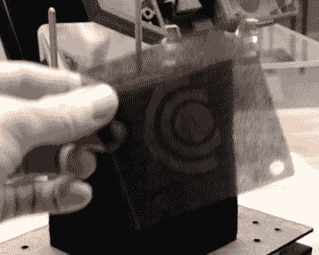
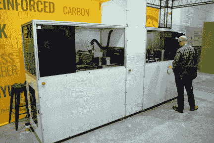
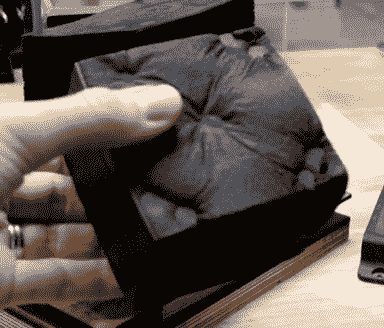
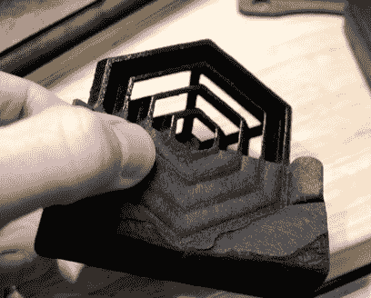
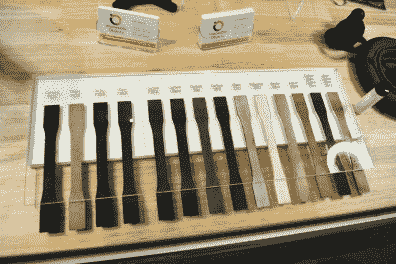
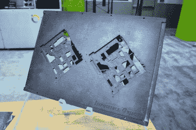
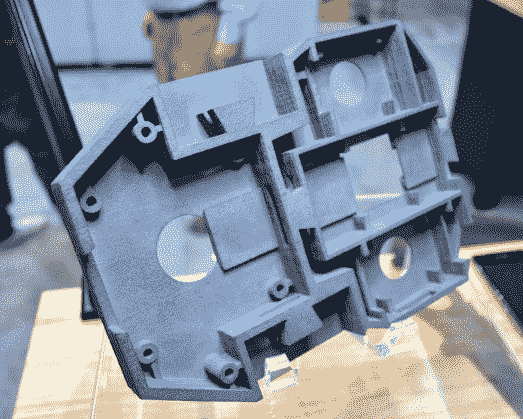
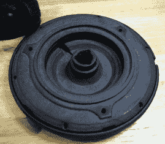

# 工业 3D 打印使用了我们从未见过的图层

> 原文：<https://hackaday.com/2018/09/19/industrial-3d-printing-uses-layers-like-weve-never-seen-before/>

我们已经看到 FDM 打印机通过挤压塑料成一条线放下层。我们已经看到打印机使用烧结和光刻来熔化或固化一层，然后更多的打印介质移动到下一层。我们以前从未见过这样的打印机，它能从不同的基材层中制造零件。

在上周的国际制造技术展上，我和埃里克谈到了不可能的物体。该公司正在使用一种“薄板层压工艺”，首先在碳纤维或玻璃纤维上印刷每一层，然后使用液压机和烤箱烘烤零件，然后用珠光处理去除多余的基底。查看我对埃里克的采访，并在下面加入我以获得更多的图片和细节。

 [https://www.youtube.com/embed/TL2uncdat8I?version=3&rel=1&showsearch=0&showinfo=1&iv_load_policy=1&fs=1&hl=en-US&autohide=2&wmode=transparent](https://www.youtube.com/embed/TL2uncdat8I?version=3&rel=1&showsearch=0&showinfo=1&iv_load_policy=1&fs=1&hl=en-US&autohide=2&wmode=transparent)

令人难以置信的是，看到一个单独打印各层的过程，使用孔来对齐棒上的所有层，然后将它们融合在一起。我被告知精确度和分辨率相当好，但没有一个指标来支持这一点。平行于层运行时精度最好，因此宽平面部分将产生一致的结果。需要许多层的非常高的零件最终会在精度上出现变化。

**更新:**我们向不可能的物体询问了这一过程的精度和层高限制，得到了以下解释:

> 该过程不推荐层限制。Z 高度目前受限于我们能找到的热压机的尺寸。理论上我们可以有一个更高的 Z 值，但是它 A)需要足够大，以适合松散的一叠板材，B)提供足够的能量，以熔化零件中心的热塑性粉末。
> 
> 当几何图形的 Z 高度输入印刷机时，印刷机将停止在所需的高度。我们将任何膨胀/收缩都考虑在内，它会相应地进行调整。但简短问题的长答案是，精度仍在 50-200 微米范围内。

  Single sheet of substrate thermoplastic  Sheet printer

在这个过程中使用的衬底是非常薄和纤细的。打印机本身通过使用喷墨打印来沉积粘合剂的过程来移动基底。然后，将粉末状热塑性塑料涂在粘合剂上，多余的部分回收。这些层在机器末端自动按顺序堆叠。

  Compressed and baked part  Half of substrate removed

该过程的第二部分是在压机中压缩这些层，并烘烤它们以将热塑性塑料熔化成固体。然后使用喷丸处理去除多余的基底。根据您的应用，零件现在可以使用，或者可以通过机械加工、添加螺纹嵌件或其他复合材料常用工艺进行进一步加工。

  Material examples  Carbon Fiber PEEK jig for wave soldering

有一系列材料可用于这项技术。它们取决于所选择的基底和热塑性塑料。他们手头上一个更有趣的例子是由碳纤维增强聚醚醚酮(PEEK)制成的。这种材料耐热性极好，拿在手里感觉像金属。这个特殊的演示是一个夹具，用于在波峰焊接过程中固定 PCB。

      

你最终得到的是复合材料部件，这些部件与粉末或树脂工艺打印的部件具有非常不同的特性。这些部件通过基材的纤维得到增强，肯定会在制造业中找到其他添加技术无法满足的应用的热切客户。

如果你喜欢这个，一定要看看我们在 IMTS 看到的直接金属印刷设备。