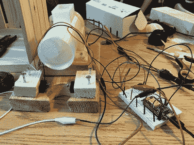

# 通过 Twitch 喂狗是最新的电子竞技热潮

> 原文：<https://hackaday.com/2018/09/24/feeding-dogs-over-twitch-is-latest-e-sport-craze/>

现代社交网络推动的互联网最喜欢两件事:宠物和看别人做事。温顿·瑟夫家的文件柜后面可能藏着一个卷轴，预言任何能够驾驭这两个元素的人都将获得互联网的控制权 *Ready Player One* style。如果是这样，我们认为[泰勒·皮尔斯]正在登上王位。

 为了让*看守*抽动未婚妻的溪流更加诱人，[【泰勒】想出了一个办法，让观众通过在聊天中丢下一个命令来喂他们的狗拉里](https://www.tylerpearce.ca/twitch-dog-treat-dispenser-bot/)。有一个令人惊讶的复杂的软件和硬件舞蹈来使这种可靠性和视觉吸引力，但这是值得的，因为表演在竞争激烈的电子竞技的勇敢新世界中很重要。我们假设在封面上有堡垒之夜球员的那期《ESPN 杂志》上是这么说的，但是在 Hackaday 没有人有资格订阅它，所以我们真的不确定。

运行在电脑上的服务器为 treat 系统提供了一个光滑的管理仪表板，包括谁在什么时候喂过 Larry 的运行日志。还有一些检查到位，以防止在短时间内分发太多的糖果，并防止个人向系统发送垃圾邮件。

在硬件方面，他使用两个连接到本地 MQTT 经纪人的 NodeMCU ESP8266 微控制器:一个处理照明，另一个运行 3D 打印螺旋，实际上将食物推出。打印的螺旋钻由标准的业余爱好伺服系统驱动，甚至包括一个红外传感器，当它检测到糖果已经分发时，会自动停止旋转。[Tyler]报告说螺旋钻工作得很好，尽管如果装得太满会有堵塞的趋势。

这些年来，我们已经看到了各种各样的自动化宠物喂食器，甚至还有拥有自己电子邮件账户的喂食器。所以他们来 Twitch 可能只是时间问题。[如果可以用它安装 Linux】，为什么不用它来喂狗呢？或者别人的，视情况而定。](https://hackaday.com/2015/10/30/delightfully-horrible-idea-twitch-installs-linux/)