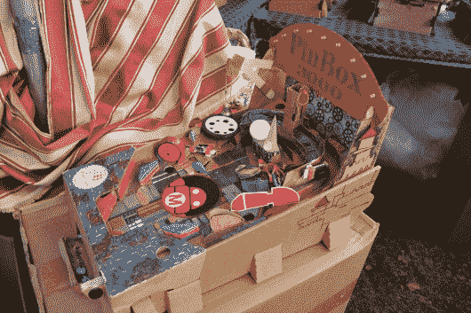
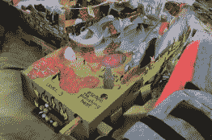
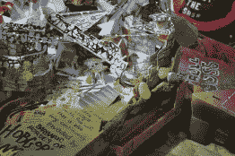
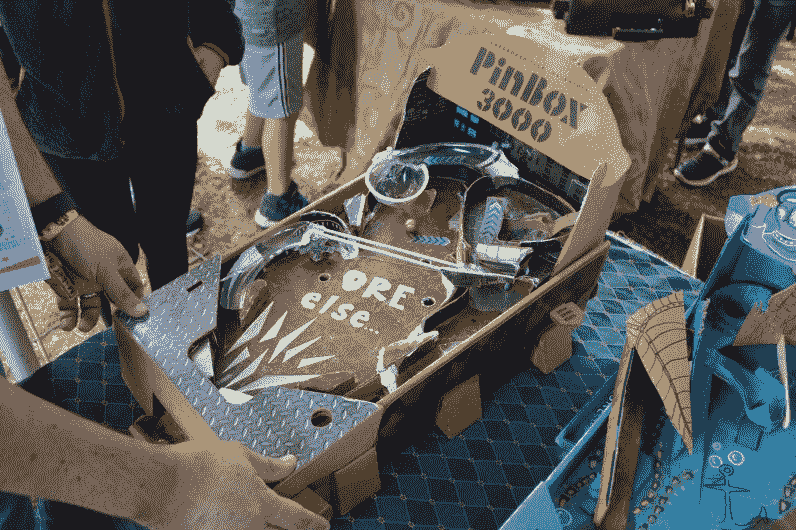
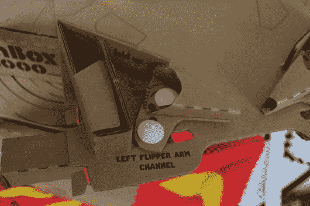
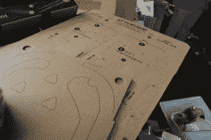
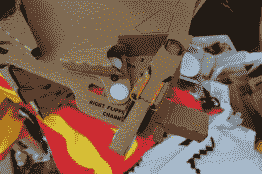

# 这个弹球游戏不是装在盒子里的…它就是盒子

> 原文：<https://hackaday.com/2018/09/23/this-pinball-game-doesnt-come-in-a-box-it-is-the-box/>

弹球仍然有一点魔力，使它从第一人称射击游戏或那些在公共汽车上消耗你时间的屏幕捣碎器中脱颖而出。秘方是运动和反馈的感觉，以及当球在重力作用下穿过运动场时失去控制的感觉。当然，真正的问题是找到一个弹球机。Pinbox 3000 正以一种创造性的方式解决这个问题。这是一个纸板弹球机，你可以自己制作和装饰。

  Pinbox with electronics    Pinbox with bell  Pinbox with plastic packaging as obstacles

周末，我们在纽约的 Maker Faire 遇到了他们，展位上挤满了孩子和成年人，他们都在捣鼓脚蹼，让弹球继续发挥作用。该套件以平板包装纸板的形式提供，已经划线并印有组装指南，组装时间约为一小时。

      

这个设计非常巧妙，材料仅限于纸板、橡皮筋和一些塑料铆钉。发射弹球的活塞和鳍状肢都出奇的结实。它们经得起很大的力，从展出的模型来看，似乎纸板与纸板之间的摩擦点才是问题所在，而不是玩家施加的力导致机械装置弯曲。

第一次组装时，操场是空白的。这并没有阻止这套背靠背堆叠的玩家对战游戏的乐趣。操场顶部有一个洞，这让我感觉有点像在现实生活中打乒乓球。然而，该套件真正的亮点在于定制你自己的游戏。实际上，你正在建立一个你能想象到的最有创意的大理石跑道。这个任务很好地展示了纸板，模压塑料包装(通常是垃圾填埋场)巧妙地放置，加上一些噪音和灯光效果。该公司一直在努力收集制造这种机器的灵感和范例。我们喜欢在 Pinbox 中融入多层次的参与，从构建库存工具包，到充实运动场，甚至到添加自己的电子设备，如音频效果。

观看下面的视频，了解 Maker Faire 展台的乐趣。

 [https://www.youtube.com/embed/iGRKAVvXIMQ?version=3&rel=1&showsearch=0&showinfo=1&iv_load_policy=1&fs=1&hl=en-US&autohide=2&wmode=transparent](https://www.youtube.com/embed/iGRKAVvXIMQ?version=3&rel=1&showsearch=0&showinfo=1&iv_load_policy=1&fs=1&hl=en-US&autohide=2&wmode=transparent)

