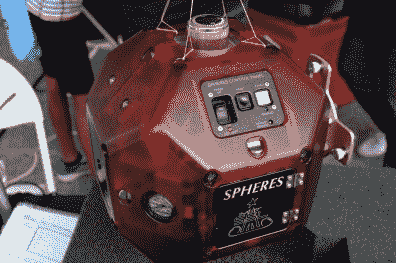
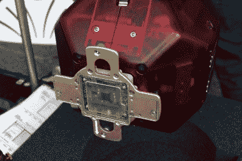
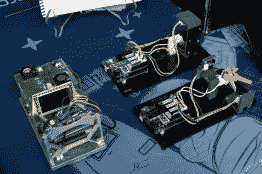
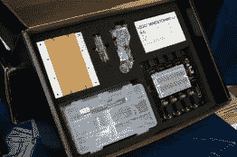

# 纽约制造商博览会:为最后的前沿发展

> 原文：<https://hackaday.com/2018/09/28/maker-faire-ny-developing-for-the-final-frontier/>

将一件硬件送入太空的成本现在比以往任何时候都更便宜，这在很大程度上要归功于 SpaceX 等商业发射提供商取得的快速进步。在不久的将来，随着更多的低成本供应商上线，它应该会变得更便宜。几年内，我们可能会看到低地球轨道的每公斤成本是航天飞机的十分之一。可以肯定的是，这是一个非常令人兴奋的设计和建造航天器的时代。

但是，无论发射到轨道上的成本有多低，都不会比简单地通过电子邮件将一些源代码发送到国际空间站(ISS)便宜。考虑到这一点，有几个项目为学生提供了最接近预订猎鹰 9 号的机会:[有机会开发可以在空间站上运行的软件](http://www.spacestationexplorers.org)。在纽约举行的 2018 年世界创客大会上，我们有机会近距离接触已经在轨道上运行的硬件的功能复制品，在太空术语中称为“地面单元”。

展出的是自 2006 年以来一直在国际空间站上的球体自由飞行卫星的复制品。它们大约有足球大小，利用二氧化碳推进器和超声波传感器在空间站内移动。由麻省理工学院设计，作为一种研究航天技术的方法，如对接和导航，而没有使用全尺寸飞行器的费用和风险，SPHERES 卫星可能是唯一从未暴露在太空中的运行中的航天器。

    Expansion port for additional hardware.

麻省理工学院现在举办一年一度的“零机器人”竞赛，该竞赛要求中学生使用 SPHERES 卫星解决一个特定的挑战。参赛者在模拟器上运行他们的程序，直到决赛，决赛使用国际空间站上的真实硬件进行，并向学校直播。

我们还看到了来自“Quest for Space”的硬件，这是一家为小学到高中学生提供课程的公司，不仅包括地面单元，而且当学校决定将代码发送到空间站上的匹配硬件时，还提供培训和技术支持。如果收取额外费用，他们甚至可以与学校合作设计、启动和恢复一个定制的硬件实验。

他们的标准硬件基于现成的平台,如 Arduino 和乐高 Mindstorms EV3，这有利于学校现有 STEM 项目的轻松过渡。目前在轨道上的硬件是为处理吸热、湿度和对流的实验而设置的，但“探索太空”指出，他们每两年更换一次硬件，以提供不同的实验机会。

      

像这样的项目，再加上之前像 ArduSat 这样的努力，为大众提供了一种与空间联系的独特方式，这在 21 世纪之前是不可想象的。2018 年阅读 Hackaday 的任何人是否会*个人*有机会摆脱地球的粗暴束缚仍有待讨论，但至少你可以放心，因为你知道你的软件错误可以搭便车离开地球。