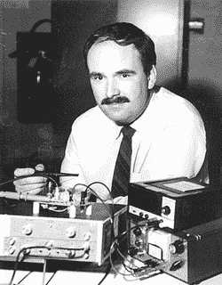
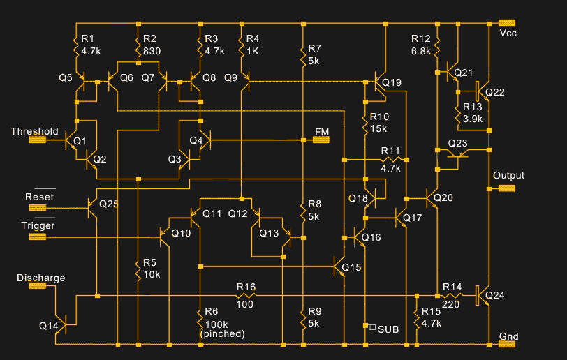
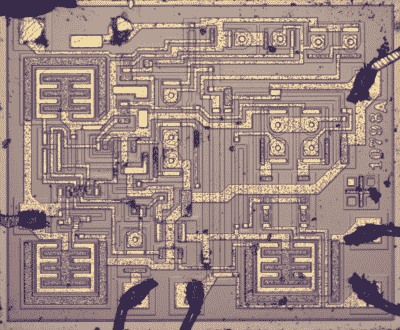

# 555 以及它是如何变成这样的

> 原文：<https://hackaday.com/2018/10/10/the-555-and-how-it-got-that-way/>

典型的黑客读者在商店里的任何时候都可能有一套最少的东西在触手可及的地方。焊台？大概吧。示波器？也许吧。万用表？很有可能。但是有一样东西是如此的基本，没有它无数的项目将更加难以完成，以至于一个没有一个或十几个复制品的商店几乎是不可想象的。它是不起眼的 555 定时器芯片，一个有八条引线的黑色塑料小块，只需几个额外的组件就可以做任何事情，从每秒闪烁几次 LED 到创造音乐和声音效果。

我们之前已经看过 555 的引擎盖，并展示了[许多](https://hackaday.com/2017/12/13/the-tiniest-of-555-pianos/)、[许多](https://hackaday.com/2017/10/06/fighting-machine-tool-chatter-with-a-555-timer/)项目，这些项目很好地展示了这款古老芯片的多重个性。但是我们还没有看大家的第一个芯片是怎么产生的，是什么激发了它的设计。以下是 555 的故事，以及它是如何成为这样的。

## 完美的时机

Hans R. Camenzind. Source: [IEEE Spectrum](https://spectrum.ieee.org/tech-history/silicon-revolution/chip-hall-of-fame-signetics-ne555)

对于瑞士出生的工程师汉斯·卡门辛德来说，20 世纪 60 年代是一个大杂烩。他在本世纪初来到美国，并在东北大学获得了硕士学位。在那些日子里，波士顿周围的社区圈正成为技术的圣地，汉斯想参与其中。但有了妻子和即将出生的孩子，一个人必须做他必须做的事情，他在马萨诸塞州的 P.R. Mallory 公司找到了一份工作，该公司主要从事干电池业务。

马洛里算不上是一家尖端科技公司，但汉斯坚持了六年，希望这家古板的公司能开拓出比电池更令人兴奋的领域。事实并非如此，汉斯开始用简历轰炸东海岸到西海岸的科技公司。1968 年，他与 Signetics 签约，这是一家年轻的硅谷公司，由前飞兆工程师创办，他们对公司专注于分立元件感到愤怒，并认为集成电路将成为未来的潮流。终于，这是汉斯可以全力以赴的事情了。

可悲的是，这并没有持续多久。Signetics 从一开始就在努力，试图围绕根据客户规格定制的集成电路来发展业务。该公司最终在国防市场取得了成功，但当汉斯加入时，来自其他更大制造商的竞争，讽刺的是包括飞兆在内，已经使该公司陷入财务困境。再加上 20 世纪 70 年代美国经济的下滑，导致 Signetics 一轮又一轮的裁员。两年之内，汉斯看到他一半的 Signetics 同事消失了。

知道了故事的结局，汉斯大胆地相信了。他从 Signetics 辞职，但在此之前，他说服他的管理层聘请他作为顾问。该公司迫切需要一场胜利，所以他们给了他一年的合同，让他想出一些新东西。汉斯工作的薪水只是以前的一小部分，但他做着自己喜欢的事情，更重要的是，他在别人不工作的时候工作。1970 年夏天，汉斯在桑尼维尔两家中国餐馆中间的租来的地方开始工作。

## 一个别针太多了

当汉斯开始自己创业时，他脑子里已经有了计时器芯片的基本想法。他的灵感来自于他在瑞士接受的技术教育，其中包括一段时间的无线电修理工，或者瑞士人称之为“无线电技工”。因此，他对无线电设计了如指掌，在马洛里工作期间，他曾考虑是否有可能在芯片上制造无线电。他知道使用大型线圈的传统设计在硅片上行不通，所以他寻找替代方案。

晚上在麻省理工学院图书馆搜索时，汉斯发现了描述锁相环(PLL)的论文，他意识到它们非常适合构建无线电接收器 IC 所需的调谐电路。当他跳槽到 Signetics 时，他让新管理层相信 PLL 芯片可能是赢家。他们同意了，汉斯继续设计 565 PLL 芯片，这是一款成功的产品，在汉斯离开之前上市。

Hans 设计的 PLL 的主要部分之一是一个振荡器，其频率可以由外部元件控制。汉斯突然想到，这可以很容易地修改成一个定时器电路，可以用于自由振荡或单次触发模式，这取决于外部元件的接线方式。他认为这样的计时器本身就是一个方便的组件，并将其作为他的合同项目推销给 Signetics。他们起初犹豫不决，担心计时器会蚕食其他 Signetics 芯片的销售，但他们最终批准了这个想法。

Hans 在合同的前六个月里一直在试验他的电路并优化设计。它工作正常，但有一个主要问题:芯片需要 9 个引脚，这将迫使它采用 14 引脚 DIP 封装，而不是更便宜、更紧凑的 8 引脚部分。他对这种妥协感到不满，但时间紧迫，于是他提交了自己的设计供审查，并着手设计芯片的光刻工艺。

然而，这个问题并没有离开他，在光桌旁用小刀从光刻胶片上手工切割电路元件的乏味会议进行了两周之后，他意识到自己犯了一个错误。他可以去掉电压电流转换器电路，直接对外部电容充电或放电，从而不再需要第九个引脚。这一改变意味着失去两周的布局工作，但改进电路的优势太好了，不容错过。

Original 555 schematic. Note that Q18 and Q23 as configured as diodes. Source: [Designing Analog Chips,](http://www.designinganalogchips.com) by H. Camenzind

芯片的布局在 1971 年是一个完全手工的过程，几乎占据了他一年合同的剩余时间。尽管 Signetics 的一名前员工在最后一刻进行了欺骗，但汉斯还是打败了时钟，这名员工去了另一家公司，该公司推出了自己的定时器芯片，该芯片与汉斯在最初的设计审查中展示的电路惊人地相似。当 Signetics 发布他们的芯片时，该产品被撤出市场，被称为“555”，只是因为营销主管 Art Fury 喜欢它的声音。

## 一炮而红

新芯片总共有 23 个晶体管、16 个电阻和两个二极管，封装在 8 引脚 DIP 或带 8 条引线的 TO-5 金属罐中。当它在 1972 年问世时，售价仅为 0.75 美元，一炮而红。工程师们爱上了这种芯片，因为它简单灵活。它几乎可以做任何事情，汉斯经常对设计者为它想出的应用程序感到惊讶。他曾把它看作可以用作振荡器的计时器，但无法预见它的所有用途。

Portrait of a classic: the 555 die. Source: [Ken Shirriff](http://www.righto.com/2016/02/555-timer-teardown-inside-worlds-most.html)

555 已经被应用到数百种产品中，从厨房电器到玩具到游戏机和个人电脑，它甚至被送上了卫星太空。1972 年至 2003 年间生产了超过 10 亿个芯片，而设计一直保持不变。555 加入了在一个封装中带有两个独立定时器的 556，以及后来的 558 四定时器。还发布了 CMOS 版本，该芯片至今仍在生产。

555 经久不衰并不是因为它是一个坚固的设计；卡门辛德自己也承认，它远非完美。让它成为经典的是，它被故意做得尽可能灵活。创造力青睐开放式设计，这可以成为开发的沙箱，555 已经提供了半个多世纪，现在没有放缓的迹象。它来自一种信念的飞跃，意在让食物留在家庭餐桌上，这只会让它更可爱。