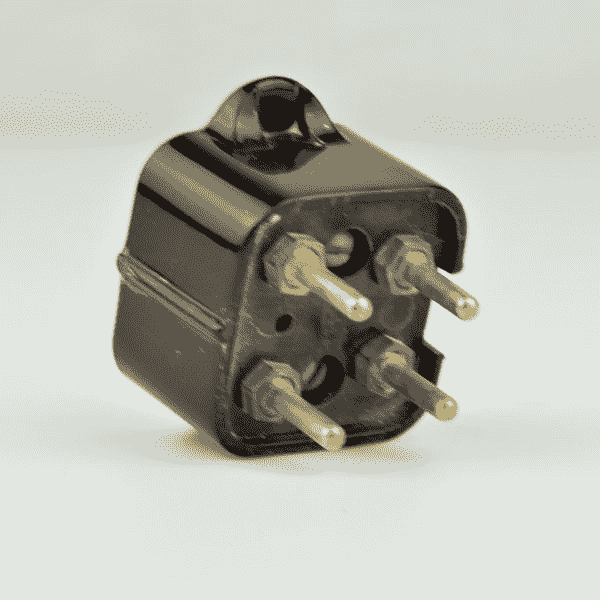
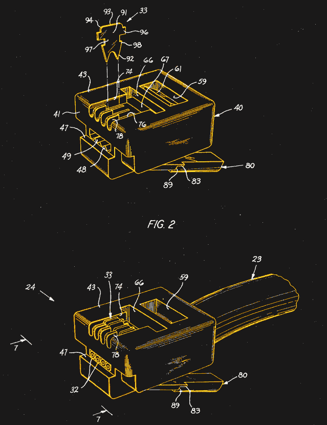

# 模块化连接器以及它是如何形成的

> 原文：<https://hackaday.com/2018/10/02/the-modular-connector-and-how-it-got-that-way/>

它们装饰着 Cat5 网络跳线和多功能一体打印机随附的扁平缎面电缆的末端，我们通常要么扔进垃圾箱，要么一起扔掉。块状矩形插头由透明塑料模制而成，带有镀金触点，被广泛称为模块化连接器。在过去半个世纪左右的时间里，它们和它们的插座同行已经成为互联世界中无处不在的组件，毫不奇怪，它们从许多其他创新开始的地方开始:从管理电话网络增长和降低成本的需要开始。这就是模块化连接器的由来。

## 服务即服务

在美国电话网络的前 80 年左右的时间里，贝尔公司发号施令。他们绝对拥有系统中的每一个设备——电线杆上的电线、中央办公室的开关设备、微波链路，甚至客户家中的电话机。他们完全控制了服务交付的每个方面，并利用其垄断地位建立了一个难以置信的集成和持久的系统。

但是，权力越大，责任也越大，或者说，对于一个复杂的技术系统来说，无论它有多强大，都有可能崩溃，这意味着巨大的支持负担。客户完全依赖电话公司的技术人员做任何事情。想把手机搬到另一个房间吗？那是服务电话。狗咬断了电视机和墙之间的电线？服务电话。朱尼尔拿起剪刀，决定剪断手机电线？很可能是服务电话。有些服务是向客户收费的，但即使是设计寿命为 40 年的战舰般的手机，磨损最终也会累积起来。

Bell 238 plug: robust and portable, but not good enough. Source: [Oldphoneworks.com](http://www.oldphoneworks.com/4-prong-plug-male.html)

在客户服务电话上投入了越来越多的钱，美国电话电报公司决定寻找在这一领域降低成本的方法。有了堆积如山的服务单来提供原始数据，他们发现，到目前为止，最常见的呼叫是因为底座和手机之间的电线断裂。这可以理解；手机软线被扭曲和扭结，尽管在应力点有足够的应力释放，最终软线磨损和断裂。不仅有很多断线的电话，而且每一个都需要技术人员花费大量的时间来纠正，因为必须拆卸电话来更换有问题的电线。

为了减轻服务负担，20 世纪 60 年代末，美国电话电报公司让其制造部门西部电气的工程师来解决这个问题。包括 Edwin Hardesty 和 Charles Krumreich 在内的团队查看了这些规格。他们知道他们需要四根导线，并且连接器必须在现场轻松快速地断开。连接器必须具有内置的应变消除装置，易于制造，并且便宜。还希望手机连接器通常是有用的，特别是用于替换电话和墙壁之间的电线，这是服务呼叫的另一个常见原因。

## 轻松的挤压

目前还不清楚矩形模制塑料连接器的灵感来自哪里，除了在 20 世纪 60 年代中期 [Krumreich 已经获得了一个类似连接器](https://patents.google.com/patent/US3369214)的专利。早期的设计有许多熟悉的元素:多个平行导体，隔离和绝缘每个电路的塑料通道，插头中的绝缘位移触点，插座中的弹性导线触点。后来的设计改变了一些东西，特别是用固定刀片取代了插座中的弹簧丝触点，但总体上设计非常相似。

Hardesty and Krumreich’s modular plug. Source: [US Patent 3,860,316](https://patents.google.com/patent/US3860316A/en?oq=+US+3860316)

最大的区别在于对连接器如何在现场使用以及如何制造的考虑。专注于绝缘位移意味着现场技术人员将能够用简单的压接工具批量端接连接器，并使连接器更容易制造，以满足全系统转换的大量需求。模制插头主体还意味着应变消除将被集成到插头中，以柔性棒的形式，在电连接完成后，该柔性棒将被向下卷曲到电线护套上。

这种设计很快就会得到改进，回到插座中的弹簧丝触点，并用模制塑料插销取代原来将插头锁定在插座中的金属插销。但是模块化插头的基本设计已经确定。像 Trimline 电话这样的新电话设计，其中手机包含拨号或键盘，将成为第一批使用新电线的电话，在 20 世纪 70 年代，全国各地的电话公司改造了数百万部现有的电话。

随着 20 世纪 80 年代的到来，美国电话电报公司的垄断开始被打破，新的模块化连接器将在电话系统的民主化中发挥重要作用。消费者第一次可以去零售店直接购买他们想要的任何手机，而不是租赁“任何颜色，只要是黑色”的手机。模块化连接器第一次使客户自我连接成为可能；不幸的是，这也使得劣质的企业操作视频不可避免。

 [https://www.youtube.com/embed/IphPS58ZUc8?version=3&rel=1&showsearch=0&showinfo=1&iv_load_policy=1&fs=1&hl=en-US&autohide=2&wmode=transparent](https://www.youtube.com/embed/IphPS58ZUc8?version=3&rel=1&showsearch=0&showinfo=1&iv_load_policy=1&fs=1&hl=en-US&autohide=2&wmode=transparent)

## 各行各业的注册杰克

良好的设计、可轻松扩展至更多或更少导线的强大组合，以及庞大的安装基数带来的市场饱和，这些因素使得模块化连接器在各行各业得到了广泛认可。这得益于 1976 年联邦通信委员会的指令，即电话系统连接要标准化以实现互操作性，主要是允许用户将他们自己的设备连接到电话网络。

该指令将这些规范称为注册接口，模块化连接器被称为注册插孔，简称 RJ。六导线 RJ11 成为连接电话到网络的标准，而四导线 RJ14 被指定用于手机到基站的连接。在电话系统的基础上，八导线模块连接器最终在一套独立的标准下成为以太网连接的标准；它通常被错误地称为 RJ45，与它类似，但在插座和插头中有一个键控接线片。

模块化连接器已经经受了近 50 年的时间考验，虽然设计并不完美，但看看你，这个小小的塑料闩锁已经被证明非常适合广泛的应用。从某种程度上来说，它始于让现场服务变得更容易的需要似乎是合适的。

[特色图片:[淡水河谷大学多塔夸里分校](https://www.univates.br/tecnicos/manutencao-e-suporte-em-informatica)