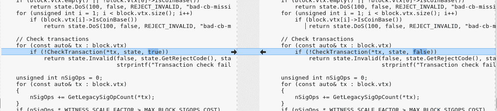
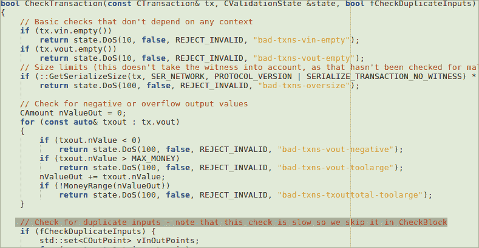

# 比特币的双重消费缺陷在推出时是保密的

> 原文：<https://hackaday.com/2018/10/02/bitcoins-double-spending-flaw-was-hush-hush-during-rollout/>

有那么一会儿，花两次比特币是可能的。把它想象成一个穿在绳子上的硬币，你把它放入自动售货机得到美味的小吃，但是如果你足够快地拉动绳子，你也可以再次把它花在一些苏打水上。只不过这枚硬币价值大约八万美元。

9 月 20 日，比特币核心最新补丁的全部细节被公布。这个信息是在补丁正式发布的两天后(T0)发布的。涉及两个漏洞；一个拒绝服务漏洞和一个严重的通货膨胀漏洞， [CVE-2018-17144](https://nvd.nist.gov/vuln/detail/CVE-2018-17144) 中均有涉及。这些最初是向几个从事比特币核心工作的开发人员以及支持其他加密货币的项目报告的，包括 ABC 和 Unlimited。

让我们来看看这是如何工作的，以及如何修补网络(同时保持安静)来消除这个漏洞。

## 比特币核心是什么，我为什么要关心？

比特币核心(Bitcoin Core)是一个开源项目，维护并发布名为“比特币核心”的比特币客户端软件。它是最初的比特币软件客户端的直接后代，最初的比特币软件客户端是由[中本聪](https://hackaday.com/2016/05/03/i-am-satoshi-nakamoto/)在他发表著名的比特币白皮书之后发布的。该软件既是一个验证区块链的全节点，也是一个比特币钱包。比特币核心拥有巨大的影响力，因为它是一个受欢迎的全节点，许多其他节点软件都是从这个项目派生出来的。

因此，当影响比特币核心的漏洞出现时，通常会让很多人感到紧张。事情就是这样。代码中出现了一个漏洞，主要是因为加速优化，最终使主干节点容易受到拒绝服务的攻击，很快发现这导致了双重支出错误。

## 如何利用此漏洞

这里的部分威胁是对网络的信任。攻击者可以利用此漏洞，通过创建一个特殊的块并将其推送到其他节点来导致旧节点崩溃(0.14.x 版节点)，从而造成拒绝服务的情况。通过以这种方式瞄准重要节点(或大量节点)，攻击者可以引发比特币网络和加密货币的负面宣传。

但或许更有趣的是变出不存在的比特币的能力。可以制作一种特殊的块，欺骗 0.15.0 到 0.16.2 版本的核心软件接受无效块。这个假的块会增加供给，看起来你有两倍的可用量，而实际上你会花同样的量两次。像魔术师一样，一半的硬币凭空出现了。

## 在保持安静的同时努力解决问题

这个 bug 的时间线很好地展示了这个缺陷的潜在严重性。9 月 17 日 15 点左右，有人匿名举报了这个 bug。三个小时后，DoS 的漏洞和双倍支出造成的通货膨胀都被发现了。到了 22 点，补丁已经出来了。在接下来的两天里，这条消息在公共论坛和邮件列表中传播，敦促人们升级——但没有透露完整的细节，只提到了 DoS 条件。然后，在 9 月 20 日，一个独立的研究人员完全发现了这个缺陷。届时，比特币核心团队将公布全部细节:

> “为了鼓励快速升级，决定立即修补并披露不太严重的拒绝服务漏洞，同时联系矿工、企业和其他受影响的系统，同时推迟发布完整版本，以便给系统升级留出时间 *[sic]* 。9 月 20 日，一个公共论坛上的帖子报道了这一事件的全部影响，尽管很快就被撤回，但该声明仍被进一步传播。

如果漏洞没有被第三方完全发现，那么细节似乎会被隐瞒更久。当然我们不知道还要多久，但最近任何谣言似乎都会导致广泛的秘密恐慌，所以这种立场是可以理解的。这并不意味着我同意，这似乎很有争议，但事实就是如此。尽管如此，该补丁还是在漏洞被发现后的几个小时内被制作出来并广为流传，这一点确实值得注意。在这个领域工作，我可以向你保证，这种情况发生的概率大约是 0.001%。是的…这是一个乐观的数字。

## 双重支出和阻止它的补丁

双倍消费立刻让我好奇，谁不想要凭空创造出来的免费加密货币呢？所以我去了比特币核心网站，下载了有补丁和没有补丁的版本，试图找出问题所在。

幸运的是，没有太多的代码更改，修复的主要部分似乎出奇的简单:

我不打算假装我经历了一些痛苦的~500k 行 C++代码，我只是检查了更改并读取了一堆函数。但是对于那些想要真正深度潜水的人来说，可以看看吉米·宋的非常详细的解释。

实际上，我读的这段小代码很快就让我想起了我对 C++的爱恨情仇，以及我偶尔对它为何不会消亡的疑惑…我知道，我知道…

乍一看，这个 bug 是以一种疏忽的方式引入的，只是为了获得一些速度。但是在阅读了完整的详细解释后，结论是错误的，认为检查是多余的，可以优化掉。这个结论是不正确的。

## 那么…有人得到免费硬币了吗？

任何人都可以从这个漏洞中获得免费硬币，这似乎是不现实的。事实是，这个缺陷在理论上听起来比实际上更糟糕。为了实际触发 DoS 或双重开销攻击，创建具有足够工作证明的恶意块是有成本的，因为这需要与找到有效块相同数量的能量/采矿设备。我们谈论的是实施攻击至少需要 12.5 BTC(按今天的汇率计算约为 82500 美元)，即使这样，攻击也会被比特币网络中的不同参与方注意到。你必须花钱来赚钱，但在这里，攻击者最有可能以丢失硬币而告终。至于制造的隐秘恐慌，那就很难衡量了。

## 早点更新，经常更新

此时，已经有超过 33%的节点运行补丁版本，据称相当于超过一半的比特币哈希值，因为最大的挖掘池和交易所首先收到警报，大多数挖掘节点在第一天的几个小时内就被打了补丁。据我们所知，没有人试图在野外利用这一漏洞。

随着技术和软件的成熟，总会有缺陷。在一个关键软件中，在知道这些缺陷的存在后所做的决定对于阻止潜在的攻击和保护最终用户是至关重要的。最后，比特币网络似乎真的千钧一发，开发者的快速行动在问题变成问题之前解决了问题，即使只是糟糕的公关。

另一方面，隐瞒信息的方式让我不舒服。你怎么看这件事，这件事处理得正确吗？