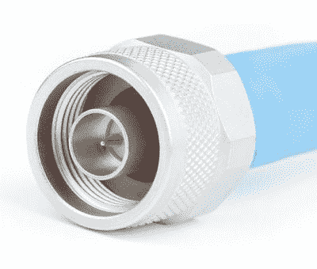
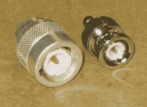

# BNC 连接器以及它是如何形成的

> 原文：<https://hackaday.com/2018/10/19/the-bnc-connector-and-how-it-got-that-way/>

20 世纪 80 年代初，当我开始在一家视频制作公司工作时，很快就发现在设备方面有很多势利之处。这是家庭视频市场起飞的日子；VHS 打了一场格式战，并取得了胜利，消费级 vcr 从货架上飞下来，进入了起居室。大部分设备都很便宜，按照一定的价格制造，注定会像大多数消费设备一样，迟早会出现故障。在我们的商店里，被我们的 Ikegami 相机和索尼 3/4”磁带走带设备包围着，我们嘲笑这种设备是[“reggie vision”](https://www.youtube.com/watch?v=gmiTIossMME)设备。我们还年轻。

对我来说，pro gear 与消费产品的区别在于它后面板上的连接器类型。如果一台录像机只有普通的 F 连接器，就像有线电视盒上的那些连接器，以及用于视频输入和输出的 RCA 插孔，我知道它是垃圾。为了给我留下深刻印象，它必须有 BNC 连接器；这是专业级装备的标志。

我可能很傲慢，但我并没有真的错。一般来说，看看同轴连接器和现在我们熟悉的 BNC 连接器的设计决策，就可以了解为什么我的势利感至少部分是有道理的。

## 保持阻抗

这种连接器在 20 世纪 50 年代发明时最终被称为 BNC 连接器，它源于 20 世纪 30 年代和 40 年代为蓬勃发展的无线电和电话行业开发的两种独立的连接器。当谈到 DC 和低频交流电路的电线和连接器时，几乎任何能够承载电流并提供牢固机械连接的东西都可以。但是一旦电路进入无线电频率范围，情况就不同了。在这种频率下，同轴电缆是传输线路的首选，插入线路的任何连接器都需要经过精心设计，以最大限度地减少阻抗变化，阻抗变化可能会导致信号反射，并产生驻波，从而造成损坏。

Type N connector: Source: [Wikipedia](https://commons.wikimedia.org/wiki/File:Male_type_N_connector.jpg)

Paul Neil 是一名电气工程师，自 1916 年以来一直在贝尔公司工作，他精通射频系统。20 世纪 40 年代，他发现需要一种能够在微波频率下良好工作的同轴连接器，并设计了 N 型连接器。像所有同轴连接器一样，它被设计成通过保持中心导体连接和外壳之间的间距尽可能接近馈线尺寸，来尽可能小地改变馈线的特性阻抗。尼尔的连接器在插头上有一个内螺纹外壳，与匹配插座上的外螺纹配合，并且被设计成不受天气影响。N 连接器以 Neil 的最后一个字母命名，并一直沿用至今。

Type-C connector and a BNC, both male. Source: [Wikipedia](https://commons.wikimedia.org/wiki/File:C_connector.JPG)

与此同时，安费诺公司的一名工程师正在进行他自己的设计。Carl Concelman 的连接器，也称为 C 型连接器，使用相同的方法来减少同轴连接中的阻抗变化。然而，他选择让他的连接器快速断开；C 连接器采用卡口连接，而不是繁琐的拧松外壳。插座的外壳在其外表面上具有径向相对的凸耳。这些凸耳将与加工在插头外壳内表面上的 L 形凹槽的长臂相配合。旋转外壳，将接线片移动到凹槽的短臂中，将两个连接器机械和电气锁定在一起。385

## 两全其美

Octavio Salati. Source: [University of Pennsylvania](https://almanac.upenn.edu/archive/v47/n26/deaths.html)

N 和 C 连接器在市场上都取得了成功，但都不理想。N 连接器在外形上比 C 连接器更纤细，但却要处理所有烦人的螺纹和松脱问题；C 连接器有很好的快速断开功能，但是体积很大。此外，这两种连接器都不容易制造，因为每一种都需要相当精细的加工。考虑到这些缺点，哈泽泰电子公司的工程师奥克塔维奥·萨拉提提出了自己的设计。它将具有 C 连接器的卡口锁定特征和 N 连接器的更薄轮廓。它使用与两种连接器相同的技术，以最大限度地减少线内阻抗变化引起的反射。

Salati 的连接器在 1951 年以一个不令人兴奋的名字“电连接器”获得专利与它的前辈不同，它不会被称为“S 连接器”，而是以一种绅士的姿态，被称为 BNC，意为“刺刀尼尔-康塞尔曼”为了支持最初设计的射频工作，连接器具有 50 欧姆的特性阻抗；后来，一个 75 欧姆的版本被用于电视行业。该连接器的最高可用频率约为 11 GHz，但超过 4 GHz 左右就不理想了，因为在外层屏蔽导体中切割出的槽会开始辐射信号。

 [https://www.youtube.com/embed/cBW-Pot1Co0?version=3&rel=1&showsearch=0&showinfo=1&iv_load_policy=1&fs=1&hl=en-US&autohide=2&wmode=transparent](https://www.youtube.com/embed/cBW-Pot1Co0?version=3&rel=1&showsearch=0&showinfo=1&iv_load_policy=1&fs=1&hl=en-US&autohide=2&wmode=transparent)

BNC 连接器作为一种同轴连接器，在其最初的目标市场之外的行业中已被广泛接受。从公共服务通信到示波器探头到计算机网络，Salati 的设计，以及 Neil 和 Conselman 的设计，在过去的 60 年里都表现出色。

[特色图片: [SMT 分析](http://www.smtanalytical.com/photo-gallery.html)，[百通公司](http://www.belden.com)