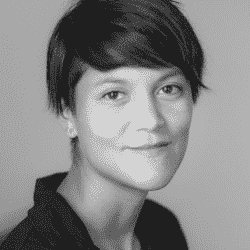
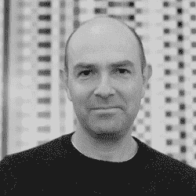

# Hackaday 奖不可思议的评委们

> 原文：<https://hackaday.com/2018/10/29/the-incredible-judges-of-the-hackaday-prize-4/>

进入[hack aday 奖](https://hackaday.io/prize)的时间已经结束，但这并不意味着世界上最大的硬件竞赛就此结束。在过去的几个月里，我们已经看到了一千多个令人惊叹的项目，从开放硬件到人机界面。然而，这是一场竞赛，为了决定获胜者，我们邀请了硬件领域的一些大师来评判这些令人惊讶的项目。

以下是今年 Hackaday 奖评委的预览。他们一直在忙着查看所有的决赛选手，周六我们将在帕萨迪纳举行的 [Hackaday 超级大会上宣布 Hackaday 奖的获奖者。这是一个不容错过的活动，我们不仅将听到硬件大师们精彩的技术演讲，还将看到谁将赢得 50，000 美元的大奖。](https://www.eventbrite.com/e/hackaday-superconference-2018-tickets-47386813234?aff=1029com)

* * *

### [t1](https://hackaday.com/wp-content/uploads/2018/10/judge-quinn.png)奎因邓尼茨

强大的奎因已经在从苹果 II 到各种新奇事物的平台上制作游戏 36 年了。她目前在 Scopely 管理手机游戏工程，从事咨询、独立开发、混合媒体工程项目和写作。奎因因《维罗妮卡》、《拥有一切的 6502 系统》和《底板上的厨房水槽》而为黑客群体所熟知。ROM 中有 PS/2、VGA 和 Pong。Veronica 的构建日志对许多人来说是一个灵感，并作为许多自制系统的基础。她继续通过[她的博客](http://www.blondihacks.com/)，她的 [YouTube 频道](https://www.youtube.com/c/Blondihacks)，当然还有她的 [Hackaday 文章](https://hackaday.com/author/blondie7575/)来激发灵感。

###  艾本阿普

在他的早期生活中，Eben 创建了两家成功的移动游戏和中间件公司，但现在他最出名的是创建了 Raspberry Pi 基金会并担任 Raspberry Pi (Trading) LTD .的首席执行官。在他的领导下，Raspberry Pi 已经从一个看起来很奇怪的板发展成一端有 USB 端口，另一端有 HDMI，中间有一个摄像头。经过几个月的工作，[希望这台电脑不会是蒸汽软件](https://hackaday.com/2011/08/26/raspberry-pi-might-not-be-vaporware/)，现在树莓派是有史以来最畅销的电脑(向有史以来最畅销的*家用电脑*背后的工程师们道歉)。

###  劳伦·麦卡锡

劳伦·麦卡锡是一位生活在洛杉矶和布鲁克林的艺术家，他的作品探索了成为一个人以及与其他人互动的系统。她是加州大学洛杉矶分校设计媒体艺术的助理教授，圣丹斯学院的研究员，之前是 CMU 工作室创意调查，Eyebeam，Autodesk 等的常驻人员。劳伦的作品曾在国际上展出，如电子艺术节、温特图尔美术馆、SIGGRAPH、奥纳西斯文化中心、IDFA 文献实验室和日本媒体艺术节。她是 [p5.js](http://p5js.org/) 的创建者，这是一个通过代码在线学习创意表达的开源平台。

###  克里斯·安德森

从 2001 年到 2012 年，克里斯是《连线》杂志的主编，但现在他是 [3DR](https://3dr.com/) 的首席执行官，也是 DIY 无人机和 DIY 机器人汽车的创始人。这些 Robocar 比赛大约每月举行一次，迄今为止已经证明是一个教孩子 STEM 的理想平台，已经成为下一代战斗机器人的一部分，只是多了一些计算机视觉算法和少了一些 RC 发射器。除了 Robocars，Chris 是飞行无人机的最大倡导者之一，包括固定翼无人机。

这些只是我们列出的几位杰出的评委，他们将决定今年 Hackaday 奖的获胜者。获胜者将于 11 月 3 日在[黑客日超级大会](https://www.eventbrite.com/e/hackaday-superconference-2018-tickets-47386813234?aff=1029com)上宣布。如果你不能亲自加入我们，不要担心。我们将现场直播一切，包括颁奖仪式，其中一个团队将获得 5 万美元的大奖。这不是一个可以错过的事件。

The [HackadayPrize2018](https://hackaday.io/prize) is Sponsored by:     