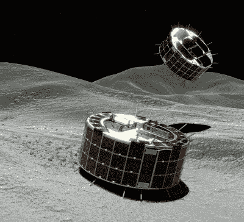
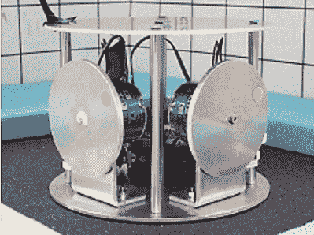
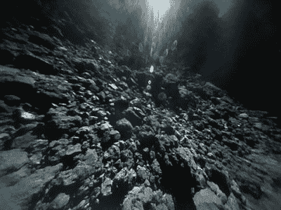

# 在小行星上着陆的科学

> 原文：<https://hackaday.com/2018/10/16/the-science-of-landing-on-an-asteroid/>

开发火星和外行星之间布满岩石的广阔空间的资源多年来一直是科幻小说的内容。他们的太空岩石中有黄金，或钻石，或白金，或其他使他们成为资本家和科学家的诱人目标的东西。但在真正开采小行星带的财富之前，我们被困在这里，因为我们在一个非常深的重力井的底部，爬出来非常昂贵，我们必须回答几个问题。比如，如何与小行星会合？在一个相对较小的天体附近进行机动涉及到什么？最重要的是，一个人究竟如何在小行星上着陆并做有用的工作？

早在 6 月，日本宇宙航空研究开发机构(JAXA)发射的一艘宇宙飞船在追逐了一颗名为 Ryugu 的小行星大半年后，终于追上了它。“隼鸟 2 号”配备了回答所有这些问题以及更多问题的设备，当它靠近小行星并搭载一小队机器人漫游车时，它即将创造历史。这是他们如何设法不仅在小行星上着陆，而且漫游者如何在表面上移动，以及他们如何将小行星的样本带回地球进行研究。

## 这些不是你要找的漫游者

Rendering of MINERVA-II-1 rovers on Ryugu. Source: [JAXA, University of Tokyo & collaborators](http://www.hayabusa2.jaxa.jp/en/topics/20180919e/)

随着星际飞船的运行, *Hayabusa2* 看起来很像你所期待的，两块长方形的太阳能电池板位于立方体形状的飞船主要部分的侧面。它的设计类似于它的前身*隼*——这个名字在日语中的意思是“游隼”——它在 2000 年代中期探索了小行星丝川，并将小行星的样本返回地球。*隼鸟*配备了一个机器人漫游车，被命名为密涅瓦；可悲的是，一个通讯错误导致火星车在*隼*从小行星上升时被释放，火星车没有被其微小的引力捕获。隼鸟号将再次尝试登陆，这次母舰携带的不是一辆而是四辆！其中三辆是改进的 MINERVA-II 火星车，第四辆是德国制造的 MASCOT。

这些不是你想象中的“漫游者”类型。我们都熟悉阿波罗时代的月球车，甚至火星*好奇号*月球车，这是一种可以通过遥控驾驶的轮式车辆。但是在地球重力加速度的 1/10000 的太空岩石微粒上行驶是一个问题。由于拉下火星车的力很小，车轮缺乏足够的摩擦力来获得任何牵引力，所以不是车轮，而是火星车都在 Ryugu 的表面上跳跃。

## 失去车轮；使用扭矩仪

Prototype torquers used for testing hopping in a microgravity environment. Source: [JAXA, University of Tokyo & collaborators](https://pdfs.semanticscholar.org/9495/4d807e7fa94897a36cb0a9af6112f16ed417.pdf?_ga=2.67179288.881849897.1537890509-1485126826.1537890509)

有很多方法可以让火星车跳跃，包括压缩气体的小型喷射，展开的手臂推着小行星的表面，甚至是推动火星车向上的弹簧。但是 MINERVA-II 火星车采用了一种不同的解决方案:被称为“扭矩器”的小型电机驱动飞轮扭矩器通过非常小心地调节角速度来工作，产生的扭矩可以将漫游车翻转到小行星表面上方的弹道轨道上。两个力矩器相互成 90 度角，漫游者不仅可以控制速度，还可以控制高度。这使得漫游者可以在小行星上的任何地方着陆。

The surface of Ryugu from Rover 1B’s camera. Source: [JAXA, University of Tokyo & collaborators](http://www.hayabusa2.jaxa.jp/en/topics/20180927e_MNRV/)

9 月 21 日，首批两辆 MINERVA-II 火星车从 *Hayabusa2* 释放，并成功降落在 Ryugu 表面。从那以后，两辆火星车都成功地绕过了这颗小行星。这些漫游者是直径 18 厘米、重约 1.1 公斤的扁平圆柱体，都是太阳能驱动的，旨在长期在地表运行。他们的仪器包，包括照相机，只要母舰在视野中，就将数据发送回母舰。

另一方面，吉祥物漫游者是一个电池供电的 10 公斤重的包，旨在对 Ryugu 的表面进行光谱和磁场研究。MASCOT 是为有限的任务设计的，只有一次跳跃的足够电力，于 10 月 3 日被送到地面，并在关闭前成功发送回数据 17 个小时。剩下的一个 MINERVA-II 漫游者是一个更大的模型，除了扭矩器之外，还有更多传感器和其他三种类型的移动系统，计划在 2019 年 7 月之前部署。

## 在黑暗中拍摄

虽然漫游者的跳跃引起了很多关注，但母舰也有自己的小把戏要表演。如果一切按计划进行，2019 年 1 月的某个时候,*隼鸟 2 号*将缓慢而小心地降落到琉球的表面，并将取样探测器延伸到小行星的表面。该探针设计用于收集从几毫克到 10 克的样本。为了做到这一点，采样器将发射一个 5 克的钽弹进入 Ryugu 的表面。喷出物将被收集在取样器中，并被密封在重返大气层的运载工具中，以便返回地球。

Hayabusa2 将在今年晚些时候推出类似的系列，此后不久将上演一场真正的大秀。在机动到地表以上约 200 米后，它将使用 4.7 公斤的聚能射孔弹向地表发射一个 2 公斤重的铜盘。该抛射体将以大约 2 公里/秒的速度撞击，并在小行星上炸出一个新的陨石坑，暴露出从太空破坏中分离出来的物质。*隼鸟 2 号*将飞奔到小行星的另一侧以避开碎片云，但在此之前会部署一台遥控摄像机来监控犯罪现场。一旦尘埃落定，*隼鸟 2 号*将在 2019 年末为漫长的归途做准备之前，从火山口进行最后一次样本采集。

 [https://www.youtube.com/embed/gmh2lGjXm7w?version=3&rel=1&showsearch=0&showinfo=1&iv_load_policy=1&fs=1&hl=en-US&autohide=2&wmode=transparent](https://www.youtube.com/embed/gmh2lGjXm7w?version=3&rel=1&showsearch=0&showinfo=1&iv_load_policy=1&fs=1&hl=en-US&autohide=2&wmode=transparent)

考虑到所有的事情，龙谷的任务是令人难以置信的雄心勃勃，应该会产生大量的小行星数据。这项任务有许多移动的部分，无论是字面上还是象征性的，在任务结束前有很大的可能会出现故障。但是到目前为止一切进展顺利的事实令人鼓舞。

如果一切顺利，锁定在小行星中的最初几克目前估计价值 830 亿美元的铁、钴、镍和其他物质将在 2020 年的某个时候在澳大利亚上空飘回地球。如果这标志着小行星采矿变得不仅仅是科幻小说，那将是因为隼鸟任务和它们跳跃的火星车教给我们的东西。