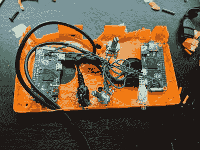

# 肮脏的视频混合与树莓派零

> 原文：<https://hackaday.com/2018/10/09/dirty-video-mixing-with-the-raspberry-pi-zero/>

现在不要太激动，我们不是在谈论那种黄色视频。你可以在网上其他很多地方找到这种东西。不，这个视频混合器是“脏”的，因为它将两个复合视频流合并成一个乱码，最好在旧的 CRT 电视上观看。你可能会问，为什么？因为摇滚，这就是原因。

 由【卢克·布莱克福特】创作，作为他乐队表演的视觉效果，[“脏 Pi”是一种非常简单的方式，用两个树莓 Pi 零](https://imgur.com/a/rMImQEf)创造一些狂野的意象。它可能不是最实用的设备，但如果你想在房子各处的屏幕上播放一些令人毛骨悚然的视频(比如为即将到来的万圣节派对)，这是一种廉价的绝佳方式。

想法很简单:将经常被遗忘的两个 Pi 零点的复合视频输出连接到电位计，然后连接到显示器。使用您选择的媒体播放器在 Pis 上播放不同的视频，旋转电位计以产生重影和干扰。如果你想得到真正的 80 年代的复古感觉，就像[卢克]那样把整个东西放进一个旧的 VHS 磁带，你就准备好摇滚了。

那些在这个街区呆过几次的人可能会认为这个技巧是[Karl Klomp] Dirty Video Mixer 的变体，而[Luke]告诉我们他喜欢这个项目，因为他能够在不编写任何代码甚至不做任何复杂布线的情况下完成它，尽管他确实想象过未来的版本，其中他添加了一些远程控制功能。

如果你喜欢你的视频混合器有更多的智能和更少的污垢，我们已经介绍了过去使用 LM1881 的非常光滑的构建。

 [https://www.youtube.com/embed/227An4z7w3Y?version=3&rel=1&showsearch=0&showinfo=1&iv_load_policy=1&fs=1&hl=en-US&autohide=2&wmode=transparent](https://www.youtube.com/embed/227An4z7w3Y?version=3&rel=1&showsearch=0&showinfo=1&iv_load_policy=1&fs=1&hl=en-US&autohide=2&wmode=transparent)

[via [/r/raspberry_pi](https://www.reddit.com/r/raspberry_pi/comments/9f46uy/dirty_pi_an_analog_sound_reactive_video/)