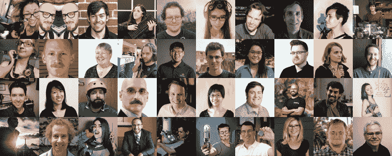
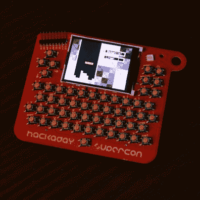
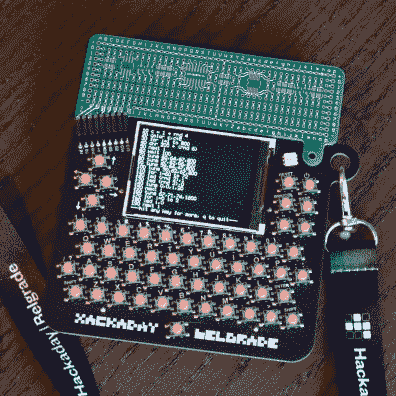

# 万物超能:这个。是。很大。

> 原文：<https://hackaday.com/2018/10/08/everything-supercon-this-is-big/>

来吧，来吧，这是关于黑客日超级会议的海报。11 月 2 日至 4 日，在帕萨迪纳参加我们不容错过的硬件大会。快去买票吧，票会卖光的！

## 这些是你的人

你会对很酷的硬件感到兴奋。我们也是。大多数会议都不是这样。来 Supercon 吧，因为这些都是你的人。体验最棒的“黑客村”氛围，这是一首诱惑你跳过有组织的谈话的迷人歌曲，因为你每次都被吸引到迷人的谈话中。装载你一直拖延的硬件黑客，到大公司来工作吧！

## 惊人的谈话

看看这些令人瞠目结舌的演讲者，他们准备好了让你大吃一惊与硬件创造相关的一切。查看 super co 的[完整时间表。上周的每一天，我们都发布了会谈的公告，这些细节都在](https://hackaday.io/superconference/#schedule)[超级会议网页](https://hackaday.io/superconference/#speakers-anchor)上。除了感谢所有这些对他们的演讲进行最后润色的伟大的人们，我还能说什么呢！

## 工作坊门票现已发售

Supercon 工作坊门票马上售罄。由于大众的需求(以及来自主持人的大量伟大提议)，我们今年增加了研讨会的数量。单击下面的标题了解每个研讨会的详细信息。这些会很快结束，所以[在它们结束之前拿到你的工作票](https://www.eventbrite.com/e/hackaday-superconference-2018-tickets-47386813234?aff=1008com)！

*   

**An Introduction to Animatories Featuring Tentacle Mechanisms**

    Joshua Vasquez is a basic engineer who is keen on repairing after work. During the day, he writes software and controls the machines in a factory that manufactures DNA and RNA. In the evening, he works on some part-time projects and sometimes writes for Hackaday. In this seminar, he will show you how to build your own tentacle mechanism and cable controller from scratch. All the tools, instructions and materials will be provided to you on the spot, so that you can leave with your own crawling work.
 
*   

**Building Wi-Fi Connected Devices with Arduino**

    Don Coleman Studio. This practical seminar will teach you how to build and program Wi-Fi-based IoT devices with Arduino. Your sensor will use MQTT to send data to the "cloud". You will also use the web page to send commands back to your hardware. Some programming experience is helpful, but not necessary. Each participant will receive a hardware development kit with Arduino microcontroller and components required for the course. Participants must bring their laptops.
 
*   

**The Coolest Workshop**

    This seminar was hosted by Will Caruana. Participants will participate in a large number of hands-on experiments that require liquid nitrogen, from making ice cream to demonstrating the characteristics of superconductors. We will monitor the change of electrical conductivity in electronic products and demonstrate how materials change at extremely low temperatures. We will learn about superconductors through experiments! If you want to freeze something, this is your chance. Take it with you and let's see what happens!
 
*   

**Designing expressive modular wearable hardware**

    The seminar was hosted by Angela Sheehan and Mary West, who created products and projects ranging from Internet of Things and optoelectronics to wearable technology. During the seminar, participants will receive instructions on customizing interactive wearable devices with Arduino and prototype. Participants will creatively explore personalization through code and hardware assembly to build a unique wearable technology to take home. You will actively explore these ideas by customizing a wearable electronic project to enhance your interaction with the world.
 
*   

**Full Stack Product Development with Autodesk Eagle and Fusion 360**

    This workshop is conducted by Matt Bogren. In this meeting, we will take you from beginning to end: from building a new schematic diagram, simulating the circuit with EAGLE's built-in SPICE emulator, laying out PCB, and generating mfg. Documents, and learn some tips and tricks for milling plates and making templates. We will also take you through Fusion 360 to understand the connection between electronics and machinery. Together with EAGLE, we will build a shell for your mechanical design (CAM, 3D printing, etc.) and generate manufacturing output. We will focus on library management across electronics and mechanics, and the two-way synchronization between these two fields. This is not just an introduction, because Matt will also provide you with some important and often overlooked background details and EAGLE tips, otherwise you may never know.
 
*   

**Environmental Robotics Bioblitz!**

    Irene Kennedy is an eccentric and energetic inventor! She is the technical founder of Robot Mission, where she developed a low-cost shoreline cleaning robot. As part of this seminar, you will help use robots to clean up garbage in nearby parks. The robot will use its arm to pick up any rubbish, while recording the air quality and image data mapped to GPS coordinates. In this workshop, you will learn how the robot operates by yourself.
 
*   

**Introduction to Lora Sensor Networking**

    The seminar was hosted by Reinier van der Lee, the winner of Hackaday's "Best Product" award in 2015 and the founder of a precision irrigation company named Vinduino in Temecula. This lecture/seminar introduces LoRa network technology and provides beginners with instructions on how to build the first connected sensor.
 
*   

**Logic noise: seminar of elliot williams, executive editor of Breadboard Your Own Primitive Synthesizer**

    Hackaday. Starting with a bare test board and a pile of CMOS integrated circuits, participants will make "music" noise as quickly as possible. Elliot will demonstrate some of his favorite circuits with the goal of holding a "concert" before everything is finished. This is a very practical seminar, but it is also very simple. Someone has done this experiment before. They have never inserted IC into the test board, and the result is surprising.
 
*   

**Prototyping IoT Applications Using the AVR-IoT WG Development Board**

    This workshop was conducted by Ricky Johnson. Participants will learn to use the new AVR-IoT WG development board to develop IoT applications. By the end of this course, you will have a good understanding of how to develop IoT nodes quickly and easily. This IoT node is equipped with an ambient light sensor and a temperature sensor. You will learn how to configure your IoT nodes to wireless networks and transfer data to Google Cloud, which can then be visualized in online GUI. Participants don't need to install any tools on their computers, because the whole seminar will use the configuration interface pre-installed on AVR-IoT WG development board. Participants will also be shown how to push their projects to a new level by adding their own custom sensors and transmitting new data.
 
*   

**Small Scale CNC/Robotics Workshop (Build A CNC Badge! )**

    Join Barton Dring and share his 20-year knowledge of DIY CNC machine tools. Learn valuable skills and tricks. When you use a bigger machine, you can upgrade it, and then make your own wearable CNC plotter badge! Work card hardware is included in the workshop cost. Badge PCB will be pre-assembled to run plotter, but there will be a partially filled, modular and hackable prototype area to create dozens of types of machines.
 
*   

**WT FPGA, Introduction to FPGA**

    This seminar was hosted by Piotr Esden-Tempski, who is the co-owner of 1BitSquared. The purpose of this seminar is to help people who are new to FPGAs get started quickly, so that they can understand Verilog design and make minor modifications to it, and see the results on hardware, all using free open source tools. The scope is intentionally limited to ensure that it is feasible in a short time, so participants don't need to invest a lot of time to gain practical understanding of FPGA, Verilog, Yosys, Nextpnr and Icestorm open source FPGA toolchains.
 
*   

**Weird synthmaking**

    Erin Demastes uses reused technology and everyday objects to explore acoustic phenomena related to acoustics, resonance, electricity and magnetism. This seminar will deeply study the construction of some basic square wave synthesizers, but encourage experiments and out-of-the-box designs (literally). Attendees can use unusual shells or no shells at all in their final design. Sculpture, jewelry and other types of technology and art integration will be encouraged. According to the knowledge level of participants, the seminar can go deep into schematic reading, component function and use, test board layout and welding. This workshop can be designed for intermediate level students or those who want to design something unusual or learn from an artistic point of view.
 
*   

**Wireless based IoT ESP32 sensor design with new IoT design tools**

    This workshop was conducted by Robert Nelson. Participants will build a low-cost Wi-Fi/BLE sensor based on ESP32 platform, combined with the simple plug-and-play connection of Grove sensor. Learn to easily connect to the cloud and visualize your data in real time using the upcoming IoT design environment. This new tool has a graphical user interface that allows simple drag-and-drop functions. Participants will be able to send data to the cloud through the development environment and visualize the data. Need a laptop; Windows, Mac or Linux. Mobile phone/tablet; You need to use BLE to run Android or iOS and visit Google Play or Apple App Store. All materials for building IoT sensors will be provided without any coding experience.
 

## 硬件徽章

每个持有有效超级会议入场券的人都将获得一个令人惊叹的徽章！这里显示的是一个原型，生产徽章将有黑色而不是红色的阻焊膜。对于 Supercon 来说，全新的是硬件黑客附加板，它将带有所有徽章，便于添加您的定制电路。

  Supercon Badge Prototype (production version will be black)  Hackaday Belgrade badge with hardware breakout prototype (production will be black)

这是基本徽章的最新版本。它有一个完整的 QWERTY 键盘，漂亮的彩色屏幕，和一个带 3 语音音频的扬声器。有一个解释器和编辑器，这样你就可以用 BASIC 编程语言编写自己的程序，并存储 16 个最大 16 kb 的程序。它运行 CP/M，所以你可以在上面玩 Zork(默认加载)或者使用串行转 USB 来加载你自己的程序。这只是冰山一角，这个设计(Voja Antonic:硬件，Jaromir Sukuba:软件)在 5 月的贝尔格莱德 Hackaday 大会上大受欢迎。前往[项目页面](https://hackaday.io/project/80627-badge-for-hackaday-conference-2018-in-belgrade)，尽可能多地学习，为为期一周的徽章黑客活动做准备！更多信息即将发布。

我们知道你想得到一个，我们已经有很多人问，如果他们买了票，我们是否会给他们邮寄一个。不幸的是，不行。你需要[出现在 super co](https://www.eventbrite.com/e/hackaday-superconference-2018-tickets-47386813234?aff=1008com)上。我们很高兴收到 Microchip 捐赠的芯片(运行 PIC32 ),部分组装成本由 Macrofab 捐赠。所有零件都在手边(30，000 个开关！)并且生产运行即将开始。如果我们不知何故超支了，我们会在 Tindie 上出售任何额外的票…但就票的情况来看，我们不能做出任何承诺。

## 吃饱喝足

令人惊讶的人，引人入胜的谈话，酷的研讨会，和令人瞠目结舌的硬件徽章…你唯一需要的是一个饱满的肚子，我们有这些。Supercon 的食物既美味又丰富，而且已经包含在门票里了。饮料也是。

星期五，我们将为晚上的开球晚会准备小吃和饮料。周六周日早点来吃早餐。这两天都会提供午餐。周六是一个大型派对，有茶点庆祝 2018 年 Hackaday 奖的结束，周日甚至还有一个非官方的派对。

Supercon 是一种体验，是帕萨迪纳市中心的一小片黑客天堂。

## Hackaday 派对

让我们面对现实吧，整个周末感觉就像一个派对。但是随着每天的谈话和研讨会的结束，我们将转变为真正的派对模式。周五和周六，我们将现场直播 Rich Hogben 和 DJ Jackalope 等 Hackaday 最爱的节目。互动黑客，演示和游戏将在手边。徽章黑客攻击当然会继续，我们确信自发的黑客攻击会成真(在下面的评论中询问去年的与会者)。

这是你的会议。Hackaday 社区充满了不可思议的人，Supercon 的氛围庆祝每个人朝圣到这个终极硬件大会的这一方面。错过这个就是错过了真正独特和真正特别的东西。我们迫不及待地想在 11 月见到大家！