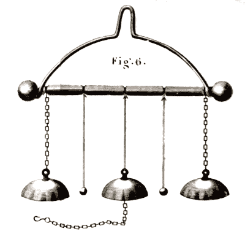

# 钟声。钟声。自 1840 年以来的一个电池

> 原文：<https://hackaday.com/2018/10/07/the-bells-the-bells-one-battery-since-1840/>

建议你至少每年更换一次火灾报警器的电池。即使是我们的低功耗液晶计算器也需要不时更换新电池。但是在牛津大学，他们有一个用一组电池基本上不间断地响了 178 年的电铃。那么能源危机解决了吗？也许不是。钟声需要高电压，但电流很小，这对电池——用 1840 年的说法是成堆——已经保持了大约 100 亿次铃声的电荷流动。正如你在下面的视频中看到的，铃声并不强烈。

它是如何工作的？当你想到将电能转换为机械运动时，你可能会想到电机，尽管还有许多其他传感器，如扬声器、肌肉导线和螺线管。可以说，第一个设备是静电铃，是由苏格兰人安德鲁·戈登在 1742 年左右发明的。[本·富兰克林]使他们出名，所以他们经常被称为富兰克林钟。

 这个想法很简单:有三个铜钟排成一排。两头挂在金属链上，中间的挂在不导电的东西上。在每对铃之间是一个金属“铃片”，挂在一根不导电的线上。莱顿瓶连接在金属支架和中央钟之间。这导致铃锤被中心铃或边缘铃吸引。当它撞击钟时，它获得电荷，这导致它被排斥，它将电荷转移到对面的钟，然后再次排斥它。只要有新的装料供应，整个过程就重复进行。

牛津钟有点不同。他们使用一对干桩——没有人确切知道它们的构造，但它们可能是赞博尼桩——一种可以追溯到 1812 年的电池，由一位似乎与溜冰场毫无关系的牧师发明。事实上，[赞博尼]用同样的原理开发了一种静电时钟，其中的拍板实际上是一个类似节拍器的钟摆。如果你曾经用硬币、锡纸和浸泡在醋里的纸巾制作过电池，想法是相似的。赞博尼使用干电解质。

一些人推测牛津钟是一台永动机，但是——当然——不是。电池最终会耗尽，铃声也会消失。其实他们今天之所以沉默，是因为你听不到他们隔着两层防护玻璃发出的轻轻的声响。尽管如此，它足以保持提供 tintinnabulation 的耐用电池的吉尼斯世界纪录(是的，我们必须查找)。

我们见过自制的静电噼啪声。我们还看到了至少一个现代的富兰克林钟，T2 用了汽水罐、一个易拉罐和一根魔杖。

 [https://www.youtube.com/embed/1Dx1-f8xQio?version=3&rel=1&showsearch=0&showinfo=1&iv_load_policy=1&fs=1&hl=en-US&autohide=2&wmode=transparent](https://www.youtube.com/embed/1Dx1-f8xQio?version=3&rel=1&showsearch=0&showinfo=1&iv_load_policy=1&fs=1&hl=en-US&autohide=2&wmode=transparent)

