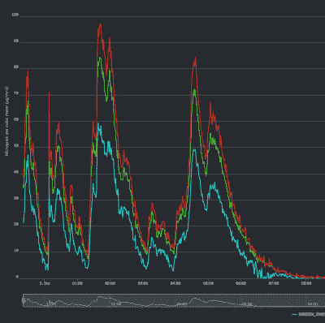

# 黑掉 ZH03B 激光粒子传感器

> 原文：<https://hackaday.com/2018/10/09/hacking-the-zh03b-laser-particle-sensor/>

激光粒子探测器是一种量化空气中漂浮物质的高科技方法。借助风扇、激光和灵敏的光电探测器，他们可以实时测量烟雾和其他微粒。令人惊讶的是，它们还相当便宜，在一些进口网站上不到 20 美元。他们只是需要一点鼓励来执行我们的命令。

【Dave Thompson】最近买了一台 ZH03B，想让它与他最喜欢的传感器平台 Mycodo 一起工作。凭借少量的硬件和软件，[他能够让这些廉价的激光粒子传感器在他的树莓派](https://hackaday.io/project/161602-usb-connected-laser-particle-detector-for-iaq)上工作，他的工作最终被整合到上游的 Mycodo 中。真正实现开源梦想。

ZH03B 具有 PWM 和 UART 输出模式，但[Dave]将注意力集中在 UART 上。通过添加 CP2102 USB-UART 适配器，他能够将其连接到他的 Pi 和 Mac，但仍然需要弄清楚它在说什么。他最终想出了一些 Python 代码，让您既可以将传感器作为更大网络或服务(如 Mycodo)的一部分使用，也可以作为独立设备使用。

他的基本 Python 脚本(目前只在 Linux 和 OS X 上测试过)不断循环，并给出 PM1、PM2.5 和 PM10 测量的运行输出。这些分别对应于直径为 1、2.5 和 10 微米的颗粒。如果您想将传感器插入另一个服务，Python 库更成熟一些，它允许您关闭 ZH03B 的风扇以节省电力。

这些传感器越来越便宜，以至于你可以用它们建立分布式网络，这对于众包环境监测来说是一个巨大的突破(T2)；尤其是有黑客编写开源代码来支持它们。