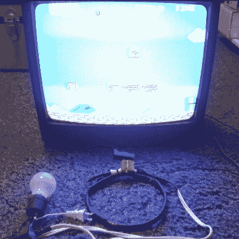

# 消磁线圈，以恢复像 1985 年的游戏

> 原文：<https://hackaday.com/2018/10/15/degaussing-coil-to-restore-gameplay-like-its-1985/>

你可能认为阴极射线管(CRT)电视和显示器已经过时了，但你错了。许多人仍然用它们在家里或商场玩电子游戏，进行老式计算，甚至用来看电视节目。[Nesmaniac]用他的电视玩超级马里奥兄弟，但几年来，由于附近的雷击，它的右上角有一个红色区域。可悲的是，它在游戏的蓝色背景下显得特别突出。他的解决方案是[制作一个消磁线圈](https://www.youtube.com/watch?v=vDnu4za9nXM)。

我们有[一篇详细解释消磁的文章](https://hackaday.com/2016/05/25/wtf-is-degaussing/)，但简单来说，红色是由显示器前面的金属荫罩区域被雷击磁化引起的。消除红色区域的一种方法是将一个线圈靠近它，并逐渐将线圈移开。来自墙上插座的交流电通过线圈，产生一个振荡磁场，使荫罩上的磁场随机化，使色彩恢复到原来的光彩。

你会在下面找到[nes maniac]解释他是如何做到的视频。这有点卡通化，但细节都在，还有必要的安全警告。他的消磁线圈绝对称得上是黑客。线圈本身来自一个 15 英寸的 CRT 显示器，他的开关来自一个拼图。一个 100 瓦的灯泡作为一个电阻来最小化电流，如果需要更多或更少的电流，那么灯泡可以换成不同瓦数的。

为了展示它的作用，并给出更多的结构细节，我们在下面添加了第二个视频，由[Arcade Jason]制作，他为 Arcade 游戏屏幕消磁。

 [https://www.youtube.com/embed/vDnu4za9nXM?version=3&rel=1&showsearch=0&showinfo=1&iv_load_policy=1&fs=1&hl=en-US&autohide=2&wmode=transparent](https://www.youtube.com/embed/vDnu4za9nXM?version=3&rel=1&showsearch=0&showinfo=1&iv_load_policy=1&fs=1&hl=en-US&autohide=2&wmode=transparent)

 [https://www.youtube.com/embed/8cl8EpSAK44?version=3&rel=1&showsearch=0&showinfo=1&iv_load_policy=1&fs=1&hl=en-US&autohide=2&wmode=transparent](https://www.youtube.com/embed/8cl8EpSAK44?version=3&rel=1&showsearch=0&showinfo=1&iv_load_policy=1&fs=1&hl=en-US&autohide=2&wmode=transparent)

我们感谢[example]提供了这方面的提示，并提醒我们对 CRT 进行消磁有时仍然是必要的。