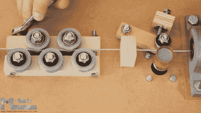

# DIY 电线弯曲机将电线弯曲成形

> 原文：<https://hackaday.com/2018/10/14/diy-wire-bender-gets-wires-all-bent-into-shape/>

自从我们展示了一台 DIY 电线弯曲机以来，已经有一段时间了，[How To Mechatronics] [通过使用 3D 打印部件处理大部分固有的复杂性，提出了一个具有简单构造的优雅设计](https://howtomechatronics.com/projects/arduino-3d-wire-bending-machine/)。这个也有一个 Z 轴，这样你就可以制作 3D 线的形状。和所有的折弯机一样，观看它的运行是很有趣的，你可以在下面的视频中看到一步一步的构造。

一个很好的特点是，他包括了一个限位开关，当你第一次打开它时，它会自动定位 Z 轴。它还为所有电机和充当大脑的 Arduino 使用单一的 12 伏电源。一个伺服马达的 5 伏电压是使用 LM7805 电压调节器从 12 伏电压转换而来的。他还出色地将 Arduino、步进电机驱动板和分立元件封装到一个定制的表面贴装 PCB 上。

Wire straightener and feeder

虽然折弯机也有一些问题，比如没有自动的方法给它弯曲指令。你可以将步骤代码写入 Arduino 草图，这实际上只是大量的复制和粘贴，他还提供了手动模式。在手动模式下，你从串行终端给它简单的命令。然而，从一个文件中获取这些相同的命令，或者甚至从 g 代码或其他格式转换，只需要多一步。

另一个问题是，钢丝矫直机在钢丝上施加了太大的张力，阻止了进给器拉动钢丝。一种解决方案是喂它预先拉直的钢丝，不要要求太多，因为它确实是我们所追求的弯曲。但是彻底解决这个问题可能就像改变两个部分一样简单。对于馈电线，电线被拉在铜管和扁钢轴承之间，我们不禁想知道，或许用滚花圆柱体和凹槽圆柱体来代替它们是否会像我们在 2012 年写的[PENSA]的人用[他们的 DIWire](https://hackaday.com/2012/06/21/a-closer-looks-helps-you-build-your-own-diwire-bender/)所做的那样有效。可悲的是，我们链接的博客条目不再工作，但搜索显示[他们的指令](https://www.instructables.com/id/DIWire-Bender/)仍然存在，如果你想检查他们的馈线部分。

至于应用，我们可以想到雕刻，分形天线，大理石机器的轨道，以及任何可以使用线框结构的东西。有人有想法吗？

 [https://www.youtube.com/embed/HPQbKTJPsU4?version=3&rel=1&showsearch=0&showinfo=1&iv_load_policy=1&fs=1&hl=en-US&autohide=2&wmode=transparent](https://www.youtube.com/embed/HPQbKTJPsU4?version=3&rel=1&showsearch=0&showinfo=1&iv_load_policy=1&fs=1&hl=en-US&autohide=2&wmode=transparent)

