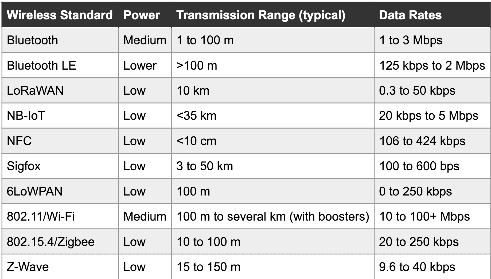

# 哪种无线是正确的无线？

> 原文：<https://hackaday.com/2018/10/19/which-wireless-is-right-wireless/>

早在 Arduino 扩散的早期(在你问之前，是的，我们意识到在那之前也有一段时间)，无线是一个奇怪的外国野兽。红外通信绝对是一个东西。如果你有资金，有一种叫做 ZigBee 的很酷的技术可以使用，通常在有趣的蓝色房子形状的 XBee 板中。有了更多的资金和对 AT 命令的兴趣，你甚至可以安装一个 2G 蜂窝无线电来获得无限的覆盖范围。WiFi 也存在，但是把它连接到一个业余爱好者的电路板生态系统就有点麻烦了(虽然可能对我们的读者来说不是)。

但是，随着手机推动了对低功耗无线通信的需求，以及标志术语互联网(当然是物联网)的发展，无线通信的选择出现了激增。本周早些时候，我们看到了由 Digikey 在今年早些时候编写的关于一些主要无线技术的很棒的入门书。我们不要埋了 led。这张桌子是这件作品的关键:

这里有一些不太常见的整洁条目(以及我们的老朋友，经常受到诽谤且从未渗透市场的 ZigBee)。它实际上甚至*遗漏了*一些条目。让我们来分解一下:

*   极近距离:只是 NFC。对于缓慢传输少量敏感信息或与位置高度相关的内容(如正在接触的手机之间)非常有用。
*   短程:BLE、Zigbee、Z-Wave 等。对于所谓的[个人局域网](https://en.wikipedia.org/wiki/Personal_area_network)和家庭级系统来说非常方便。
*   中/远程:Wifi、蓝牙、Zigbee、Z-Wave、LoRaWAN:有时在开阔的空间延伸一公里或更长。只要有足够多的节点，它对任何事情都有用，从发布 tweets 到在一个森林上缝合网状网络。其中一些在短距离内也是有用的。
*   甚长距离/无范围:Sigfox、NB-IoT、LTE 类别-0。在任何地方都可以连接，通常需要订购某种网络接入服务。无范围是指范围太长，你需要使用基础设施，而不是将收音机挂在桌子下的树莓皮上。虽然劳拉可以是一个有趣的例外。

如果不深入了解几种不同通用协议的可用开发板，您不太可能从零到定制无线解决方案，但是是哪几种协议呢？这些年来，形势变化如此之快，人们很容易陷入一种舒适的技术中，而错过下一个重大事件的出现(比如 LoRaWAN 最近如何成为新的酷小子)。本指南是一个很好的概述，可以帮助您了解并决定哪些开发工具包值得进一步研究。当然，我们仍然希望在下面听到您关于您最喜爱的无线宝石——过去、现在和未来——但没有进入列表(我们正在查看您的 433 MHz)。