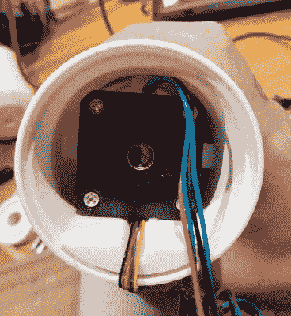

# 风力涡轮机推动桌面 3D 打印的极限

> 原文：<https://hackaday.com/2018/10/15/wind-turbine-pushes-limits-of-desktop-3d-printing/>

曾几何时，就在不久前，桌面 3D 打印的热度如此之高，似乎你可以打印任何东西。只要想象一下，你的便利的神奇 3D 打印机就能把它变成现实。但是现在越来越多的人已经有了这项技术的第一手经验，泡沫已经破裂。现实让我们清醒了一些，今天我们对传统的桌面 3D 打印机能打印什么和不能打印什么有了更好的认识。

 但这并不意味着我们不感到惊讶。作为一个完美的例子，看看这个几乎完全由【尼古拉·彼得罗夫】设计和建造的 [3D 打印风力涡轮机。除了电子元件、安装它的杆子和一些零零碎碎的东西，他在自己的大幅面 TEVO 黑寡妇打印机上生产所有的零件。他提到，如果他要建造另一个，他会做一些不同的事情，但对于这样一个华丽的建造，很难找到太多抱怨。](https://www.thingiverse.com/thing:3138588)

可以肯定的是，这不是为 3D 打印新手准备的。首先，你需要一台至少 370 毫米宽的打印机来打印刀片。[Nikola]还建议将零件印刷在 ABS 上，并涂上丙酮以使外表面光滑和硬化。如果你能在没有加热外壳的情况下打印如此大的物体，我们会感到惊讶，所以计划把它加入你的购物清单。

然而从另一方面来看，电子设备就像它们来的时候一样简单。叶片旋转标准的 NEMA 17 步进电机(通过 1:5 齿轮箱)以产生交流电。然后，这是馈入两个 W02M 整流器和一个强大的电容器，这给他一个最小的忙乱 DC。理论上，它应该能够产生 12V 的 1A，这足以点亮发光二极管和给手机充电。在这种设计中，没有电池充电电路或任何类似的东西，因为[Nikola]说这取决于读者如何将涡轮机集成到他们的系统中。

如果你认为你的 3D 打印技术不能胜任这项任务，不要担心。过去我们见过用吊扇和[建造的](https://hackaday.com/2017/07/26/the-most-straightforward-wind-turbine/)[风力涡轮机，甚至更少](https://hackaday.com/2017/08/03/diy-wind-turbine-for-free-energy/)。