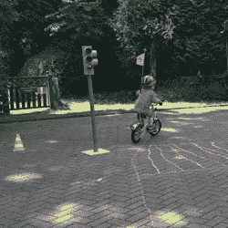

# 物联网红绿灯是纸板做的好玩

> 原文：<https://hackaday.com/2018/10/20/iot-traffic-light-is-cardboard-made-fun/>

红绿灯！孩子们喜欢它们，黑客也喜欢它们，它们在工业环境中很有用，可以用来查看这台巨大的机器目前是在工作还是过着糟糕的一天。虽然真实的交易难以操作且难以获得，但没有什么能阻止你在家里制作一个有趣的纸板玩具。

It’s a great way to teach kids about traffic rules, too.

在这种情况下，灯光由 WS2812b LED 灯条提供。它们是一个很好的选择，因为它们很容易与大多数微控制器接口，这要归功于现成的库。一台 ESP8266 在这里运行，通过 WiFi 提供一个基本的网络界面。这允许远程控制各种 led 的颜色。它还允许开关灯来指挥你可能控制的任何交通。整个项目都被包裹在一个简单的纸板外壳中，模仿市政街道设施，这些设施如此坚决地指挥着我们的行动。

纸板交通灯是一个项目，展示了一些现成的零件和一些老式的幼儿园风格的艺术和工艺品可以做什么。如果你发现自己也喜欢这些设备，看看我们关于北美交通信号的初级读本。休息后的视频。

 [https://www.youtube.com/embed/RrbeM2V_vII?version=3&rel=1&showsearch=0&showinfo=1&iv_load_policy=1&fs=1&hl=en-US&autohide=2&wmode=transparent](https://www.youtube.com/embed/RrbeM2V_vII?version=3&rel=1&showsearch=0&showinfo=1&iv_load_policy=1&fs=1&hl=en-US&autohide=2&wmode=transparent)

