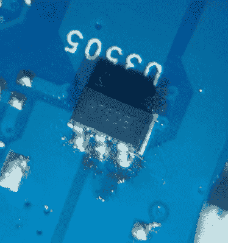

# 你会为这个 7404 集成电路主板修复翻转

> 原文：<https://hackaday.com/2018/10/20/youll-flip-for-this-7404-ic-motherboard-fix/>

我们经常感叹，可修复电子产品的时代已经一去不复返了。过去，你会得到一个齿轮的原理图，你可以像当地的修理工一样轻松地打开它修理东西——假设你有知识和工具。但是今天，所有东西都是为了在出问题时扔掉而制造的，如果你在寻找一种新的消费电子产品的电路图，你可能会在彩虹的尽头找到。

 但是【罗布森】写了一个有趣的故事，告诉我们[给了我们一个希望，那就是“旧方式”并没有完全消失](https://dragaosemchama.com/en/2018/10/do-i-deserve-my-usb-ports-back/)，尽管它们在 21 世纪已经发生了变化。当他连接一个可疑的电路时，他的笔记本电脑的 USB 端口烧坏了，他迫切需要一个符合他的学生预算(换句话说，几乎为零)的解决方案。唯一的问题是他没有修理电脑的经验。哦，他网购的东西要几个月才能到达巴西。开局不利。

他的第一点运气来自于发现他可以在网上购买笔记本电脑的原理图。现在，我们不能保证他使用的网站(它肯定不是直接来自戴尔)，但不到 5 美元[罗布森]显然得到了完整而准确的原理图，让他甚至不必打开计算机就可以找出电路板上的哪个部分被炸坏了。他所要做的就是订购一个替换 IC (SY6288DAAC)，然后焊接上去。零件花了两个月才到，不得不用熨斗而不是热风站来做，但最后，他把零件安装好了。

可惜没有成功。他对自己的诊断很确定，芯片看起来安装得足够好，所以他不知道自己哪里出了问题。经过仔细检查，他意识到自己的错误:他订购了错误的零件。他需要 SY6288DAAC，却买了 SY6288CAAC。不同之处在于，他的芯片被启用为高电平，而相应的部分被启用为低电平。

订购正确的零件意味着又要等两个月，所以[罗布森]决定选择核能。他在他的零件箱里寻找，直到他找到了一个 7404 hex 逆变器，他把它放在 SY6288CAAC 和主板之间。反相器就位后，LOW 变为 HIGH，反之亦然；使他不必等待正确的部分。他现在有了正常工作的 USB 端口，学到了一些关于 SMD 工作的宝贵经验，并确保您密切关注这些型号。

这不是我们第一次看到[罗布森]在他所在的地区解决航运限制问题。他最近组装了一个低成本的 PCB 工厂，这样当他想要制作一个原型时，就不必在专业制作的电路板上等上好几个月。

 [https://www.youtube.com/embed/-puck8jbtuI?version=3&rel=1&showsearch=0&showinfo=1&iv_load_policy=1&fs=1&hl=en-US&autohide=2&wmode=transparent](https://www.youtube.com/embed/-puck8jbtuI?version=3&rel=1&showsearch=0&showinfo=1&iv_load_policy=1&fs=1&hl=en-US&autohide=2&wmode=transparent)

