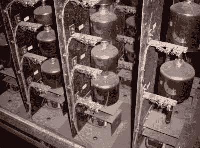

# 臭名昭著的三叶草的回归

> 原文：<https://hackaday.com/2018/10/19/return-of-the-infamous-triforium/>

三叶草是洛杉矶的一个公共艺术装置，重 60 吨，有六层楼高。它建于 1975 年，旨在结合光和声音，所有这些都在那个时代的计算机硬件的控制之下。

可悲的是，它从一开始就受到技术问题的困扰，多年来，成为嘲笑的对象。然而，由于 Triforium 项目的不懈努力，这一“多声部”杰作将再次复活。Triforium 项目[将在 10 月和 11 月的周五晚上举办一系列免费公共表演](https://triforium.la/)，所以如果你在这个地区，一定要去看看。这个系列今晚开始，所以赶快行动吧！

该团队能够恢复运行雕塑效果的原始软件——存储在 8 位纸带上，这在那个时代并不罕见。这些是手动转码的，并且已经创建了原始程序的模拟版本。为了不对雕塑造成进一步的损坏，原有的灯光没有被改动。取而代之的是，一个 LED 系统将被安装到雕塑上，使其能够被重新点燃。

Quartz bells of the original carillon

雕塑底部的一个倒影池早已不复存在，最初的音频源也是如此。最初建造的时候，里面有一个钟——一种乐器，音阶中的每个音符都有一个钟。在 Triforium 的例子中，编钟由 79 个石英钟组成，可以手动或由计算机演奏，并通过扬声器系统放大。

在 2006 年，钟被移走了(换成了数字音频源),但是那天垃圾箱搜寻之神在微笑。有人认出了这种乐器的独特性，并在一个简短的网页上分享了他们的故事。我们希望有一天，这也将恢复到工作状态，并在展览中与三叶草一起演奏。钟琴的声音是[亲自听到](https://youtu.be/3VSUuTABb3U?t=29)的神奇，我们怀疑[石英钟的音色](https://www.youtube.com/watch?v=kEHnoCZHq38)给这种体验增加了一层难以形容的层次。

对于那些不能参加即将到来的公开表演的人来说，你至少可以通过谷歌街景来感受一下这个雕塑。在 Hackaday，我们确实喜欢好的公共艺术作品——无论是[的大头](https://hackaday.com/2017/09/07/1-5-million-dollars-buys-850000-leds-and-29-raspberry-pis/)，还是[的一对翅膀](https://hackaday.com/2016/08/05/art-and-creepy-mechanisms/)，或是[的沙滩涂鸦](https://hackaday.com/2018/10/18/sandbot-happily-and-tirelessly-rolls-patterns-in-sand/)。

【感谢 JohnU 的提示！]