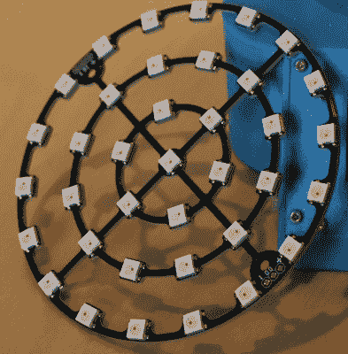

# 实时卫星追踪器告诉你你在想什么

> 原文：<https://hackaday.com/2018/10/22/real-time-satellite-tracker-shows-you-whats-going-over-your-head/>

虽然现代技术严重依赖卫星，但人们很容易忘记它们的存在；毕竟，很难理解大部分看不见的高密度技术块以可笑的速度在你上方呼啸而过。当然，如果你已经[建造了一个实时卫星追踪器，它可以准确显示在任何给定时间](https://www.reddit.com/r/space/comments/9py5qd/i_made_a_thingy_that_shows_satellites_and_space/)你头顶上方的轨道上有什么，这就不难理解了。[保罗·克林格]的创作显示了卫星穿过追踪器上方 200 公里半径的圆柱体的位置。

每一层发光二极管代表一个特定的高度波段，而发光二极管的颜色和屏幕上的文字代表物体的类型。led 本身是良好的旧 WS2812b 模块，焊接到定制的 PCB 上，并安装在 3D 打印的支架上。整个事情是一个非常干净的构建，看起来很棒——你可以在休息后的视频中看到它的运行

在软件方面，Raspberry Pi 负责运行 Python，它利用 [pyorbital](https://github.com/pytroll/pyorbital) 来完成一些繁重的工作。数据取自 space-track.org 的[，他们提供了一个方便的 API。所有代码都在](https://www.space-track.org)[项目 GitHub](https://github.com/PaulKlinger/satellite_tracker) 上，其中也包括 3D 打印和 PCB 文件。

[Paul]回答了 reddit 主题中的问题，并在此 [reddit 评论](https://www.reddit.com/r/space/comments/9py5qd/i_made_a_thingy_that_shows_satellites_and_space/e854ist/)中提供了更多细节。这个项目的灵感来自我们最喜欢的网站之一: [stuffin.space](http://stuffin.space/) 。

设备显示的一些卫星已经退役并且不活动。太空垃圾是一个重大问题，一个只能由太空垃圾车解决的问题。

 [https://www.youtube.com/embed/Xof4bjcwHAY?version=3&rel=1&showsearch=0&showinfo=1&iv_load_policy=1&fs=1&hl=en-US&autohide=2&wmode=transparent](https://www.youtube.com/embed/Xof4bjcwHAY?version=3&rel=1&showsearch=0&showinfo=1&iv_load_policy=1&fs=1&hl=en-US&autohide=2&wmode=transparent)

