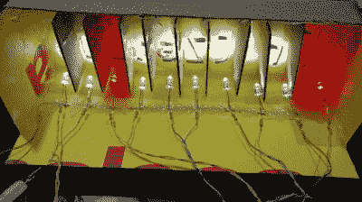
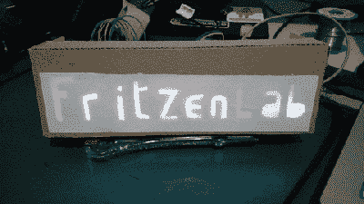

# 家居用品定制 LED 标牌

> 原文：<https://hackaday.com/2018/10/27/custom-led-signage-from-household-items/>

我们承认:有时候我们想多了。我们想象你们中的一些人也是这样；黑客心态中似乎有些东西驱使我们偶尔过度设计想法，以至于无法识别。这本身没有什么错，但有时它确实会让我们看不到更简单的解决方案。

 例如，[【克洛维斯·弗里岑】最近写的看起来非常光滑的个性化 LED 标志](https://fritzenlab.com.br/2018/10/display-led-personalizado-para-bancada/) ( [谷歌翻译](https://translate.google.com/translate?sl=auto&tl=en&js=y&prev=_t&hl=en&ie=UTF-8&u=https%3A%2F%2Ffritzenlab.com.br%2F2018%2F10%2Fdisplay-led-personalizado-para-bancada%2F&edit-text=&act=url))与我们分享。如果我们的任务是创建这样的东西，那么在说了和做了所有事情之前，肯定会有 3D 打印机和可能的 CNC 参与进来，几天后我们仍然会解决 OpenSCAD 代码中的错误。但是他的方法非常不同。这是一个非常简单的项目，主要由家庭用品构成，是一个让初级黑客在下雨的周末娱乐的好项目。

这个过程的第一步是在一张纸板上画出你想要的字符，然后小心地把它剪下来。如果你担心自己不是特别有艺术感，如果你把设计打印出来，然后用胶带把纸粘在纸板上作为模板，这一步会好一点。一旦你把设计剪下来，你就用胶水或胶带把一张标准打印纸粘在上面。这是显示器的正面；只需要从背后照亮。

 如果你想制作一个只有单一颜色且没有单独可寻址元素的标志，那么用一个光源照亮整个切口就足够了。但是这有什么吸引力呢？正如[Clovis]所展示的，你可以通过构建一个分段的盒子来获得更好的结果，每个单元中有一个 LED。通过将每个 LED 连接到 Arduino 或其他微控制器上的一个引脚，您可以控制标牌每个部分的颜色和亮度。

当然，如果你对整个硬纸板美学不感兴趣的话，你甚至可以用前面提到的 CNC 和 3D 打印机来重现这个设计。[克洛维斯]展示了基本概念是如何工作的，并且它可以很容易地扩展[，这取决于你可以获得的材料的种类](https://hackaday.com/2018/10/20/iot-traffic-light-is-cardboard-made-fun/)。