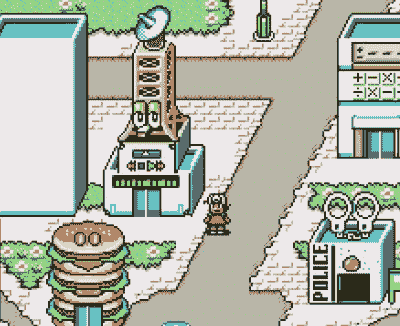

# 通过卫星监视 SNES

> 原文：<https://hackaday.com/2018/10/23/slack-on-the-snes-via-satellite/>

我们喜欢看到过去时代的硬件和软件通过现代黑客获得新生，长期读者肯定可以证明这一点。当这些东西今天可以投入使用时，为什么要把它们放在某个壁橱里腐烂呢？诚然，在 21 世纪，这可能并不总是完成一项任务最有效的方式，但至少你会因为原创而获得一些宝贵的互联网积分。

 作为一个完美的例子，看看这个项目，它让你[通过一个超级任天堂游戏](https://bert.org/2018/10/18/slack-on-a-snes/)读取松弛信息。如果你的第一个想法是这样的事情会涉及不合理的努力和跳圈…那么你是正确的。[Bertrand Fan]要实现这一点，确实需要跳出框框思考，甚至承认最终用户使用它需要一点想象力。但不可否认的是，这是一种独创的方法，所以我们在此授予他习惯性的互联网积分。

那么这是如何工作的，卫星从何而来？关键在于一个相当不起眼的日本 SNES 外设，名为 Satellaview，这是任天堂为其游戏机创建在线内容交付系统的早期尝试之一。在卫星电视支持下设计的游戏将能够从常规卫星广播中下载新内容，这对 1995 年来说还不算太坏。这意味着，如果你有硬件，并且碰巧拥有一颗卫星，你可以将自己的内容推送到未经修改的 SNES。没问题吧？

好吧，[Bertrand]并没有真正使用一个插在 SNES 上的卫星电视调制解调器。另外，我们相当肯定他没有自己的卫星网络来广播垃圾信息。但事实证明，一些 SNES 模拟器支持虚拟卫星视图调制解调器，甚至有软件可以让你为系统内置的游戏创建新的内容“下载”: *BS-X:名字被盗用的小镇的故事。他所要做的就是把这些点联系起来。*

[Bertrand]从剥离 SatellaWave 的用户界面开始，satella wave 是一种用于创建 Satellaview 内容的开源工具，因此它只需要提供一个 XML 文件，该文件包含虚拟卫星调制解调器要“下载”的内容。通过使用 Slack API，他想出了从服务器中提取最后 10 条消息，并把它们推送到他修改过的 SatellaWave 版本中的方法。每当有人发布新消息时，他的软件就会产生一个新的卫星下载，自动被 SNES 模拟器接收并弹出到游戏中。

如果这对你来说还是太实际，你可以随时全押，然后在你的 64 号准将上放松一下。

 [https://www.youtube.com/embed/CwXY2raEzPk?version=3&rel=1&showsearch=0&showinfo=1&iv_load_policy=1&fs=1&hl=en-US&autohide=2&wmode=transparent](https://www.youtube.com/embed/CwXY2raEzPk?version=3&rel=1&showsearch=0&showinfo=1&iv_load_policy=1&fs=1&hl=en-US&autohide=2&wmode=transparent)

