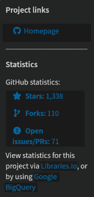
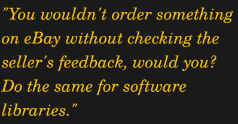

# 当好软件变坏:开源中的恶意软件

> 原文：<https://hackaday.com/2018/10/31/when-good-software-goes-bad-malware-in-open-source/>

开源软件总是值得信赖的吧？[贝尔图斯]披露了一个关于名为“Colourama”的恶意 Python 包的故事。使用时，它会秘密安装一个 VBscript，监视系统剪贴板中的比特币地址，并用硬编码的地址替换该地址。本质上，这个插件试图将比特币支付重定向到编写“colourama”库的人。

为什么会有人安装这东西？有一个名为“Colorama”的合法软件包，它接受 ANSI 颜色命令，并将它们翻译到 Windows 终端。这是一个相当受欢迎的库，但更重要的是，这个名字包含一个有多种拼写的单词。如果你让一个朋友推荐一个颜色库，而她用英国口音说“coulourama ”,你可以这样拼写。所以攻击很简单:将原始项目的代码复制到一个新的拼写错误的项目中，并添加一个讨厌的惊喜。

将恶意软件偷偷放入现有的代码库并不是什么新鲜事，这种特别便宜又容易的攻击载体有一个名字:“域名抢注”。但是这个包是如何托管在 PyPi 上的呢？PyPi 是 Python 社区贡献的主要资源。你们中有多少人从 PyPi 下载了包而没有浏览所有的源代码？`pip install colorama`？我们猜想几乎所有人都在使用 Python。

也不仅仅是 Python。[2017 年在 NPM javascript 库](http://blog.npmjs.org/post/163723642530/crossenv-malware-on-the-npm-registry)发现了类似问题。一个用户提交了几个新的包，都是对现有的流行包的拼写错误。每个包都包含恶意代码，这些恶意代码抓取环境变量并将其上传给作者。有多少 web devs 匆忙安装了这些包？

当然，这个问题并不是开源软件独有的。“抽象主义”是一款托管在 Steam 上的游戏，直到[它被发现在玩家玩的时候挖掘 Monero](http://www.polygon.com/2018/7/30/17630664/steam-abstractism-cryptocurrency-mining) 。还有很多其他恶意软件伪装成其他东西的例子——在有人试图从可疑网站下载 Flash Player 后，我每天工作的很大一部分就是清理电脑。

## 买家当心

在开源世界中，我们已经习惯于简单地下载声称做我们正在寻找的很酷的事情的库，我们没有人有时间一行一行地钻研代码。你怎么能相信他们？

像 PyPi 这样的库在忠实打包提交给它们的库和程序方面做得很好。随着这些存储库的增长，手工检查每个包变得越来越不实际。PyPi 列出了 156，750 个项目。像[贝尔图斯]所做的自动扫描是将恶意代码排除在我们的存储库之外的重要一步。事实上，[贝尔图斯]在测试 PyPi 库时发现了 11 个其他恶意软件包。但是更聪明的黑客可能会找到绕过自动化测试的方法。

 开源库确实增加了一层额外的可靠性，因为代码原则上可以被任何人、任何时间审计。随着库的使用、缺陷的发现和特性的增加，越来越多的人有意无意地审查代码。在“colourama”示例中，解码并执行了一个长 Base64 字符串。不需要专业研究人员就能意识到事情有猫腻。在某种程度上，足够多的人已经审查了代码库，可以合理地信任它。“Colorama”在 Github 上有超过 1000 颗星，28 个贡献者。但是你在下载之前检查过吗？

域名抢注滥用信任，利用相似的名字和任何不够密切关注的人。让每个用户检查他们操作系统中的每个包是不现实的。那么，我们如何信任任何安装呢？密码术解决了其中的一些问题，但是它不能克服人的因素。url 中的一个错别字、对一个全新项目的信任，甚至是[混淆的 C 代码](http://hackaday.com/2015/06/15/code-so-sneaky-you-have-to-explain-it/)都会时不时地愚弄我们中最优秀的人。

有什么解决办法？我们如何对我们的软件有信心？当从网上下载时，有一些好习惯可以帮助你抵御攻击。交叉检查项目的网站和源代码实际上相互指向对方。检查网址中的错别字。不要仅仅因为一个下载位于一个流行的存储库就相信它。

但最重要的是，检查项目的声誉，项目贡献者的数量，甚至可能是他们的声誉。你不会在没有检查卖家反馈的情况下在易贝上订购东西，是吗？对软件库做同样的事情。

使用受流行发行版支持的库可以找到更深一层的安全性。在 quality 发行版中，每个包都有一个熟悉被维护项目的维护者。虽然他们不会检查每个项目的每一行代码，但他们会确保“colorama”而不是“colorama”被打包。与 PyPi 的 156，750 个 Python 模块相比，Fedora 只打包了大约 4，000 个。这种选择是好事。

像 PyPi 和 NPM 这样的软件仓库并不像我们有时认为的那样是可信软件的精心策划的来源——我们应该采取相应的行动。仔细调查这个项目的声誉。如果库是由您选择的发行版打包的，您可以将这项工作交给发行版的维护者。

最终，除了一行一行地检查代码，一些信任锚是必要的。如果你盲目地安装随机库，即使是来自一个“值得信赖的”库，你也会放松警惕。