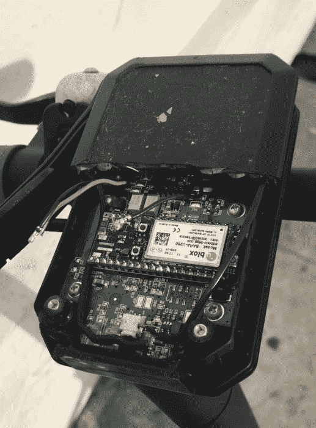

# 选择蜂窝调制解调器:硬件设计的戏剧皇后

> 原文：<https://hackaday.com/2018/11/15/choosing-cell-modems-the-drama-queen-of-hardware-design/>

所以你去了一个贸易展，听说了一个叫做物联网的很酷的新想法；现在是时候打造自己的物联网产品了。你知道要成为物联网，你的 Widget D'lux *有*要有网络连接，但是选哪个呢？

你可以使用 WiFi 或蓝牙，但那会很笨拙。也许是洛拉万？这些天来，所有酷孩子都在使用 LoRa 进行中远程无线通信，但这仍然需要一个基站，而且 Widget D'lux 将成为一种全球现象。或者至少是你卧室墙上的一个现象。你*知道*用户有多讨厌设置东西。这是一个手机调制解调器！但是你要怎么做才能合法地在你的产品中包含一个呢？这有点复杂。

我们之前已经讨论过[政府认证测试](https://hackaday.com/2016/09/19/preparing-your-product-for-the-fcc/)(说真的，去看看那篇文章吧。鲍勃做得很好！)这里完全相关，但蜂窝调制解调器在洋葱上加了几层。这场讨论有许多切入点，所以让我们挑选一个深入讨论。

## 认证:有意、无意、多次

那么在你运输你的产品之前，你需要什么样的政府认证呢？有几个。如果你打算打开手机无线电*的*功能，整个设备将需要进行有意辐射认证，以确保你打算使用的无线电功能正常(不要在给定的频段发射过多的能量)。如果你打算打开 Widget D'lux *的话*也需要检查它是否有无意的辐射，以确保没有太多你不想传输的电磁能量。如果你想添加另一个无线电，如蓝牙或 WiFi，也有多辐射器认证，以查找多个无线电同时工作引起的问题。

幸运的是，有一些技巧可以让这个过程变得更容易。多个辐射器的测试和认证仅在多个辐射器同时开启时才有意义。也许应用程序可以调整，这样你就不需要在连接手机的同时使用蓝牙了？还是只在手机信号低于某一强度时打开 WiFi 无线电，随后无线电被禁用？只要一次只有一个发射器开启，你就不需要寻求额外的认证。虽然如果有*曾经*的情况下，他们都可以在一次，它需要适当的认证。

一个更具体的例外是使用 WiFi 来收集访问 ESSID 和 MAC 以[帮助地理定位](https://developers.google.com/maps/documentation/geolocation/intro)。主动扫描接入点可能会更快，但如果你坚持[被动扫描](https://www.wi-fi.org/knowledge-center/faq/what-are-passive-and-active-scanning)，WiFi 无线电永远不会*发射。*无需额外认证。

或者，如果不同辐射器的天线放置得足够远，一些模块化认证(我们稍后会谈到)允许您避免双辐射器认证([这里有一个示例](https://cdn-shop.adafruit.com/datasheets/SIM800_FCC_TCB_BT.pdf)，间距为 20 厘米)。关于这一点的具体信息可能在给定设备的 FCC 授权中。(注意！跟你的 NRTL 谈谈这个吧！仔细阅读相关拨款，你会弄不清楚*实际上*的要求是什么。最终，您选择的实验室的测试工程师将不得不签署您的测试结果，因此他们的意见可能是最重要的)

还有一个完整的[设备类型列表，这些设备类型可以免除](https://www.metlabs.com/emc/some-electronic-devices-are-exempt-from-fcc-emc-testing/)某些类型的排放测试。例如，某些种类的电器和汽车设备不需要测试。虽然如果他们有故意辐射，他们仍然必须遵守相关法律。因此，只要没有蓝牙应用程序进行配置，像 underglow 这样的设备可能就不需要测试。

我们不会详细讨论这些测试是如何进行的。同样，请参考 Bob 关于 FCC 测试的文章，了解更多详细信息。

## 电池特定认证:PTRCB

好吧！如果这对你来说还不够，你还需要更多的蜂窝认证:PTRCB 和/或运营商认证。FCCs 的工作是确保你的设备能与其他人的设备很好地兼容，并且电波通常可以共享。他们不关心你的设备是否真的能工作(虽然他们关心它是否会因 ESD 敏感而损坏！).另一方面，手机运营商需要确保你的设备符合他们的网络规范，这样你就不会导致服务质量下降。

Thanks Cetecom

这里的最终目标是真正的运营商认证，这意味着认证的设备已经过测试，可以与威瑞森要求的特定草药和香料混合使用。运营商认证是特定于该网络的，尽管对于许多运营商(在美国、美国电话电报公司、T-Mobile 和 Sprint)来说，获得该认证实际上是根据一个称为 PTRCB 的机构的规范所做的测试的超集。惊喜！PTRCB 由一个运营商联盟创建，旨在帮助测试和管理手机设备。

咻！还在为将 Widget D'lux 带给饥饿的大众而兴奋吗？没有吗？但是我们连成本和时间(几万块钱，最多几十周)都没谈！我是不是听到你在乞求一个更简单的答案？听起来没什么意思，但我想我们可以探索其他选择。

神奇的词是“模块化认证”蜂窝调制解调器有各种形状和尺寸，从原始调制解调器和 RF 元件到设计用于插入试验板的开发套件。在中间有一个最佳点，蜂窝调制解调器可以作为模块使用，设计为永久安装在终端设备中。在其最完整的形式中，这种模块包括所有与 RF 相关的硬件。

对于上述所有认证内容，除了无意辐射模块可以不同方式批准用于模块化终端设备。抱歉，这仍然是一个混乱的描述。在电气方面，组件可以通过 FCC 测试和认证，用作其他产品内部的有意和无意散热器*，也称为“模块化使用”。只要您遵守 FCC 认证授权的条件，比如不要将另一个有意辐射器放得太近，认证就会一直延续到终端设备。模块可以类似地进行终端设备使用的载体测试。因此，坚持使用经过严格认证的模块可以让你在很大程度上成为一个可运输的设备。*

## 将蜂窝调制解调器集成到产品中

有几种方法可以集成蜂窝调制解调器，幸运的是，它们都没有相同的监管负担。

The board is called “bird brain”

### 开发套件和提线

对于原型和非常小批量的产品，将一个开发工具包粘贴到系统的其余部分可能足以让一个系统出门。在这个空间中有一些选择，其中[粒子的电子](https://docs.particle.io/quickstart/electron/)可能是最广为人知的。在开始时，这可能是一个不错的选择，但供应商通常不会提供大量面向消费者/原型的开发套件，对于长期安装来说可能不够稳定，并且可能没有经过适当的认证，无法用于商业设备。但这并不意味着它们不能使用。

正如 [Make 注意到的](https://makezine.com/2018/04/25/vandals-crack-open-dockless-scooter-discover-particle-electron-board-inside/)由 [Bird](https://www.bird.co/) 改装的第一代踏板车(目前价值超过 20 亿美元)在踏板车顶部的主板上惊人地包含了一个粒子电子！从照片上看，它的 USB 和 JST 电池连接器已经被移除，整个子板可能被焊接到踏板车上。但是，嘿，我猜一个航运产品是最重要的事情！

### 模块关闭

本文中还有很多其他内容，但是将蜂窝调制解调器集成到产品中最简单的方法是“使用模块”。如上所述，调制解调器与它们的许多/大部分 RF 位一起作为模块出售。无论是使用通孔、城堡形结构还是令人讨厌的栅格阵列，这些都被设计成永久安装在最终产品中。如果你选择一个有正确认证(也就是所有认证)的产品，投放一个模块是进入市场最快的实用方式，尽管价格可能会比购买一个裸调制解调器高。

模块里面有什么？看情况。有些只是带有支持电路和标准化安装模式的调制解调器。其他包括另一个微控制器，可能足以成为您的系统的主要应用处理器。走模块化路线还有其他一些便利的好处:

*   如果供应商有标准化的引脚排列，随着电池技术的变化，使用模块可以在未来提供升级途径。这是 MultiTech 和 Digi 模块的主要特点。
*   如果一个模块增加了另一个微处理器，他们也可以在调制解调器可能说出的原始 AT 命令周围增加一个漂亮的包装器。这可能会使打开 TLS 包装的套接字、发送文本消息等变得更加容易。Particle 和 Digi 的模块都提供这种功能。
*   运营商会要求调制解调器保持最新，否则他们会把你踢出他们的网络。具有板载微控制器的模块可能能够在很少或没有开发者干预的情况下自我更新。
*   一些供应商(Particle 是一个典型的例子)提供不同级别的云基础设施，这使得快速设置应用程序变得很容易。

一些常见的模块供应商有 Particle(他们也有非开发套件选项)、 [Digi](https://www.digi.com/products/xbee-rf-solutions/embedded-cellular-modems) 、 [MultiTech](https://www.multitech.com/brands/socketmodem-cell) 、 [NimbeLink](https://nimbelink.com/) 和 [Link Labs](https://www.link-labs.com/lte-cat-m1-carrier-certified-expansion-board) 。

### 调制解调器关闭

制造和销售蜂窝调制解调器的公司会很乐意将它们用于终端设备(你认为模块内的*是什么？).但是通过购买一个 [Telit](https://www.telit.com/m2m-iot-products/cellular-modules/) 或 [u-blox](https://www.u-blox.com/en/cellular-modules) 或 [Sierra](https://www.sierrawireless.com/) 模块并将其放在电路板上，你将需要通过大部分艰苦的认证过程。这些供应商知道这个过程有多艰难，他们会帮助你决定进行什么样的测试，和谁交谈，但是这仍然是一个昂贵和耗时的过程。这种复杂性是*为什么*模块化产品首先存在的原因；这太难了，这是一个完整的行业。*

除此之外，直接使用调制解调器将比模块更便宜，并且可以根据您的应用最小化/定制尺寸。

## 芯片向下

如果您正在构建一个非常大规模的产品，并且确实需要不同寻常的功能或尽可能低的成本，您可以自己组装蜂窝调制解调器。这是迄今为止最昂贵、最耗时、最复杂的选择。所有的证明都是必须的。

## 了解更多信息

如果你真的要这么做，现在很明显你需要寻求一些帮助。专家帮助。一种选择是聘请顾问。但另一种方法是与测试实验室交流。不是所有的实验室都愿意成为一个活生生的常见问题，但有些会。我发现，当一个实验室愿意提供帮助时，这是一个好迹象，也许是选择合作伙伴时要考虑的一个有用的特征。在湾区有很多选择。我认识的人中，与莱茵[TV](https://www.tuv.com/en/usa/services_usa/product_testing/product_testing.html)、 [NTS](https://www.nts.com/services/testing/emc/) (他们为顾客准备了披萨和苏打水，这是一大优势)、[湾区合规实验室](http://www.baclcorp.com/services.html)、 [MET labs](https://www.metlabs.com/services/emc/) 和 [Cetecom](https://www.cetecom.com/en/testing/) 一起工作的人排名不分先后。理想情况下，你工作的实验室也是你认证的实验室。

准备好让 Widget D'lux 焕发生机了吗？没有吗？你想在鞋盒里回到 ESP8266 和面包板上吗？没关系，也许这个世界不需要另一个有针对性广告的[物联网温度计](https://twitter.com/internetofshit/status/1055222277858607104)。

* * *

注意:如果这不是显而易见的，这应该被看作是一种随意的建议。这是一条通向更大知识的线索……但是不要仅仅根据你在这里读到的来推出产品。