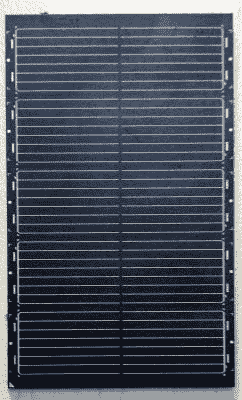
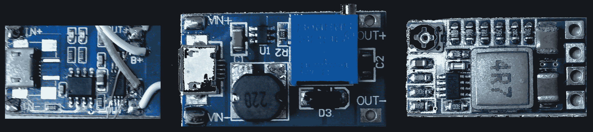
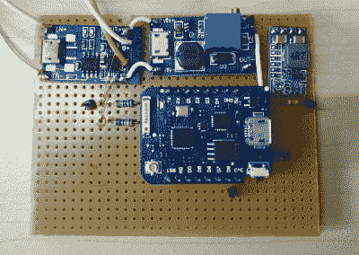

# Linux Throwie:使用 0.3W 太阳能电池板为 Linux 服务器供电

> 原文：<https://hackaday.com/2018/11/02/the-linux-throwie-powering-a-linux-server-with-a-300mw-solar-panel/>

你是否曾经有过这样的时刻，当你在你的备件堆里翻找的时候，有一个非常奇怪的项目想法，你不能完全摆脱它？你知道，那些没有明确用途，只是要求由玻璃、钢铁和硅制成的东西？

这一次，这个顽固的想法有点像一个太阳能充电 LED 投掷器，但它没有闪烁的灯，而是以 Raspberry Pi 3 Model B+的形式拥有一个完全云可访问的嵌入式 Linux 服务器。你选择的嵌入式 Linux 主板应该是可行的——由于运输错误，我刚好有很多这样的主板。

这里有两个主要挑战:首先，它必须结合太阳能电池板、电源和锂离子电池的最小实际组合，才能运行树莓 Pi。其次，无论 Pi 在哪里，我们都需要远程激活和访问它，并且能够在没有直接物理访问的情况下将其连接到 WiFi。在本文中，我们将处理第一组问题——其余的请继续关注。



One time I stuck a bunch together to make a ‘Dyson Lampshade’, which is of course a [Dyson Sphere](https://en.wikipedia.org/wiki/Dyson_sphere) rendered less large, less spherical, and more absurd.

## 太阳能运输

我是从树莓派不需要经常出现的角度来应对第一个挑战的。运行 NodeMCU 的 ESP8266 (Wemos D1 Mini)可以提供电池管理，并通过 MQTT 接收命令以激活它，同时大部分时间处于深度睡眠模式。这消耗非常少的功率，允许一个小的 5 伏太阳能模块对一个足够大的锂离子电池进行涓流充电，为服务器提供几个小时的运行时间。

太阳能模块值得一提。它们是夏普公司的 lr0gc 02 T1(PDF)，旨在为各种移动电子设备进行涓流充电。与外面的许多模块不同，它们封装得非常好，而且非常薄(大约 1 毫米)。它们还附有详细的规格。对于这个项目来说，一个 300mW 的模块就足够了，但我在开发过程中并行使用了三个，以加快各种测试的速度。[这个微型太阳能模块](http://hackaday.io/project/159139-tiny-solar-energy-module-tsem)也会是一个有趣的选择。

管理这些模块的电源是事情变得有点棘手的地方。我们有一个 4-5V 电源为标称输出电压为 3.7V 的锂离子电池充电，然后我们有一个 ESP8266 模块，它以 3.3V 运行，但可以通过集成的线性稳压器接受更高的电压，只要注意压差。最后，我们需要一个 5V 输出，可以轻松切换，为树莓 Pi 供电。此外，这将是一个很好的 12V 线未来的扩展。

## 现代模块的辉煌

谢天谢地，这一切听起来比实际情况更糟，有一些非常常见的模块将为我们解决这个问题:



From left to right: A USB lithium ion cell charger, a DC-DC boost converter, and a DC-DC buck converter. They cost about a US dollar each, which was great value!

第一级是 USB 锂离子电池充电模块。这些接受我们的太阳能电池板输出约 5 伏，并会安全地为我们的电池充电。无论锂离子电池电压是多少，模块的输出都是一样的。

接下来，我添加了一个输出 12V 的 DC-DC 升压转换器模块。这些模块的效率超过 90%，接受一系列电压，并将输出由 trimpot 设置的固定电压。12V 输出连接到 ESP8266 上的线性调节器。这样，即使电池电压降至 3.7V 以下，它也能继续工作。这一点至关重要，因为 ESP8266 会监控锂离子电池并开启和关闭服务器。如果我们将它的线性调节器直接连接到电池输出端，它会因功率损耗而关断，而系统中仍有相当多的可用功率。我们在这里确实损失了一点效率，但是 ESP8266 大部分时间都是关闭的，所以我可以忍受。

然后，12V 输出馈入 DC-DC 降压转换器，将树莓 Pi 的电压降至 5V。使用带使能引脚的降压转换器很重要，这样我们稍后就可以使用 ESP8266 控制输出状态。否则，您需要添加一个 MOSFET 或类似器件来控制功率输出。

## 负责任的电池管理

在这一点上，我们已经有了我们需要的所有电压水平和充电控制电路，以防止我们的锂离子电池进行自发的无计划燃烧。然而，当锂离子电池放电过度时，它们就不能安全地再次充电。我们需要监控细胞，防止它变成不寻常的镇纸。

解决方案非常简单:ESP8266 有一个模数转换器。它只能接受最高 3.3V 的电压，而我们的电池可以提供更高的电压，因此我使用了几个 100kΩ电阻作为分压器来降低电压，我们并不需要高精度。

为了启动我们的控制程序，我设置了一个计时器，在睡眠 10 分钟之前运行 ESP8266 11 秒，这是芯片在线检查命令的充足时间。然后，如果电池电压低于 3.4 伏，它将立即休眠 16 分钟。

```

function checkvolt()
x = adc.read(0)
print (x)
	if x &lt; 528 then
		print(&quot;low battery, sleeping longer&quot;)
		node.dsleep(960000000)
	end
end

checkvolt()

function sleeping()
    node.dsleep(600000000)
end

tmr.alarm(0,11000,0,sleeping)

```

一些粗略的计算表明，该模块通常平均消耗约 1.5 毫安，如果电池电压低，则消耗约 0.2 毫安。实际上，即使系统处于休眠状态，所有器件也会消耗一些电流。我被告知大约每个月至少有一次阳光普照(我会在某个时候检查)，电池应该不会有维持充电的问题。无论如何，如果前一个假设是错误的，我有更大的问题要处理。

## 调节电压调节器



最后，我们需要能够控制最后一个稳压器的 5V 输出。虽然我购买了一个有“使能”引脚的模块，但没有关于它如何工作的文档，我的模块中使用的确切芯片也不清楚。从不同 DC-DC 转换器的一些 IC 的数据手册来看，它可能是一个高电平有效使能引脚，通过模块上的一个电阻上拉。

我试着用一个 50kΩ的电阻把它拉回来，电压输出降到零。从 ESP8266 的一个 GPIO 引脚提供 3.3 伏电压触发了 enable 引脚，它再次输出 5V 电压。

我给电池放了一点电，然后让它在阳光下运行一个小时——它像预期的那样充了一点电，引发了必要的狂笑。动力阶段…完成！

## Linux 在哪里？

它很小，是太阳能驱动的，但是除了在阳光下闲逛，它什么也做不了。大多数计算硬件都需要软件，显然这也不例外——那么我们如何让它成为一台精简、绿色的 Linux 机器呢？

在下一篇文章中，我们将介绍如何通过 MQTT 控制这个系统，设置远程配置(例如，如果我需要更改我的 WiFi 密码)，并设置反向 SSH 隧道，这样我们就可以连接到 Raspberry Pi，而不必重新配置我们的网络来适应它。

讽刺的是，我的服务器现在比我得到更多的阳光。不过我住在赤道附近，长时间的日光浴是专为游客准备的活动——他们通常会很快学会避免！