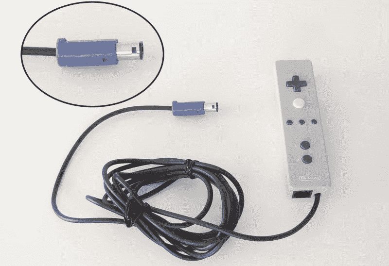

# 原型证明 Wii 是两个一直粘在一起的游戏立方体

> 原文：<https://hackaday.com/2018/10/29/prototype-proves-wii-was-two-gamecubes-taped-together-all-along/>

不管你怎么说任天堂的紫色小饭盒 Gamecube，但它是许多令人愉快的体验的家园，从超级粉碎兄弟混战到塞尔达传说:暮光之城公主。我们现在知道它也是最早的任天堂 Wii 遥控器之一的故乡，这也要感谢最近雅虎拍卖上的清单。

Wii 遥控器的原型是一种有线设计，具有专有的 Gamecube 控制器电缆。值得注意的区别包括底部的两个按钮分别标有“B”和“A”。这表明任天堂总是打算让玩家侧着遥控器玩虚拟主机游戏。方向键旁边的白色大按钮没有标签，中间是传统的“开始”和“选择”标签，分别位于“主页”的两侧。然而，在最终设计之前，这些都要经过多次修改。有趣的是，底座上有一个以太网插孔，用于连接附件。该连接器最终成为经常被诽谤的“双节棍接口”，但如果以太网端口延续到最终设计，哪个调制解调器不会喜欢它呢？

就像“无价的”马里奥派对 6 麦克风一样，原型的红外传感器棒通过 Gamecube 存储卡端口进行通信。拍卖清单上有一张原型感应条的照片尺寸对比，比最终设计宽了大约 4 英寸。Wii 遥控器的原型中缺少了一个小喇叭，但这似乎总是事后的想法。

WayForward 的 James Montagna 在一条推特上证实了控制器的有效性，他在推特上说:“哇，这是 Wii 遥控器的原型&双节棍！我记得在它还被称为任天堂革命的时候看到过这些！”。Montagna 会继续发布 2006 年 E3 Wii 遥控器的照片，上面有“后退”和“暂停”按钮，加号和减号按钮最终会出现在最终设计中。这些 Wii 遥控器进化过程中缺失环节的照片有助于填补任天堂的设计过程。他们还进一步指出，任天堂一直希望玩家用“X 个用胶带粘在一起的游戏立方体”来衡量每台新游戏机的处理能力。

[via [任天堂生活](http://www.nintendolife.com/news/2018/10/random_japanese_auction_reveals_wii_remote_prototype_for_the_gamecube)

关于以前被称为任天堂革命的游戏机的更多信息，请查看 Hackaday 上的这个令人难以置信的 Wii 游戏机模型。