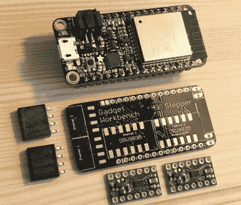

# 在 ESP32 的控制下，迷你乐高技术坦克巡逻你的桌子

> 原文：<https://hackaday.com/2018/11/01/mini-lego-technic-tank-patrols-your-desk-under-esp32-control/>

我们可能不需要告诉 Hackaday 的读者乐高不只是给孩子们玩的；我们已经看到了很多项目生活在一个由多色砖块制成的围栏中，让我们甚至不要开始我们多年来看到的思维风暴建筑。但是，尽管乐高(尤其是 Technic 产品线)很适合制作原型和组装快速项目，但库存电子元件并不完全是顶级产品。这就是为什么[Jason Kirsons]一直致力于弥合乐高和“真实”部件之间的差距。

 他的乐高技术坦克就是这一原理的完美例子。虽然坦克设计本身是标准的乐高玩具，但[他已经在电子产品](https://hackaday.io/project/158469-cnc-stepper-motor-powered-lego-technic-tank)上投入了全部。拥有 Adafruit Feather ESP32、定制电机控制板和带 3D 打印技术适配器的 NEMA 8 步进器，这个小坦克的引擎盖下有比你想象的更多的功能。虽然这个项目更多的是一个概念验证，但[Jason]演示的方法可能是你下次用 Billund 的 best 构建时要考虑的东西。

[Jason]选择 Feather ESP32 是因为它的尺寸小，但是如果您不想将所有东西都压缩到这么小的尺寸中，您也可以使用通用板。当然，如果你用另一个板，你就不能使用他设计的 PCB，它连接到羽毛上，装有四个 Pololu DRV8835 电机驱动器。

很容易，这个项目最广泛适用的元素是[Jason]设计的转接板，它可以让你使用带有乐高技术部件的 NEMA 8 发动机。他[将适配器放在 Thingiverse 上，](https://www.thingiverse.com/thing:2907018)为任何寻找嵌入式解决方案的人提供一点点*魅力*(技术术语)。

[乐高与黑客和制造者有着悠久的历史](http://hackaday.com/2018/09/07/fosscon-2018-where-open-source-and-lego-collide/)。我们已经[报道了一些绝对令人难以置信的](https://hackaday.com/2016/11/28/lego-technics-machine-produces-true-braided-rope/)项目[用著名的建筑布景](https://hackaday.com/2016/02/19/rope-braiding-machine-built-entirely-from-lego-technics/)建造，我们没有看到它在未来放缓的任何迹象。

 [https://www.youtube.com/embed/84CUjGQdUGI?version=3&rel=1&showsearch=0&showinfo=1&iv_load_policy=1&fs=1&hl=en-US&autohide=2&wmode=transparent](https://www.youtube.com/embed/84CUjGQdUGI?version=3&rel=1&showsearch=0&showinfo=1&iv_load_policy=1&fs=1&hl=en-US&autohide=2&wmode=transparent)

 [https://www.youtube.com/embed/wdyVzUeUZuI?version=3&rel=1&showsearch=0&showinfo=1&iv_load_policy=1&fs=1&hl=en-US&autohide=2&wmode=transparent](https://www.youtube.com/embed/wdyVzUeUZuI?version=3&rel=1&showsearch=0&showinfo=1&iv_load_policy=1&fs=1&hl=en-US&autohide=2&wmode=transparent)

感谢亚当的提示。]