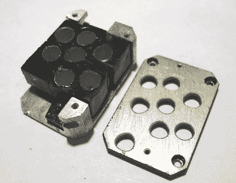

# 苏联时代的 7 段显示器，像坦克一样建造

> 原文：<https://hackaday.com/2018/11/06/soviet-era-7-segment-display-built-like-a-tank/>

在某种程度上，所有 7 段显示器都是一样的；至少从外面看是这样。在内部，它可能是完全不同的另一个故事，这肯定是苏联时代的 7 段数字显示器的构造的情况。从外面看，它可能比平时看起来更坚固，但它仍然可以一眼认出它是什么。在里面是白炽灯泡和塑料光导的不寻常的混合物。

The black-coated blocks of plastic on the left (shown from the rear) act as light guides. The holes are for nesting the incandescent bulbs. Note the puzzle-like arrangement of the uniquely shaped pieces.

显示器的后部是一个印刷电路板，上面有模糊的六边形低压白炽灯泡图案，每个灯泡都与显示器的一个部分相匹配。显示段本身是实心塑料块，每个灯泡一个，每个都是独立的一块。这些都被漆成黑色，唯一没有油漆的区域是显示器顶部的一个薄部分，以及背面的一个孔，用于匹配灯泡。

其结果是，每个塑料片都充当光导，确保 PCB 上点亮的灯泡导致面板上七个薄段中的一个也被点亮。一件有趣的事情是，黑漆是唯一能防止不需要的光从前面露出来，或者从一个部分泄漏到另一个部分的东西；在这个时代的显示器中，通常使用某种挡板来达到这个目的。

更奇怪的是，每个塑料片段都是独特的形状，显然与其功能无关。我们认为这可能是为了确保万无一失的组装；它形成了一个只能以一种方式组合在一起的拼图。其结果是一个紧凑和非常坚固的单位，表明如何旧的和坚固的技术不一定笨重。另一个来自苏联时代的小型显示技术的例子是[这个由完全不同的制造商生产的微小的 7 段显示器](https://hackaday.com/2018/06/09/marvel-at-soviet-era-smart-displays-tiny-size/)，它通常与集成的气泡透镜一起使用，以放大微小的显示器。