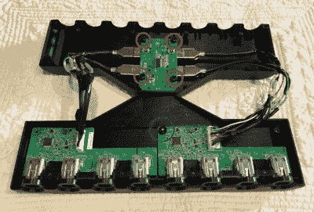

# 八人游戏魔方适配器准备粉碎

> 原文：<https://hackaday.com/2018/11/02/eight-player-gamecube-adapter-is-ready-for-smash/>

随着《粉碎终极版》的发布和任天堂 Switch 的临近，[Patrick Hess]想要领先一步，确保他的团队拥有他们需要的设备。也就是说，支持严肃的 Smash Bros 玩家要求的 GameCube 控制器。但是仅仅把一两个或者四个连接起来是不够的。即使六个 GameCube 控制器也不能满足他的欲望。不，他需要同时支持八个 GameCube 控制器，而且他也想做得好看些。

 进入他精心设计的[八玩家 GameCube 转 USB 适配器](https://www.thingiverse.com/thing:3180023)。由两个任天堂官方 GameCube 到 USB 适配器(用于 Wii U)合并在一个 3D 打印的外壳中制成，最终结果看起来像是可以获得令人垂涎的任天堂认证的东西。或者至少，在接下来的一两个月里，花几块钱就可以在进口网站上看到的东西。

[Patrick]通过使用一对卡钳重新创建官方适配器 PCB 及其 3D 外壳来启动该项目。在几次测试打印以确保所有尺寸正确后，他可以继续设计他的最终外壳，因为他知道他有准确的数据来建模。

除了两个适配器板，设备外壳内还有一个四端口 USB 集线器。每个适配器有两个 USB 引线，这里缩短以适合外壳内部，连接到集线器。集成集线器允许仅通过一个 USB 连接连接所有八个 GameCube 控制器。在 Wii U 版 Smash Bros 上的紧张测试中，所有控制器都像预期的那样工作，尽管此时[Patrick]只能假设它将在 Switch 版本发布时工作。

如果这个项目有一个缺点，那就是 3D 打印外壳的设计非常复杂，以至于[Patrick]只能在支持水溶性 PVA 的机器上打印。对普通黑客来说有点高的要求；这将是有趣的，看看是否有人可以对外壳进行第二次测试，这种外壳更适合印刷而不是美学。

虽然 GameCube 控制器的设计在这么多年后仍然有些争议，但不可否认的是，它仍然拥有令人印象深刻的追随者。无论是将它们变成 USB 设备，将它们缩小到[非常小的尺寸](https://hackaday.com/2018/01/31/what-is-this-a-controller-for-ants/)，还是找到越来越有创意的方式[在任天堂最新的游戏机](https://hackaday.com/2018/03/16/gamecube-dock-for-switch-mods-nintendo-with-more-nintendo/)上使用它们，黑客们肯定爱上了现在快 20 岁的 gonzo 小控制器。